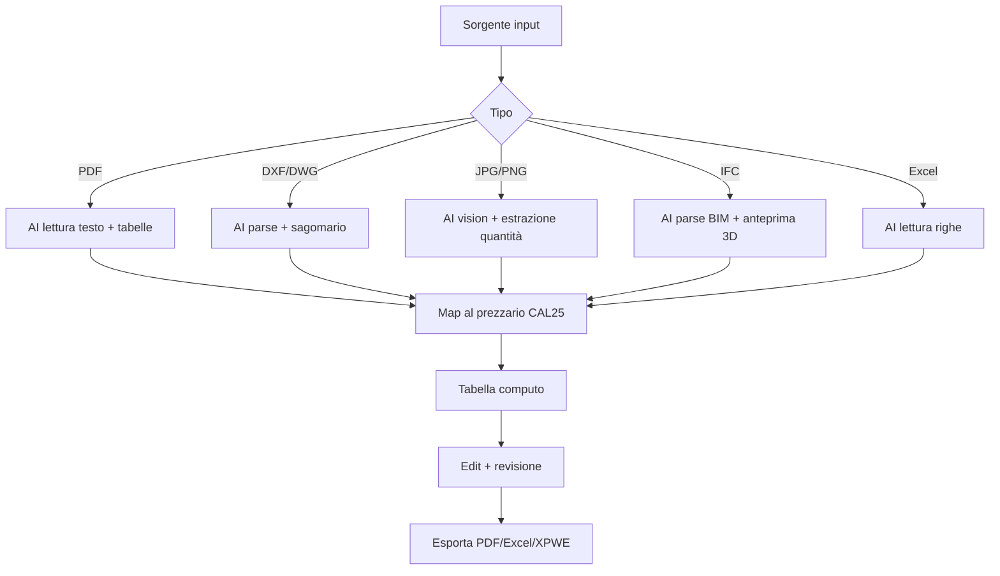

# Workflow completo

Sequenza di un computo metrico reale, dall'input alla relazione.

## Schema generale

```
INPUT                          ELABORAZIONE              OUTPUT
─────                          ────────────              ──────
1. PDF preventivo            4. AI estrazione voci      6. Tabella computo
2. DXF / DWG disegno         5. Map al prezzario        7. Subtotali
3. JPG / PNG foto                                       8. PDF impaginato
4. IFC modello BIM                                      9. Excel
5. Excel preesistente                                  10. XPWE / CSV
```

## 1. Sorgente del computo

Hai 5 modi per popolare un computo Computo NX:

### A. PDF di preventivo

Drag&drop di un PDF nella chat AI. L'AI:

- Legge il testo del PDF (OCR se è una scansione)
- Identifica le tabelle di voci (descrizione + quantità + U.M. + prezzo)
- Mappa ogni voce al **prezzario regionale** scelto (default CAL25)

**Limiti**: PDF molto creativi (layout grafico, no tabelle) possono dare
risultati parziali — verifica sempre la tabella generata.

### B. Disegno DXF/DWG

Drag&drop di un disegno CAD nella chat AI. Per il sagomario di un'armatura:

> *"Estrai la lista delle armature da questo DXF e calcola il peso totale,
> raggruppando per diametro."*

L'AI:

- Parsa il DXF (entità: linee, polilinee, blocchi armatura)
- Identifica le sagome (forme tipiche: dritto, doppia piega, staffe)
- Calcola la lunghezza totale per diametro
- Moltiplica per il **peso lineare** del prezzario
- Restituisce: `B450C ø12 — N pezzi — kg totale`

### C. Foto JPG di un disegno tecnico

Stesso del DXF ma con AI vision: l'AI **vede** il disegno e ne ricava le
quantità. Funziona bene per:

- Sagomari fotografati
- Disegni di carpenteria
- Schemi di pianta con quote leggibili

Più rumoroso del DXF (l'AI può sbagliare le letture) — riveditelo sempre.

### D. Modello BIM IFC

Drag&drop di un `.ifc` nella chat AI. Computo offre:

- **Anteprima 3D** del modello
- **Import elementi**: pareti, solai, travi, pilastri, infissi
- Per ogni famiglia di elementi, mappa al prezzario per codice / categoria
- Calcola le quantità (m², m³, m, kg) dagli attributi IFC

Esempi di sample disponibili nel modal `?`:

- *fabbricato c.a. 2 piani*
- *edificio elementare*

### E. Excel preesistente

Se hai già un computo in Excel (da BIM o da computo manuale), trascinalo
nella chat AI. L'AI legge le righe e le mappa al prezzario.

## 2. Catalogo voci (prezzari)

Computo NX include i prezzari regionali italiani:

- **CAL25** (Calabria 2025) — completo, ufficiale
- Altri prezzari regionali (in arrivo)

**Catalog browser**: pagina **Catalogo** → filtra per categoria, opera, gruppo
voce. Click su una voce → vedi descrizione completa, U.M., prezzo unitario,
analisi dei prezzi se disponibile.

!!! tip "Listini personali (fornitore + storico)"

    Con un **abbonamento GeoDropbox** puoi prezzare anche con i **tuoi listini**
    — fornitori e prezzi storici — letti in tempo reale, con priorità sui
    prezzari regionali. Vedi **[Listini custom](listini-custom.md)**.

## 3. Computo

Tab principale: la **tabella del computo**. Per ogni voce:

| Campo | Descrizione |
|---|---|
| Codice | Codice della voce nel prezzario (es. `B.01.001.a`) |
| Descrizione | Testo descrittivo (modificabile) |
| U.M. | Unità di misura (m, m², m³, kg, n., …) |
| Quantità | Quantità rilevata o inserita manualmente |
| Prezzo unitario | Dal prezzario (auto, modificabile) |
| Importo | Quantità × Prezzo |

**Aggiungi riga manuale**: pulsante **+ Voce** in toolbar → cerca nel
catalogo → seleziona → inserisci quantità.

## 4. Subtotali e totali

In basso:

- **Subtotali** per categoria (B = Edili, C = Strutture, S = Sicurezza, …)
- **Totale lordo** (somma degli importi)
- **Totale netto** (con eventuali ribassi/sconti applicati)
- **IVA** secondo aliquota
- **Totale finale**

## 5. Esporta

Toolbar **Esporta**:

- **PDF** — relazione tecnica impaginata pronta da consegnare
- **Excel** — `.xlsx` con tabella editabile, formule preservate
- **XPWE** — formato standard di scambio (compatibile con altri software
  Computo desktop GeoStru e di terze parti)
- **CSV** — tabellare semplice per Excel/analisi custom

---

## Schema riassuntivo



---

*Pagina utile? [Scrivici](mailto:info@geostru.ai?subject=Help%20Computo%20NX%20-%20Workflow).*
