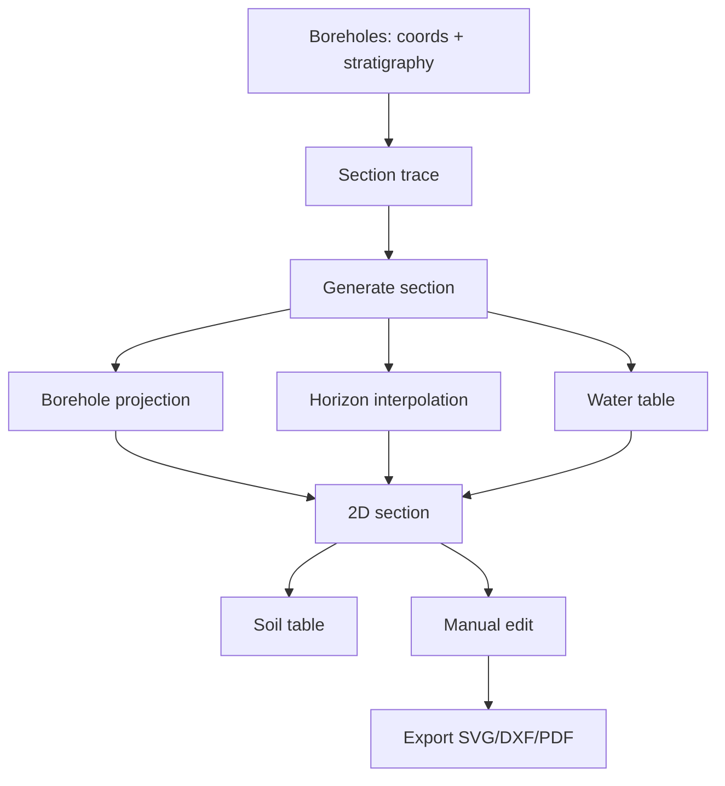

# Full workflow

Sequence of a real geological section, from input to report.

## Overall scheme

```
INPUT                          PROCESSING                OUTPUT
─────                          ──────────                ──────
1. Boreholes (coords +       4. Projection on trace      6. 2D section
   stratigraphy)             5. Horizon interpolation    7. Soil table
2. Section trace                                         8. Water table
   (polyline on map)                                     9. SVG / DXF / PDF
3. (optional) Water table
   per borehole
```

## 1. Boreholes

Create a borehole: **Add borehole** → coordinates (lat/lon or E/N) +
ground-level elevation + stratigraphy.

### Layer stratigraphy

| Field | Meaning |
|---|---|
| **Top depth** (m) | Top of layer below ground level |
| **Bottom depth** (m) | Base of layer |
| **Lithology** | Description (e.g. *"silty sand"*) |
| **Symbol** | Standard geological symbology (ISO 14689 / UNI 7029) |
| **Colour** | Auto from lithology, override possible |
| **Notes** | Free text (ISRM parameters, tests, …) |

### Water table

Water-table depth at the **time of drilling** (m below ground level).
Optional — without it, the section won't draw the water-table line.

### Core photos

For each borehole you can attach photos (core boxes, hand-drawn geological
profiles, etc.). Photos are included in the final PDF.

## 2. Section trace

Map → **Polyline** tool → click trace points (start and end usually;
intermediate points if the section "bends").

The trace renders with direction arrows + naming `A-A'`, `B-B'`, etc.

Typical length: 50-500 m for building sections, 0.5-5 km for microzonation.

## 3. Generate section

Click **Generate section**:

1. **Project** each borehole on the trace (compute progressive distance =
   position along the polyline).
2. **Lift** to ground-level elevations.
3. **Draw the vertical columns** for each borehole (with coloured layers).
4. **Interpolate stratigraphic horizons** between adjacent boreholes (linear
   by default).
5. **Draw the water table** as a blue line.
6. **Generate the soil table** below the section.

### Vertical exaggeration

A section typically has **vertical exaggeration** (e.g. 1:5, 1:10) so layers
are better visible on long traces. Configurable in **Section options**.

## 4. Edit the section

On the generated section you can:

- **Drag horizons** to correct the auto-interpolation.
- **Add annotations** (text, arrows, symbols).
- **Edit colours** or pattern of a soil.
- **Add/remove** boreholes on the fly.

## 5. Soil table

Below the section, a summary table of the represented soils:

| Symbol | Lithology | Depth from-to (m) | Notes |
|---|---|---|---|
| ░░ | Silty sand | 0.0 - 4.5 | Saturated below -2.5 m |
| ▓▓ | Stiff clay | 4.5 - 12.0 | OCR ≈ 1.5 |

## 6. Export

Toolbar → **Export**:

- **SVG** — open vector format (Inkscape, Illustrator, web).
- **DXF** — vector for desktop CAD (AutoCAD, BricsCAD, ...).
- **PDF** — paginated report: title, section, table, legend, photos.

---

## Recap diagram



---

*Helpful page? [Tell us](mailto:info@geostru.ai?subject=Help%20GeoSection%20NX%20-%20Workflow).*
