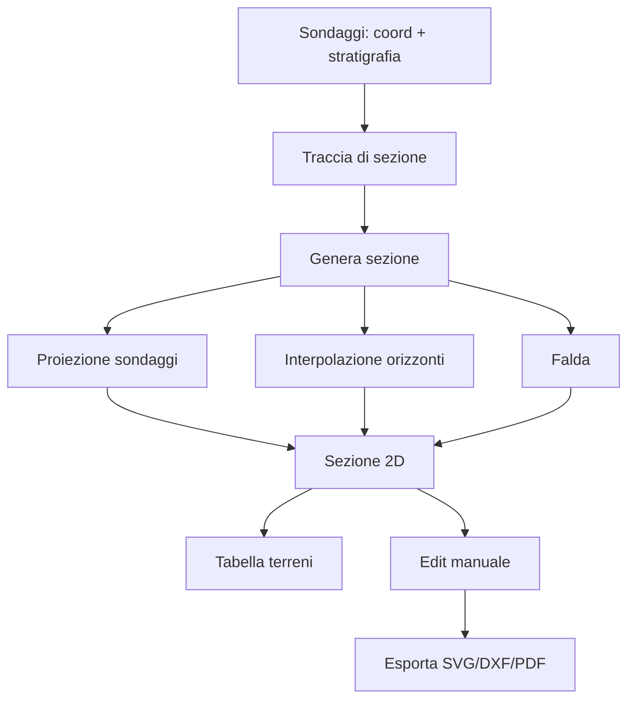

# Workflow completo

Sequenza di una sezione geologica reale, dall'input alla relazione.

## Schema generale

```
INPUT                          ELABORAZIONE              OUTPUT
─────                          ────────────              ──────
1. Sondaggi (coordinate +    4. Proiezione sulla traccia  6. Sezione 2D
   stratigrafia)             5. Interpolazione orizzonti  7. Tabella terreni
2. Traccia di sezione                                     8. Falda
   (polilinea su mappa)                                   9. SVG / DXF / PDF
3. (opzionale) Falda
   per sondaggio
```

## 1. Sondaggi

Crea un sondaggio: **Aggiungi sondaggio** → coordinate (lat/lon o E/N) +
quota piano campagna + stratigrafia.

### Stratigrafia per strato

| Campo | Significato |
|---|---|
| **Profondità top** (m) | Quota tetto dello strato dal piano campagna |
| **Profondità base** (m) | Quota letto |
| **Litologia** | Descrizione (es. *"sabbia limosa"*) |
| **Simbolo** | Simbologia geologica standard (ISO 14689 / UNI 7029) |
| **Colore** | Auto da litologia, override possibile |
| **Note** | Testo libero (parametri ISRM, prove, …) |

### Falda

Profondità della falda al **momento della perforazione** (m dal p.c.).
Opzionale — se manca, la sezione non disegna la linea della falda.

### Foto carote

Per ogni sondaggio puoi allegare foto (cassette di carote, profili
geologici disegnati a mano, ecc.). Le foto vengono incluse nel PDF
finale.

## 2. Traccia di sezione

Mappa → tool **Polilinea** → click sui punti della traccia (start e end di
solito; punti intermedi se la sezione "piega").

La traccia si renderizza con frecce di direzione + nomenclatura `A-A'`,
`B-B'`, ecc.

Lunghezza tipica: 50-500 m per sezioni di edificio, 0.5-5 km per
microzonazione.

## 3. Genera sezione

Click **Genera sezione**:

1. **Proietta** ogni sondaggio sulla traccia (calcola la distanza
   progressiva = posizione lungo la polilinea)
2. **Solleva** alle quote del piano campagna
3. **Disegna i profili** verticali per ogni sondaggio (con strati colorati)
4. **Interpola gli orizzonti** stratigrafici tra sondaggi vicini (lineare
   per default)
5. **Disegna la falda** come linea blu
6. **Genera la tabella terreni** sotto la sezione

### Esagerazione verticale

La sezione tipicamente ha **esagerazione verticale** (es. 1:5, 1:10) per
visualizzare meglio gli strati su lunghi tracciati. Configurabile in
**Opzioni sezione**.

## 4. Edit sezione

Sulla sezione generata puoi:

- **Trascinare gli orizzonti** per correggere l'interpolazione automatica
- **Aggiungere annotazioni** (testo, frecce, simboli)
- **Modificare colori** o pattern di un terreno
- **Aggiungere/togliere** sondaggi al volo

## 5. Tabella terreni

In basso alla sezione, tabella riassuntiva dei terreni rappresentati:

| Simbolo | Litologia | Profondità da-a (m) | Note |
|---|---|---|---|
| ░░ | Sabbia limosa | 0.0 - 4.5 | Saturo sotto -2.5 m |
| ▓▓ | Argilla compatta | 4.5 - 12.0 | OCR ≈ 1.5 |

## 6. Esporta

Toolbar → **Esporta**:

- **SVG** — formato vettoriale aperto (Inkscape, Illustrator, web)
- **DXF** — vettoriale per CAD desktop (AutoCAD, BricsCAD, ...)
- **PDF** — relazione impaginata: titolo, sezione, tabella, legenda, foto

---

## Schema riassuntivo



---

*Pagina utile? [Scrivici](mailto:info@geostru.ai?subject=Help%20GeoSection%20NX%20-%20Workflow).*
