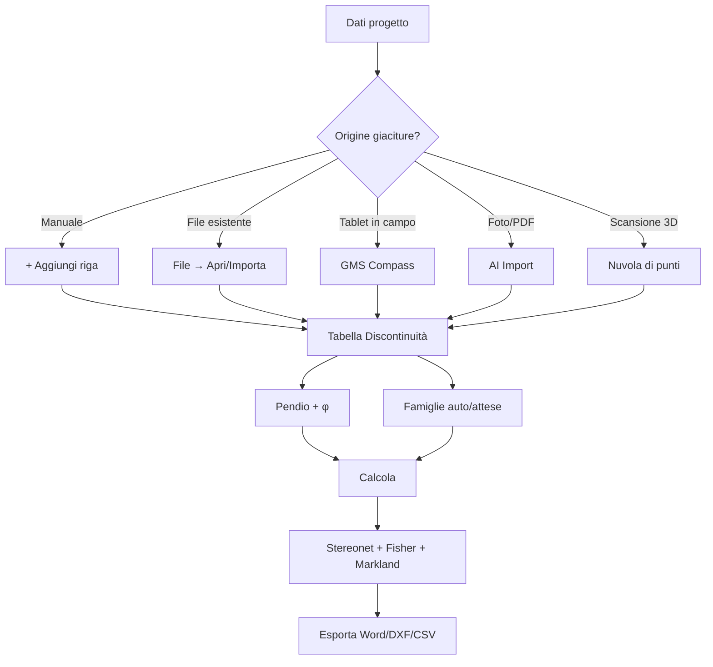

# Workflow completo

Sequenza dettagliata di un progetto reale, dal rilievo iniziale fino al report.

## Schema generale

```
INPUT                    ANALISI                       OUTPUT
─────                    ───────                       ──────
1. Dati progetto         5. Famiglie (k-means o        7. Stereonet 2D/3D
2. Discontinuità            attese)                    8. Statistica Fisher
3. Sito GPS              6. Calcola →                  9. Markland (KPI)
4. Pendio                   ↓                          10. Mappa GPS
                                                       11. Report Word
                                                       12. DXF + CSV
```

## 1. Dati progetto (sezione *Dati progetto*)

Compila almeno la **descrizione del rilievo** (es. *"Versante S, falesia di
Bianco — luglio 2026"*). Sito, operatore, data e note sono opzionali ma utili
per il report.

### Sito GPS — linea di scansione

Se hai i parametri della **linea di scansione** (lat iniziale, long iniziale,
azimut), la compilazione abilita il pulsante **"Geolocalizza giunti dalle
distanze"**: GMS calcola le coordinate WGS84 di ogni giacitura sapendo la
distanza progressiva lungo la linea.

!!! note
    Se non hai una linea di scansione, lascia i campi vuoti. Le coordinate per
    singolo giunto possono essere comunque inserite manualmente nella tabella
    (modalità *Dettagli completi*) o automaticamente da GMS Compass.

## 2. Discontinuità rilevate (tab *Discontinuità*)

Hai 4 modi per popolare la tabella:

### A. Inserimento manuale

**+ Aggiungi riga** → digita immersione β e inclinazione α. La famiglia
puoi assegnarla subito dal dropdown (se la conosci) o lasciarla vuota e
attivare il clustering automatico al passo 5.

### B. Apri file `.gms` esistente

**File → Apri…** → seleziona un `.gms` (formato nativo GMS NX, è un JSON).
Ripristina anche pendio, famiglie e tutti i metadati del progetto salvato.

### C. Importa file esterno

**File → Importa da…** → scegli il formato:

- **CSV eGEOCompass** — export dell'app Android (formato strutturato fisso)
- **CSV / TXT generico** — qualsiasi CSV con header `Imm,Incl,Note` o equivalente

Le giaciture si **aggiungono** a quelle già presenti (non sovrascrivono).

### D. Da Compass / AI / nuvola 3D

Vedi [GMS Compass](compass.md), [AI Import](ai-import.md), [Nuvola 3D](nuvola-3d.md).

## 3. Pendio (tab *Stabilità*)

Inserisci:

- **Dip pendio (α)** — inclinazione del versante in gradi (0–90)
- **Dip direction (β)** — azimut della direzione di immersione del pendio (0–360)
- **Angolo d'attrito (φ)** — gradi (tipicamente 25–35° per ammassi rocciosi)

Questi 3 valori sono **obbligatori per il test di Markland**. Senza, GMS
calcola comunque stereonet e statistica Fisher ma niente verifica cinematica.

## 4. Famiglie (tab *Famiglie*)

Due modalità che convivono:

### A. Suddivisione automatica (k-means sferico)

Imposta **Numero famiglie** (default 4) e attiva il toggle. Al **Calcola**,
GMS raggruppa i poli in N cluster sulla sfera unitaria, calcola il centroide
Fisher di ogni cluster e gli assegna automaticamente i giunti.

### B. Famiglie attese (centri pre-orientati)

Definisci a mano famiglie con dip/imm noti (es. da rilievi precedenti, da
letteratura). Premi **Aggiungi famiglia**. Per assegnare i giunti correnti
alla famiglia attesa più vicina, premi **Assegna giunti alle famiglie attese**:
ogni giunto è abbinato alla famiglia con angolo polo–centro minimo entro la
*tolleranza* impostata (default 30°). I giunti oltre tolleranza restano
disponibili per il k-means automatico.

[Approfondimento →](famiglie.md)

## 5. Calcola

Premi **Calcola** in toolbar (o `Esporta ▾ → Calcola` su tablet).

GMS:

1. Assegna i giunti alle famiglie (predefinite + auto)
2. Calcola **Fisher** per ogni famiglia: vettore medio, k, α₉₅, R̄
3. Calcola **Cylindrical Best Fit** (Vollmer 1990, Woodcock 1977)
4. Costruisce lo **stereonet** completo (poli, ciclografiche, coni)
5. Esegue il **test di Markland** se il pendio è configurato:
   - Planare (Hoek & Bray 1981)
   - Toppling (Goodman & Bray 1976)
   - Cuneo (intersezioni famiglia × famiglia)

## 6. Esamina i risultati

### Banner risultato

In cima ai risultati, un banner colorato:

- 🟢 **Versante stabile** (verde) — nessun cinematismo critico
- 🟡 **Attenzione: ribaltamenti rilevati** (giallo) — toppling presenti
- 🔴 **Versante a rischio** (rosso) — planari o cunei instabili

### KPI strip

5 contatori categorici:

| KPI | Significato | Colore se > 0 |
|---|---|---|
| Planari | Poli che immergono nello stesso quadrante del pendio con dip > φ | rosso |
| Toppling | Poli con dip alto e direzione opposta al pendio | giallo |
| Stabili | Tutti gli altri poli | verde sempre |
| Cunei instabili | Intersezioni famiglia × famiglia con plunge > φ e trend nel quadrante del pendio | rosso |
| Pendio · attrito | Riepilogo geometria pendio | grigio |

### Tab Stereo / Statistica / Mappa

- **Stereo** — stereonet 2D + 3D (Three.js), toolbar opzioni di proiezione, layer 3D, cunei
- **Statistica** — tabella famiglie con Fisher k, α₉₅, Woodcock K/C, stella di immersione, isodensità Denness, istogrammi modali
- **Mappa** — Leaflet, marker per ogni giacitura georeferenziata

## 7. Esporta

**Esporta ▾** in toolbar:

- **Report Word (.docx)** — relazione tecnica con figure, KPI e tabelle
- **Stereonet DXF** — file vettoriale per il CAD (AutoCAD, BricsCAD, …)
- **Giaciture CSV** — dati grezzi per analisi successive

[Approfondimento →](esportazioni.md)

## 8. Salva il progetto

**File → Salva con nome…** scarica un `.gms` (JSON con tutto: giunti, famiglie,
pendio, parametri, metadati). **File → Salva** memorizza una bozza nel browser
(autosave attivo durante l'editing).

---

## Schema riassuntivo



---

*Pagina utile? [Scrivici](mailto:info@geostru.ai?subject=Help%20GMS%20NX%20-%20Workflow).*
