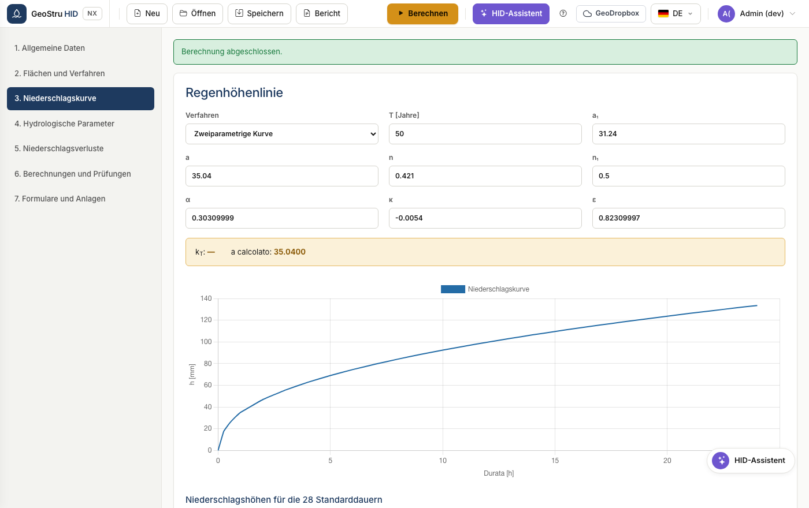

# Regenhöhenlinie

Die Kurve verknüpft die Niederschlagshöhe mit der Ereignisdauer für ein
gegebenes Wiederkehrintervall. Sie ist die Eingangsgröße jedes
Bemessungsverfahrens.

## Kurve mit zwei Parametern

Die klassische Form:

$$h(t) = a \cdot t^{n}$$

mit `h` in mm und `t` in Stunden. Geben Sie `a` (stündlicher Niederschlagsbeiwert)
und `n` (Skalenbeiwert) ein. Der Parameter **n₁** steuert die Dauern unter einer
Stunde, in denen die Kurve eine andere Neigung hat; der übliche Wert ist 0,5.

!!! example "Beispiel"
    Mit a = 46,49 und n = 0,364 beträgt der Niederschlag über 3 Stunden
    46,49 × 3^0,364 = 69,35 mm, jener über 24 Stunden 147,83 mm.

## GEV-Kurve

Die verallgemeinerte Extremwertverteilung leitet den Beiwert `a` aus dem
stündlichen Beiwert `a₁` und dem an das Wiederkehrintervall gebundenen
Wachstumsfaktor ab:

$$a = a_1 \cdot K_T$$

Geben Sie die Parameter α (alpha), k (kappa) und ε (epsilon) sowie das
Wiederkehrintervall ein. HID berechnet K_T und zeigt es neben der Kurve an.

!!! warning "Lombardia"
    Das regionale Regelwerk schreibt die GEV-Kurve vor. Die Parameter werden dem
    zuständigen regionalen Dienst entnommen. Bei der Kurve mit zwei Parametern
    blockiert HID die Berechnung.

## Tabelle und Diagramm

Nach der Berechnung enthält die Tabelle die Höhen für die 28 Standarddauern: 0;
0,25; 0,50; 0,75; 1 Stunde, danach stündlich bis 24. Das Diagramm darunter zeigt
dieselbe Reihe.

!!! note "Rundungen"
    Die Werte werden in doppelter Genauigkeit berechnet und nur für die Anzeige
    gerundet. Geringe Abweichungen in der letzten Stelle gegenüber anderer
    Software beruhen auf der Rundungsrichtung, nicht auf der Berechnung.

---

*Haben Sie auf dieser Seite einen Fehler gefunden? [Melden Sie ihn uns](mailto:info@geostru.ai?subject=Help%20HID%20NX).*
