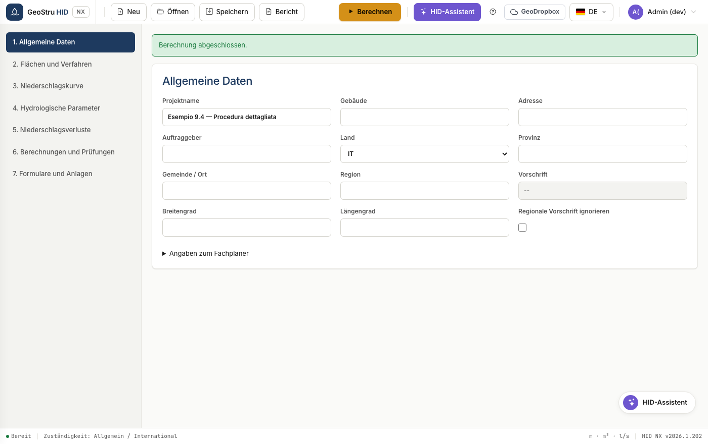
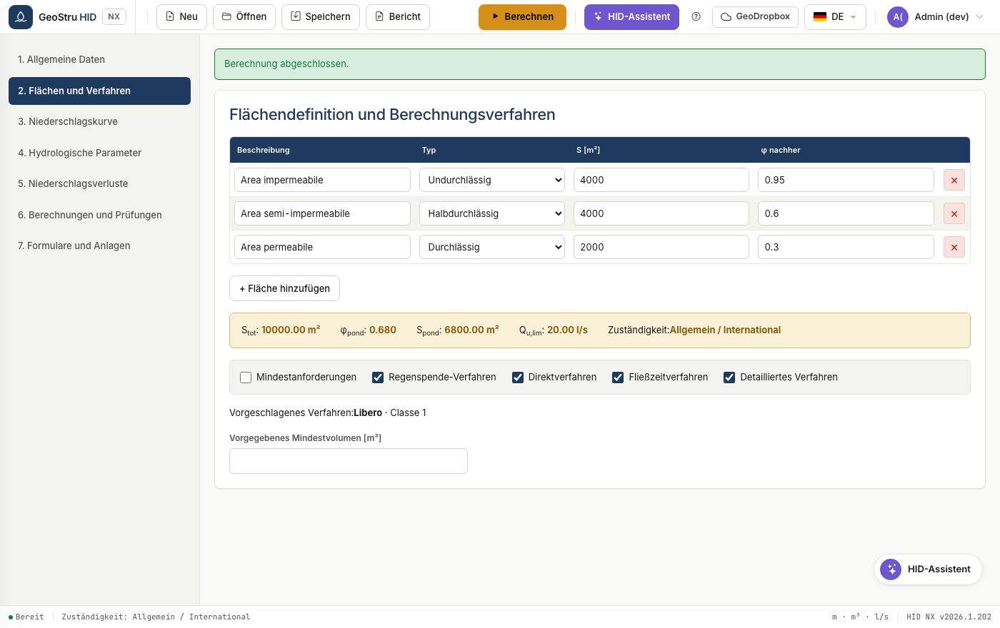
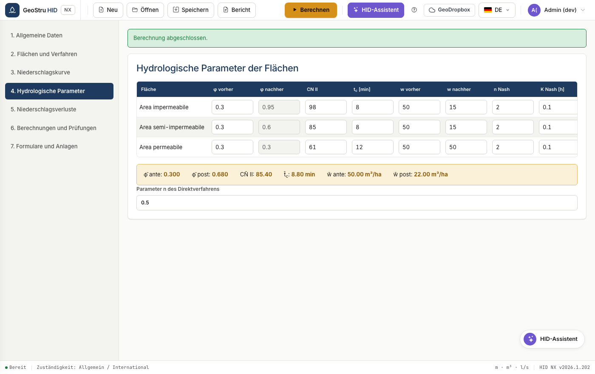
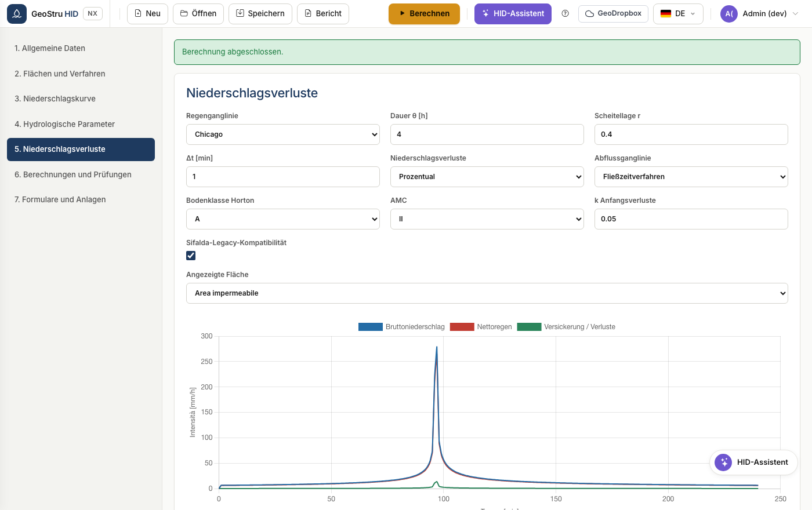
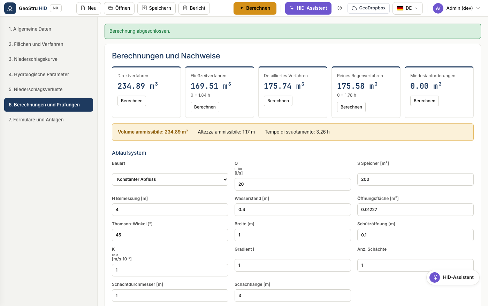
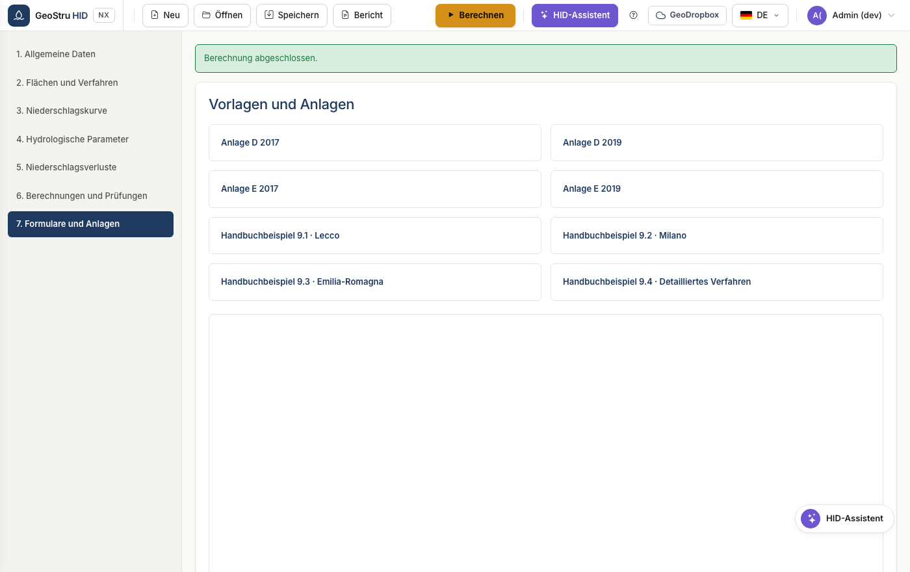

# Vollständiger Arbeitsablauf

Die Abfolge eines realen Projekts, von der Wahl des Landes bis zum
unterzeichneten Bericht. Die sieben Bereiche der App folgen dieser Reihenfolge:
Arbeiten Sie sie von oben nach unten durch.

## 1. Allgemeine Daten und Regelwerk

Geben Sie die Stammdaten des Projekts und des Fachplaners ein und wählen Sie dann
das **Land**.

Für Italien geben Sie Provinz und Gemeinde ein: HID leitet Region, Koordinaten
und anwendbares Regelwerk ab und zeigt nur die Felder, die dieses Regelwerk
verlangt. In Lombardia erscheinen das Menü der Regelwerksversion und der
Kritikalitätsbereich; in Emilia-Romagna und Marche erscheint der Block der
Flächen des regionalen Direktverfahrens.

Das Kontrollkästchen **Territoriales Regelwerk ignorieren** erzwingt auch in
Italien das generische Profil — nützlich, wenn die Behörde eigene Bedingungen
vorgibt.

!!! warning "Achtung"
    In Lombardia ist die GEV-Kurve verpflichtend und das Verfahren SCS-CN ist
    nicht zulässig. Wenn Sie dies anders einstellen, blockiert HID die Berechnung
    und erläutert den Grund.

## 2. Flächen und Verfahren

Definieren Sie die Flächen nach der Maßnahme: Beschreibung, Typ, Fläche und
Abflussbeiwert φ.

HID berechnet die aggregierten Werte und zeigt sie im Band an: Gesamtfläche,
flächengewichtetes φ, befestigte Vergleichsfläche, Drosselabfluss und angewandte
Zuständigkeit.

Siehe [Flächen und Verfahren](aree-metodi.md) für die Einzelheiten der
verfügbaren Verfahren.

## 3. Regenhöhenlinie

Wählen Sie zwischen der Kurve mit zwei Parametern und der GEV, geben Sie die
Beiwerte und das Wiederkehrintervall ein. Tabelle und Diagramm zeigen die
Niederschlagshöhen für die 28 Standarddauern von 0 bis 24 Stunden.

Siehe [Regenhöhenlinie](curva-pluviometrica.md).

## 4. Hydrologische Parameter

Definieren Sie für jede Fläche Curve Number, Fließzeit, spezifische
Rückhaltevolumina vor und nach der Maßnahme sowie die Nash-Parameter, falls Sie
dieses Modell verwenden.

Die Tabelle der Mittelwerte am Ende enthält die gewichteten Größen, die in die
synthetischen Verfahren eingehen.

## 5. Niederschlagsverluste

Wählen Sie das Berechnungsintervall und das Verlustmodell: Prozentsatz, Horton
oder SCS-CN. Die Tabelle zeigt Gesamtniederschlag und effektiven Niederschlag
Minute für Minute.

Siehe [Bemessung](dimensionamento.md) dazu, wie Regenganglinie und
Niederschlagsverluste in das detaillierte Verfahren eingehen.

## 6. Berechnungen und Nachweise

Definieren Sie die Eigenschaften des Rückhalteraums und das Drosselorgan und
berechnen Sie anschließend.

HID führt alle ausgewählten Verfahren aus und übernimmt das Maximum als
zulässiges Volumen. Die Nachweise vergleichen Nutzhöhe, Nutzvolumen und
Entleerungszeit mit den Planungswerten.

Siehe [Ableitungssystem](scarico.md) für die acht verfügbaren Organe.

## 7. Vorlagen und Anlagen

Fasst die Berichtsvorlagen und die herunterladbaren normativen Anlagen zusammen.

## 8. Speichern und Bericht

Speichern Sie das Projekt im Format `.hid` oder erzeugen Sie den Bericht über das
Menü **Bericht**. Siehe [Dateiformate](formati.md).

---

*Haben Sie auf dieser Seite einen Fehler gefunden? [Melden Sie ihn uns](mailto:info@geostru.ai?subject=Help%20HID%20NX).*
