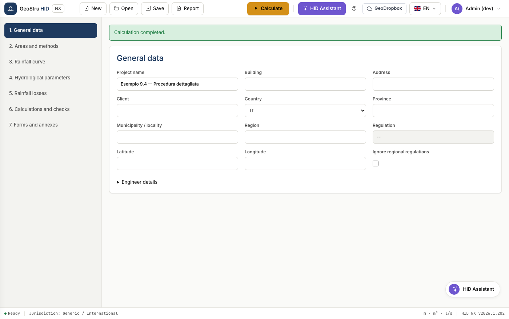

# HID NX — Hydraulic invariance

HID sizes attenuation systems for **hydraulic and hydrological invariance**: it
verifies that a land-transformation project does not increase the flow discharged
into the receiving water body compared with the previous condition.

The application runs the calculation methods you select side by side and adopts
the **highest result** as the storage volume, so the check stays valid whichever
method the reviewing authority asks for.

[**Open the app**](https://nx.geostru.ai/hid/){ .md-button .md-button--primary }

## Who it is for

Anyone designing stormwater attenuation works: hydraulic engineers, geologists
and designers who must attach a hydraulic invariance report to a building permit,
an implementation plan or a discharge authorisation.

## What it calculates

| Area | Content |
|---|---|
| Rainfall | GEV or two-parameter rainfall depth-duration-frequency (DDF) curve |
| Hyetographs | Chicago, uniform, Sifalda, triangular |
| Losses | Runoff coefficient, Horton, SCS-CN |
| Hydrographs | Time-of-concentration method and Nash |
| Sizing | Minimum requirements, rain-only, direct method, time-of-concentration method, detailed procedure |
| Discharge | Eight devices, from submerged orifices to infiltration wells |
| Checks | Effective depth, effective volume, emptying time |

## Regulations

HID applies **regulatory profiles** selected by country and region. The profile
determines which methods are allowed, which data are required, and whether the
discharge limit and the minimum volume are imposed by the regulation or chosen by
you.

- **Lombardia** — R.R. 7/2017, 2019 amendment, R.R. 3/2025: GEV curve mandatory,
  SCS-CN excluded, criticality and discharge limit derived from the municipality.
- **Emilia-Romagna and Marche** — regional direct method with n = 0.48.
- **Any other country or region** — generic profile: methods freely combinable,
  discharge limit and minimum volume chosen by you.

!!! note "Outside Italy"
    Where no municipality database exists, region and coordinates are entered
    manually. This is not an error: it is the intended way of working in
    countries not yet covered by a dedicated profile.

## Where to start

- [Quick start](quickstart.md) — your first sizing in five minutes
- [Full workflow](workflow.md) — a real project from start to report
- [Glossary](glossario.md) — the domain terms, with the symbols used in the app

---

*Found an error on this page? [Let us know](mailto:info@geostru.ai?subject=Help%20HID%20NX).*
