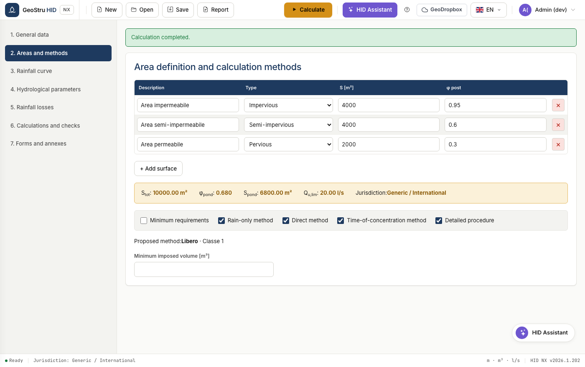
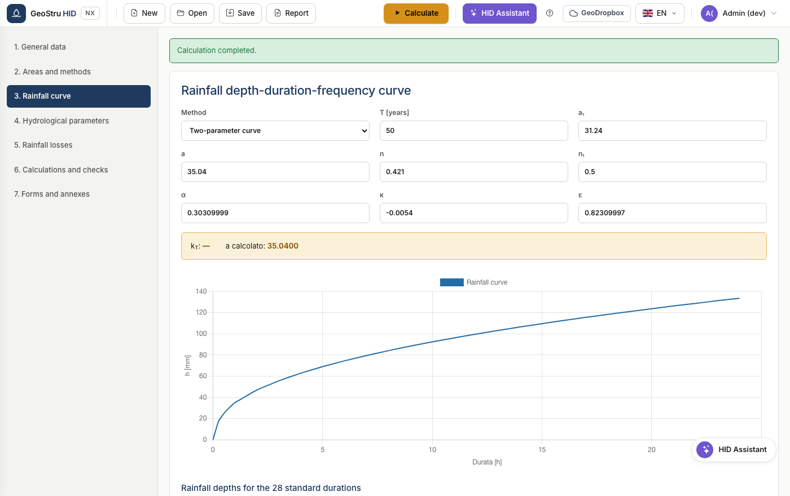

# Quick start

Five minutes from opening the app to a verified storage volume. We will use the
preloaded example from the manual, so the numbers you see are comparable.

## 1. Open the app and load the example

Go to [nx.geostru.ai/hid](https://nx.geostru.ai/hid/). At startup you already
have **example 9.4 — Detailed procedure** loaded: three surfaces for a total of
10,000 m².

All commands are in the top bar: **New**, **Open**, **Save**, **Report**, and on
the right the **Calculate** button.

## 2. Check the surfaces

Open section **2. Areas and methods**. Each row is a surface with its area and
its runoff coefficient φ.

The coloured band shows the aggregate values: total area, weighted φ, weighted
(impervious-equivalent) area and discharge limit. Below it you choose the methods
to compare.

!!! tip "Tip"
    Keep several methods active. HID calculates them all and adopts the highest:
    it is the most conservative condition and it saves you from redoing the work
    if the reviewing authority asks for a different method.

## 3. Check the rainfall curve

Section **3. Rainfall curve**. With the two-parameter curve you enter `a` and
`n`; with the GEV you enter the distribution parameters and the return period.

## 4. Calculate

Press **Calculate** at the top right. Go to section **6. Calculations and
checks**.

Each method has its own card with the calculated volume. The band below shows the
adopted **allowable volume**, the corresponding depth and the emptying time.

For example 9.4 you should read: direct method 234.89 m³, time-of-concentration
method 169.51 m³, detailed procedure 175.74 m³, rain-only method 175.58 m³. The
adopted volume is **234.89 m³**.

## 5. Produce the report

Open the **Report** menu in the bar and choose the format: Word, PDF or Word 97.
The document comes out in the language selected in the app.

---

*Found an error on this page? [Let us know](mailto:info@geostru.ai?subject=Help%20HID%20NX).*
