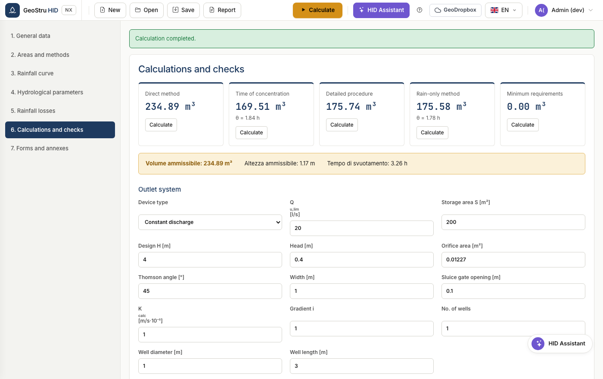

# Discharge system

The discharge device determines the outflow from the storage facility and
therefore the attenuation. HID implements eight of them.

## The available devices

| Device | Parameters | Law |
|---|---|---|
| Constant flow | Qu,lim | Q constant, independent of the head |
| Thomson weir | angle θ | Q ∝ tan(θ/2) · h5/2 |
| Bazin weir | width | Q ∝ L · h3/2 |
| Crump weir | width | Q ∝ L · h3/2 |
| Circular submerged orifice | area A | Q = 0.6 · A · √(2gh) |
| Sluice gate | opening, width | Q = 0.6 · a · L · √(2gh) |
| Constant infiltration | K, gradient | Q ∝ K · i · area |
| Infiltration well | number, diameter, length | function of the head and of the infiltrating area |

## How the discharge limit is chosen

This is where mistakes are most frequent, so HID follows a single order:

1. **If the regulation imposes it**, that value applies. In Lombardia it is
   derived from area, runoff coefficient and hydraulic criticality zone.
2. **Otherwise you choose it.** But the "constant outflow" field only makes sense
   for a constant-flow discharge: for a submerged orifice, a weir or a sluice
   gate, what applies is the **flow of the device at the design head**.

!!! warning "Warning"
    Point 2 is why, when you change the discharge type, the required volume can
    change considerably: the reference flow is no longer the one you typed in the
    field, but the one the device actually discharges.

## Design head

For devices that depend on the head, the value H you enter is the maximum
effective water head. The corresponding flow is shown below the block as **flow
at the design head**.

---

*Found an error on this page? [Let us know](mailto:info@geostru.ai?subject=Help%20HID%20NX).*
