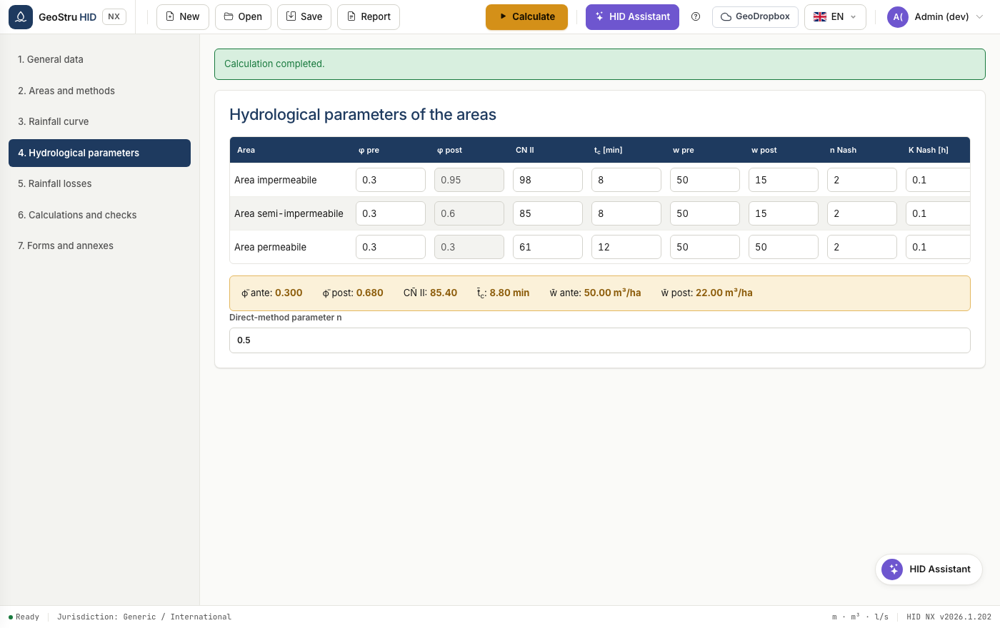
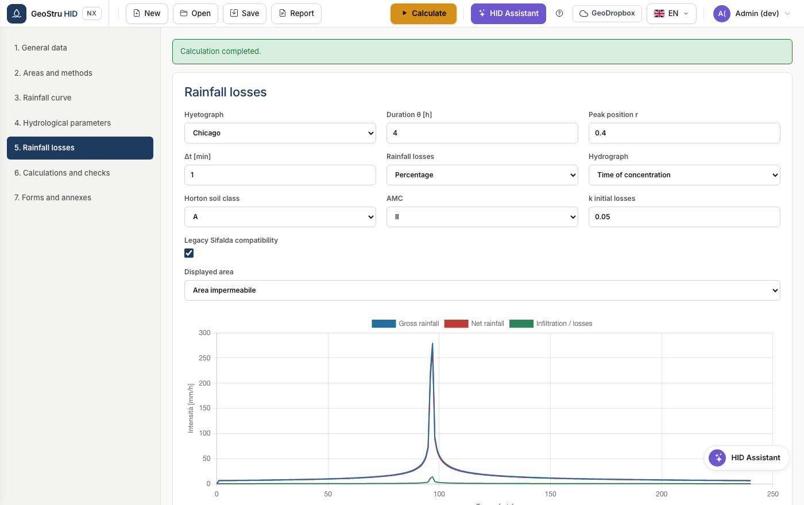
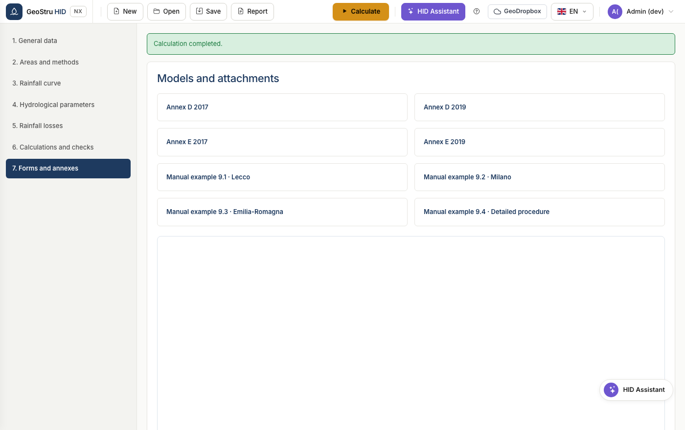

# Full workflow

The sequence of a real project, from choosing the country to the signed report.
The seven sections of the app follow this order: work through them top to bottom.

## 1. General data and regulations

Enter the project and professional details, then choose the **country**.

For Italy, type the province and municipality: HID derives the region,
coordinates and applicable regulation, and shows only the fields that regulation
requires. In Lombardia the regulation-version menu and the hydraulic criticality
zone appear; in Emilia-Romagna and Marche the surfaces block of the regional
direct method appears.

The **Ignore territorial regulation** checkbox forces the generic profile even in
Italy, useful when the authority imposes its own conditions.

!!! warning "Warning"
    In Lombardia the GEV curve is mandatory and the SCS-CN method is not allowed.
    If you set them otherwise, HID blocks the calculation and explains why.

## 2. Areas and methods

Define the post-development surfaces: description, type, area and runoff
coefficient φ.

HID calculates the aggregate values and shows them in the band: total area,
weighted φ, weighted (impervious-equivalent) area, discharge limit and the
jurisdiction applied.

See [Areas and methods](aree-metodi.md) for details on the available methods.

## 3. Rainfall depth-duration-frequency curve

Choose between the two-parameter curve and the GEV, enter the coefficients and
the return period. The table and the chart show the rainfall depths at the 28
standard durations, from 0 to 24 hours.

See [Rainfall curve](curva-pluviometrica.md).

## 4. Hydrological parameters

For each surface define the curve number, the time of concentration, the specific
pre- and post-development storage volumes, and the Nash parameters if you use
that model.

The table of mean values at the bottom shows the weighted quantities that feed
the synthetic methods.

## 5. Rainfall losses

Choose the calculation interval and the loss model: percentage, Horton or SCS-CN.
The table shows gross and net rainfall minute by minute.

See [Sizing](dimensionamento.md) for how the hyetograph and the losses feed into
the detailed procedure.

## 6. Calculations and checks

Define the storage facility characteristics and the discharge device, then
calculate.

HID runs all the selected methods and adopts the highest as the allowable volume.
The checks compare effective depth, effective volume and emptying time with the
design values.

See [Discharge system](scarico.md) for the eight available devices.

## 7. Templates and attachments

Collects the report templates and the downloadable regulatory attachments.

## 8. Saving and reporting

Save the project in `.hid` format, or produce the report from the **Report**
menu. See [File formats](formati.md).

---

*Found an error on this page? [Let us know](mailto:info@geostru.ai?subject=Help%20HID%20NX).*
