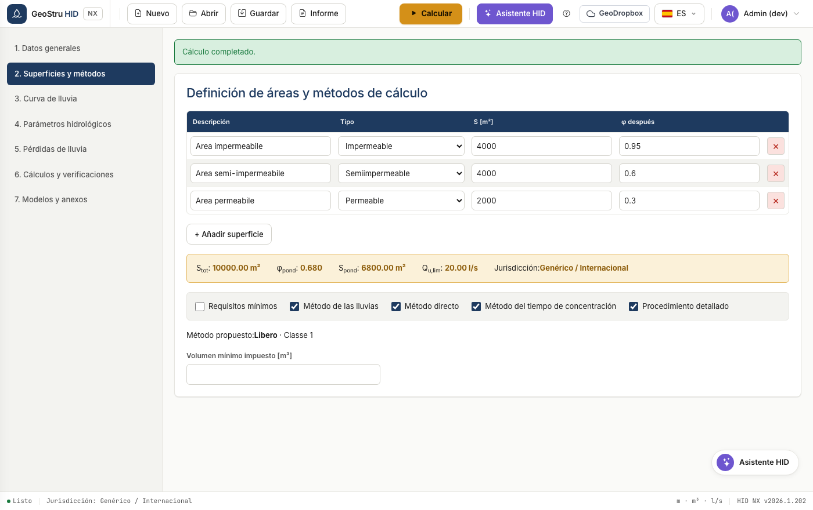

# Áreas y métodos de cálculo

## Superficies de captación

Cada fila de la tabla es una superficie homogénea por uso y permeabilidad. Hacen
falta descripción, tipo, área en m² y coeficiente de escorrentía φ después de la
actuación.

El tipo de área (impermeable, semi-impermeable, permeable) es una etiqueta
descriptiva que sugiere el orden de magnitud de φ; el valor que entra en el
cálculo es siempre el que escribes tú.

HID calcula el **coeficiente de escorrentía ponderado**:

$$\varphi_{pond} = \frac{\sum \varphi_i \cdot S_i}{\sum S_i}$$

y la **superficie impermeable equivalente** $S_{pond} = S_{tot} \cdot
\varphi_{pond}$.

## Los métodos de dimensionamiento

HID distingue los métodos **universales**, válidos en todas partes, de los
**normativos**, que existen solo donde la normativa los prescribe.

### Requisitos mínimos

Volumen específico por hectárea impuesto por la normativa en función de la zona
de criticidad. En Lombardia vale 800, 500 o 400 m³/ha según la zona A, B o C y la
versión reglamentaria. Donde la normativa no lo prescribe, el volumen mínimo lo
impones tú.

### Método de las lluvias

Equilibra el volumen entrante con el vertido a caudal constante, buscando la
duración que maximiza la retención. Es el método más difundido para las
comprobaciones rápidas.

!!! note "Duraciones inferiores a la hora"
    Cuando la duración crítica baja por debajo de la hora, HID usa el exponente
    n₁ de la curva, tal como está previsto. No redondea la duración a una hora:
    hacerlo subestima el volumen, y es un error que hemos corregido validando la
    app contra la versión anterior.

### Método del tiempo de concentración

Introduce el tiempo de concentración de la cuenca, por lo que tiene en cuenta la
forma del hidrograma. Devuelve duración crítica y volumen.

### Método directo

Compara los volúmenes de retención específicos antes y después de la actuación a
través del cociente de los coeficientes de escorrentía. En Emilia-Romagna y
Marche la normativa prescribe una variante con coeficientes fijos, que HID expone
como método separado, **Método directo regional**, visible solo en esas regiones.

### Procedimiento detallado

Es la simulación completa: hietograma de proyecto, pérdidas hidrológicas,
hidrograma de crecida y laminación del depósito de retención paso a paso. Es el
método más costoso y el más defendible.

## Cómo se elige el volumen

HID calcula todos los métodos seleccionados y adopta como volumen admisible el
**máximo** de los resultados. El método propuesto por la normativa se indica
debajo de las casillas, pero no limita qué métodos puedes calcular.

---

*¿Has encontrado un error en esta página? [Comunícanoslo](mailto:info@geostru.ai?subject=Help%20HID%20NX).*
