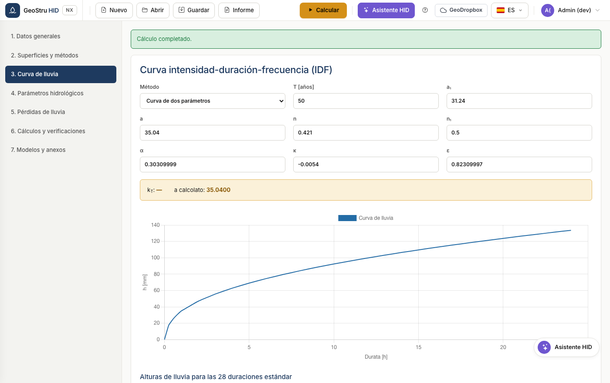

# Guía rápida

Cinco minutos desde la apertura de la app hasta el volumen de retención
verificado. Usaremos el ejemplo precargado del manual, así los números que ves
son comparables.

## 1. Abre la app y carga el ejemplo

Ve a [nx.geostru.ai/hid](https://nx.geostru.ai/hid/). Al arrancar encuentras ya
cargado el **ejemplo 9.4 — Procedimiento detallado**: tres superficies para
10.000 m² en total.

Los comandos están todos en la barra superior: **Nuevo**, **Abrir**, **Guardar**,
**Informe**, y a la derecha el botón **Calcular**.

## 2. Revisa las superficies

Abre la sección **2. Áreas y métodos**. Cada fila es una superficie con su área y
su coeficiente de escorrentía φ.

La franja de color muestra los valores agregados: superficie total, φ ponderado,
superficie impermeable equivalente y caudal máximo de vertido. Debajo eliges los
métodos a comparar.

!!! tip "Sugerencia"
    Deja activos varios métodos. HID los calcula todos y adopta el máximo: es la
    condición más conservadora y te evita rehacer el trabajo si quien tramita el
    expediente pide un método distinto.

## 3. Verifica la curva de lluvia

Sección **3. Curva IDF**. Con la curva de dos parámetros introduces `a` y `n`;
con la GEV introduces los parámetros de la distribución y el periodo de retorno.

## 4. Calcula

Pulsa **Calcular** arriba a la derecha. Ve a la sección **6. Cálculos y
verificaciones**.

Cada método tiene su ficha con el volumen calculado. La franja inferior muestra
el **volumen admisible** adoptado, la altura correspondiente y el tiempo de
vaciado.

Para el ejemplo 9.4 debes leer: método directo 234,89 m³, tiempo de concentración
169,51 m³, procedimiento detallado 175,74 m³, método de las lluvias 175,58 m³. El
volumen adoptado es **234,89 m³**.

## 5. Genera el informe

Abre el menú **Informe** en la barra y elige el formato: Word, PDF o Word 97. El
documento sale en el idioma seleccionado en la app.

---

*¿Has encontrado un error en esta página? [Comunícanoslo](mailto:info@geostru.ai?subject=Help%20HID%20NX).*
