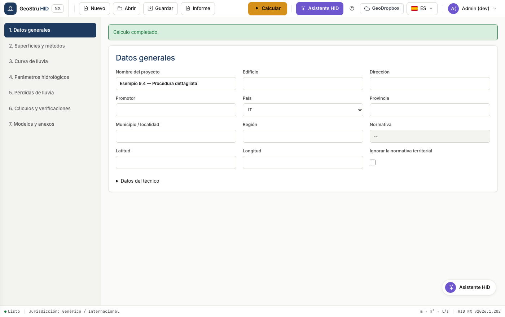
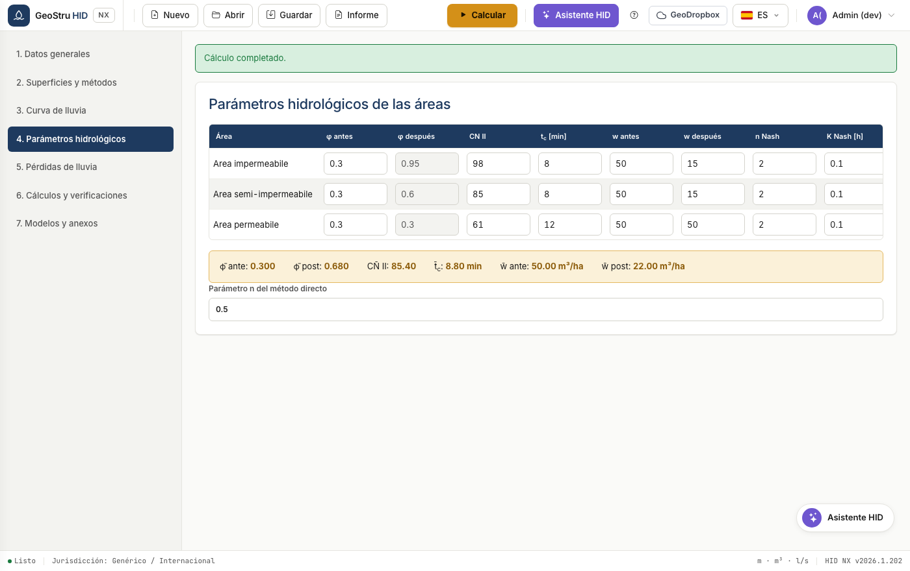
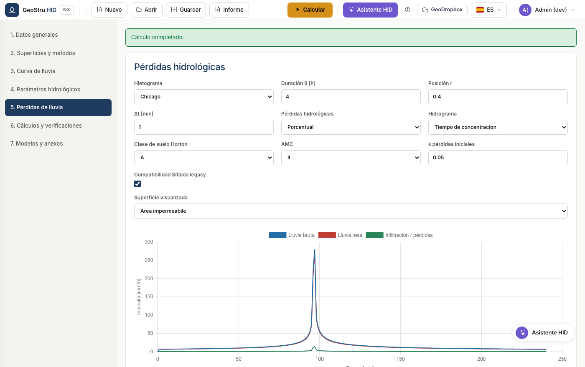
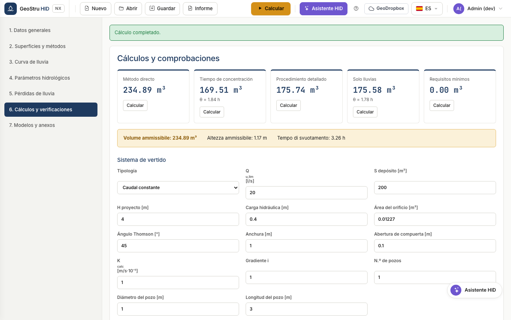
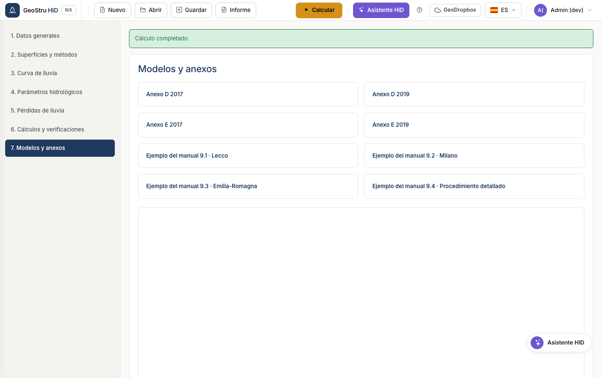

# Flujo de trabajo completo

La secuencia de un proyecto real, desde la elección del país hasta el informe
firmado. Las siete secciones de la app siguen este orden: recórrelas de arriba
abajo.

## 1. Datos generales y normativa

Introduce los datos del proyecto y del profesional, luego elige el **país**.

Para Italia escribe provincia y municipio: HID deduce región, coordenadas y
normativa aplicable, y muestra solo los campos que esa normativa exige. En
Lombardia aparecen el menú de la versión reglamentaria y la zona de criticidad;
en Emilia-Romagna y Marche aparece el bloque de las superficies del método
directo regional.

La casilla **Ignorar la normativa territorial** fuerza el perfil genérico incluso
en Italia, útil cuando el organismo impone condiciones propias.

!!! warning "Atención"
    En Lombardia la curva GEV es obligatoria y el método SCS-CN no está admitido.
    Si los configuras de otra forma, HID bloquea el cálculo y explica por qué.

## 2. Áreas y métodos

Define las superficies después de la actuación: descripción, tipo, área y
coeficiente de escorrentía φ.

HID calcula los valores agregados y los muestra en la franja: superficie total,
φ ponderado, superficie impermeable equivalente, caudal máximo de vertido y
jurisdicción aplicada.

Consulta [Áreas y métodos](aree-metodi.md) para el detalle de los métodos
disponibles.

## 3. Curva intensidad-duración-frecuencia

Elige entre curva de dos parámetros y GEV, introduce los coeficientes y el
periodo de retorno. La tabla y el gráfico muestran las alturas de lluvia en las
28 duraciones estándar, de 0 a 24 horas.

Consulta [Curva IDF](curva-pluviometrica.md).

## 4. Parámetros hidrológicos

Para cada superficie define curve number, tiempo de concentración, volúmenes de
retención específicos antes y después de la actuación, y los parámetros Nash si
usas ese modelo.

La tabla de los valores medios al final muestra las magnitudes ponderadas que
entran en los métodos sintéticos.

## 5. Pérdidas hidrológicas

Elige el intervalo de cálculo y el modelo de pérdidas: porcentual, Horton o
SCS-CN. La tabla muestra lluvia bruta y lluvia neta minuto a minuto.

Consulta [Dimensionamiento](dimensionamento.md) para ver cómo el hietograma y las
pérdidas entran en el procedimiento detallado.

## 6. Cálculos y verificaciones

Define las características del depósito de retención y el órgano de vertido,
luego calcula.

HID ejecuta todos los métodos seleccionados y adopta el máximo como volumen
admisible. Las verificaciones comparan altura útil, volumen útil y tiempo de
vaciado con los valores de proyecto.

Consulta [Sistema de vertido](scarico.md) para los ocho órganos disponibles.

## 7. Plantillas y anexos

Recoge las plantillas de informe y los anexos normativos descargables.

## 8. Guardado e informe

Guarda el proyecto en formato `.hid`, o genera el informe desde el menú
**Informe**. Consulta [Formatos de archivo](formati.md).

---

*¿Has encontrado un error en esta página? [Comunícanoslo](mailto:info@geostru.ai?subject=Help%20HID%20NX).*
