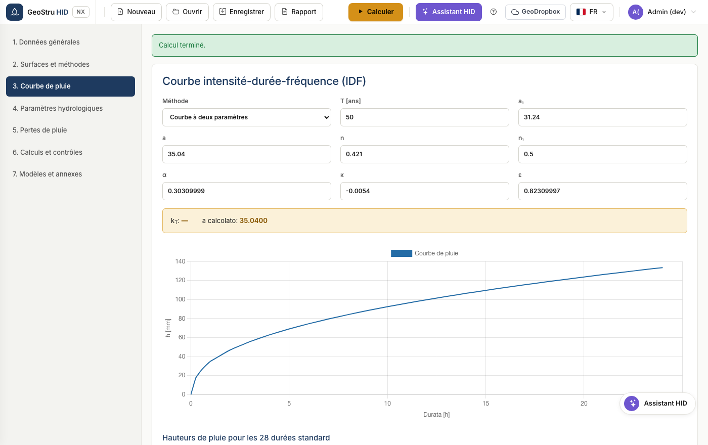

# Courbe intensité-durée-fréquence

La courbe relie la hauteur de pluie à la durée de l'événement pour une période de
retour donnée. C'est la donnée d'entrée de toute méthode de dimensionnement.

## Courbe à deux paramètres

La forme classique :

$$h(t) = a \cdot t^{n}$$

avec `h` en mm et `t` en heures. Saisissez `a` (coefficient pluviométrique
horaire) et `n` (coefficient d'échelle). Le paramètre **n₁** régit les durées
inférieures à l'heure, où la courbe présente une pente différente ; la valeur
usuelle est 0,5.

!!! example "Exemple"
    Avec a = 46,49 et n = 0,364, la pluie de 3 heures vaut
    46,49 × 3^0,364 = 69,35 mm ; celle de 24 heures vaut 147,83 mm.

## Courbe GEV

La distribution généralisée des valeurs extrêmes déduit le coefficient `a` du
coefficient horaire `a₁` et du facteur de croissance lié à la période de retour :

$$a = a_1 \cdot K_T$$

Saisissez les paramètres α (alpha), k (kappa) et ε (epsilon) ainsi que la période
de retour. HID calcule K_T et l'affiche à côté de la courbe.

!!! warning "Lombardia"
    Le règlement régional impose la courbe GEV. Les paramètres se déduisent du
    service régional de référence. Avec la courbe à deux paramètres, HID bloque
    le calcul.

## Tableau et graphique

Après le calcul, le tableau reprend les hauteurs pour les 28 durées standard : 0,
0,25, 0,50, 0,75, 1 heure, puis chaque heure jusqu'à 24. Le graphique en dessous
montre la même série.

!!! note "Arrondis"
    Les valeurs sont calculées en double précision et arrondies uniquement pour
    l'affichage. De petits écarts sur le dernier chiffre par rapport à d'autres
    logiciels tiennent au sens de l'arrondi, non au calcul.

---

*Vous avez trouvé une erreur sur cette page ? [Signalez-la-nous](mailto:info@geostru.ai?subject=Help%20HID%20NX).*
