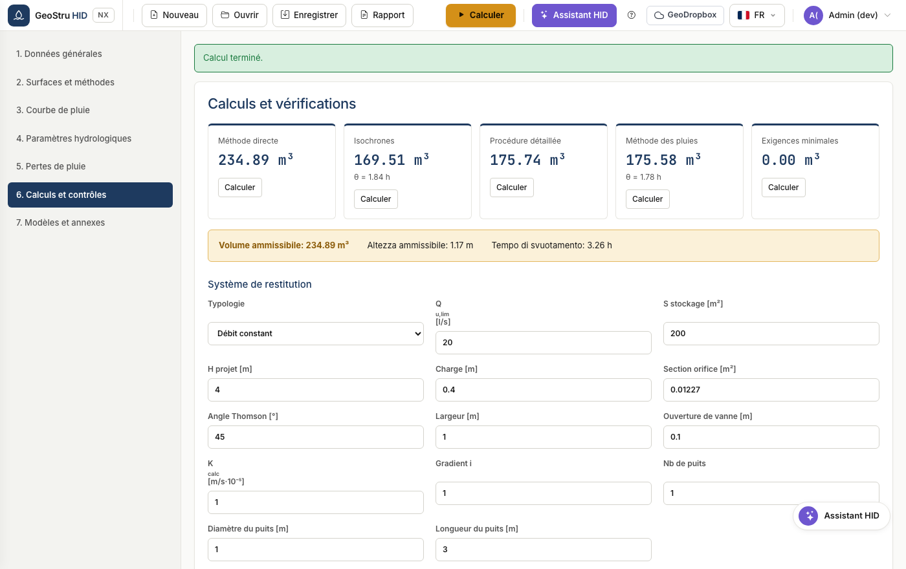

# Système de rejet

L'organe de rejet détermine le débit sortant de l'ouvrage de rétention et donc le
laminage. HID en met en œuvre huit.

## Les organes disponibles

| Organe | Paramètres | Loi |
|---|---|---|
| Débit constant | Qu,lim | Q constant, indépendant de la charge |
| Déversoir Thomson | angle θ | Q ∝ tan(θ/2) · h5/2 |
| Déversoir Bazin | largeur | Q ∝ L · h3/2 |
| Déversoir Crump | largeur | Q ∝ L · h3/2 |
| Orifice en charge circulaire | aire A | Q = 0,6 · A · √(2gh) |
| Vanne | ouverture, largeur | Q = 0,6 · a · L · √(2gh) |
| Infiltration constante | K, gradient | Q ∝ K · i · surface |
| Puits d'infiltration | nombre, diamètre, longueur | fonction de la charge et de la surface d'infiltration |

## Comment le débit de fuite est déterminé

C'est le point où l'on se trompe le plus souvent, aussi HID suit-il un ordre
unique :

1. **Si la réglementation l'impose**, c'est cette valeur qui s'applique. En
   Lombardia, elle se déduit de l'aire, du coefficient de ruissellement et de la
   zone de criticité.
2. **Sinon, c'est vous qui la choisissez.** Mais le champ « débit constant
   sortant » n'a de sens que pour un rejet à débit constant : pour un orifice en
   charge, un déversoir ou une vanne, c'est le **débit de l'organe sous la charge
   de projet** qui fait foi.

!!! warning "Attention"
    Le point 2 explique pourquoi, en changeant de type de rejet, le volume requis
    peut varier sensiblement : le débit de référence n'est plus celui que vous
    avez saisi dans le champ, mais celui que l'organe évacue réellement.

## Charge de projet

Pour les organes qui dépendent de la charge, la valeur H que vous saisissez est
la charge hydraulique utile maximale. Le débit correspondant est affiché sous le
bloc comme **débit sous la charge de projet**.

---

*Vous avez trouvé une erreur sur cette page ? [Signalez-la-nous](mailto:info@geostru.ai?subject=Help%20HID%20NX).*
