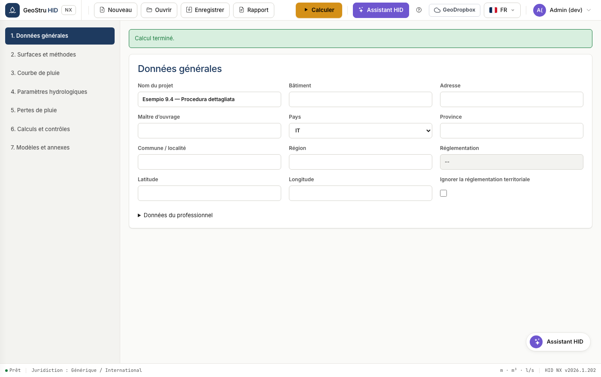
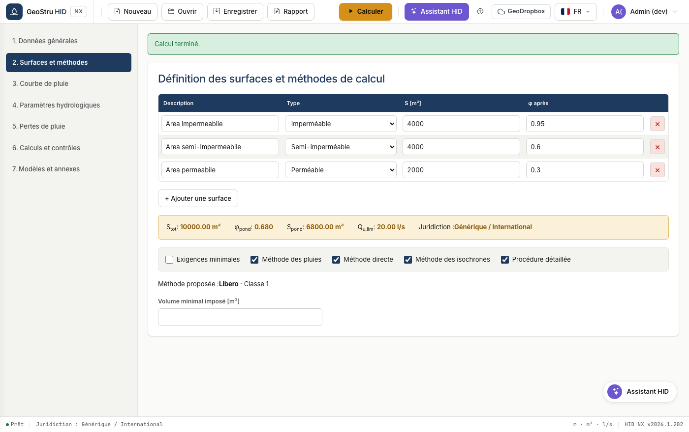
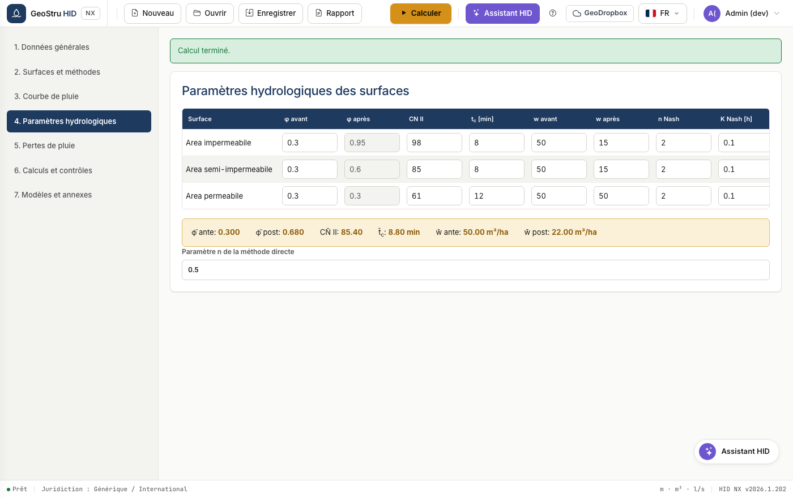
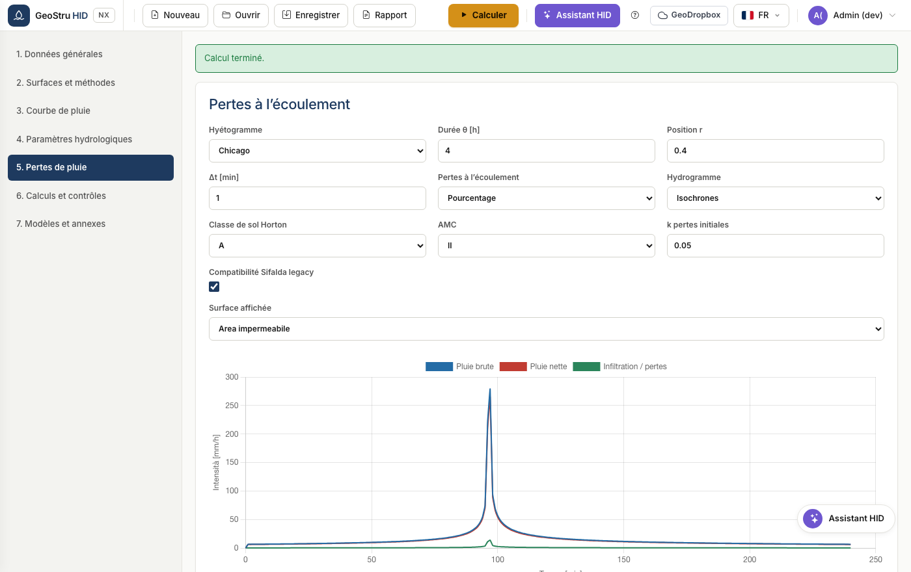
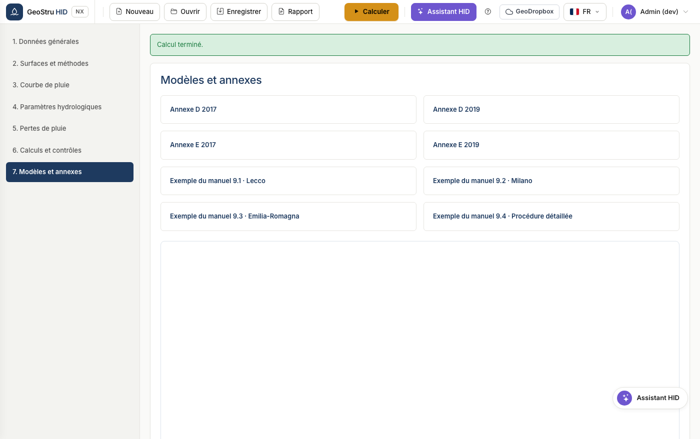

# Flux de travail complet

La séquence d'un projet réel, du choix du pays à la note de calcul signée. Les
sept sections de l'application suivent cet ordre : parcourez-les de haut en bas.

## 1. Données générales et réglementation

Saisissez les informations du projet et du professionnel, puis choisissez le
**pays**.

Pour l'Italie, saisissez la province et la commune : HID en déduit la région, les
coordonnées et la réglementation applicable, et n'affiche que les champs exigés
par cette réglementation. En Lombardia apparaissent le menu de la version
réglementaire et la zone de criticité ; en Emilia-Romagna et Marche apparaît le
bloc des surfaces de la méthode directe régionale.

La case **Ignorer la réglementation territoriale** force le profil générique même
en Italie, ce qui est utile lorsque l'autorité impose ses propres conditions.

!!! warning "Attention"
    En Lombardia, la courbe GEV est obligatoire et la méthode SCS-CN n'est pas
    admise. Si vous les paramétrez autrement, HID bloque le calcul et en explique
    la raison.

## 2. Surfaces et méthodes

Définissez les surfaces après aménagement : description, type, aire et
coefficient de ruissellement φ.

HID calcule les valeurs agrégées et les affiche dans le bandeau : surface totale,
φ pondéré, surface active équivalente, débit de fuite et profil réglementaire
appliqué.

Voir [Surfaces et méthodes](aree-metodi.md) pour le détail des méthodes
disponibles.

## 3. Courbe intensité-durée-fréquence

Choisissez entre la courbe à deux paramètres et la GEV, saisissez les
coefficients et la période de retour. Le tableau et le graphique affichent les
hauteurs de pluie pour les 28 durées standard, de 0 à 24 heures.

Voir [Courbe IDF](curva-pluviometrica.md).

## 4. Paramètres hydrologiques

Pour chaque surface, définissez le curve number, le temps de concentration, les
volumes de rétention spécifiques avant et après aménagement, ainsi que les
paramètres Nash si vous utilisez ce modèle.

Le tableau des valeurs moyennes en bas de page reprend les grandeurs pondérées
qui entrent dans les méthodes synthétiques.

## 5. Pertes à l'écoulement

Choisissez le pas de calcul et le modèle de pertes : pourcentage, Horton ou
SCS-CN. Le tableau affiche la pluie brute et la pluie nette minute par minute.

Voir [Dimensionnement](dimensionamento.md) pour comprendre comment le
hyétogramme et les pertes interviennent dans la procédure détaillée.

## 6. Calculs et vérifications

Définissez les caractéristiques de l'ouvrage de rétention et l'organe de rejet,
puis lancez le calcul.

HID exécute toutes les méthodes sélectionnées et retient le maximum comme volume
admissible. Les vérifications comparent la hauteur utile, le volume utile et le
temps de vidange aux valeurs du projet.

Voir [Système de rejet](scarico.md) pour les huit organes disponibles.

## 7. Modèles et annexes

Cette section regroupe les modèles de note de calcul et les annexes
réglementaires téléchargeables.

## 8. Enregistrement et note de calcul

Enregistrez le projet au format `.hid`, ou produisez la note de calcul depuis le
menu **Note de calcul**. Voir [Formats de fichier](formati.md).

---

*Vous avez trouvé une erreur sur cette page ? [Signalez-la-nous](mailto:info@geostru.ai?subject=Help%20HID%20NX).*
