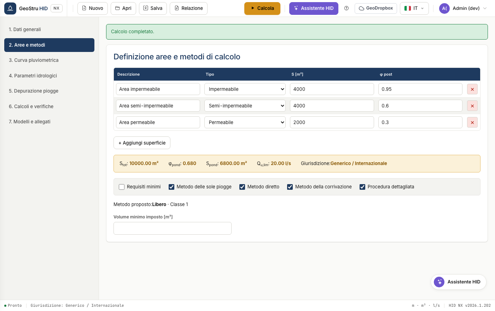
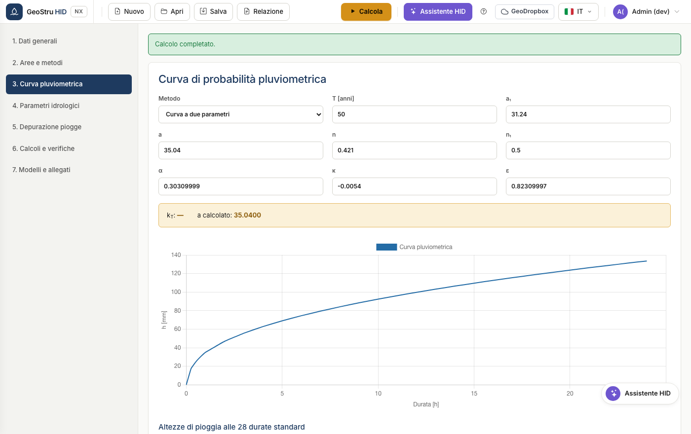
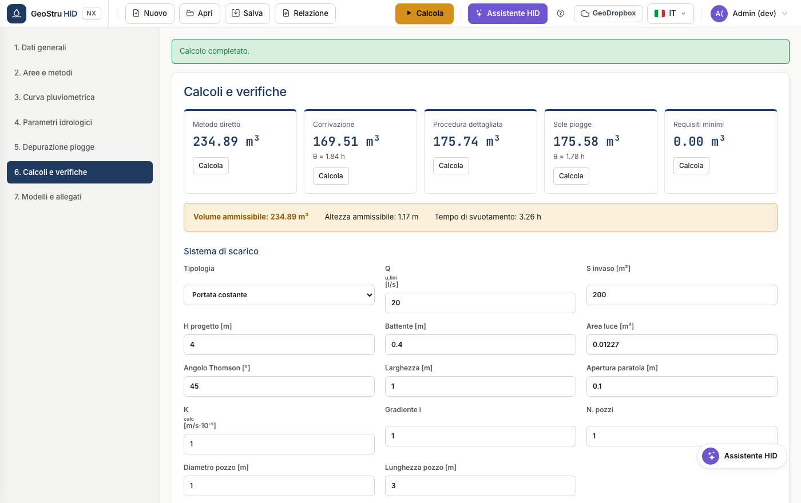

# Guida rapida

Cinque minuti dall'apertura dell'app al volume di invaso verificato. Useremo
l'esempio precaricato del manuale, così i numeri che vedi sono confrontabili.

## 1. Apri l'app e carica l'esempio

Vai su [nx.geostru.ai/hid](https://nx.geostru.ai/hid/). All'avvio trovi già
caricato l'**esempio 9.4 — Procedura dettagliata**: tre superfici per 10.000 m²
complessivi.

I comandi stanno tutti nella barra in alto: **Nuovo**, **Apri**, **Salva**,
**Relazione**, e a destra il pulsante **Calcola**.

## 2. Controlla le superfici

Apri la sezione **2. Aree e metodi**. Ogni riga è una superficie con la sua area
e il suo coefficiente di deflusso φ.

La fascia colorata riporta i valori aggregati: superficie totale, φ ponderato,
superficie ponderata e portata limite. Sotto scegli i metodi da confrontare.

!!! tip "Suggerimento"
    Lascia attivi più metodi. HID li calcola tutti e adotta il massimo: è la
    condizione più cautelativa e ti evita di rifare il lavoro se chi istruisce la
    pratica chiede un metodo diverso.

## 3. Verifica la curva di pioggia

Sezione **3. Curva pluviometrica**. Con la curva a due parametri inserisci `a` e
`n`; con la GEV inserisci i parametri della distribuzione e il tempo di ritorno.

## 4. Calcola

Premi **Calcola** in alto a destra. Vai alla sezione **6. Calcoli e verifiche**.

Ogni metodo ha la sua scheda con il volume calcolato. La fascia sotto riporta il
**volume ammissibile** adottato, l'altezza corrispondente e il tempo di
svuotamento.

Per l'esempio 9.4 devi leggere: metodo diretto 234,89 m³, corrivazione 169,51 m³,
procedura dettagliata 175,74 m³, sole piogge 175,58 m³. Il volume adottato è
**234,89 m³**.

## 5. Produci la relazione

Apri il menu **Relazione** nella barra e scegli il formato: Word, PDF o Word 97.
Il documento esce nella lingua selezionata nell'app.

---

*Hai trovato un errore in questa pagina? [Segnalacelo](mailto:info@geostru.ai?subject=Help%20HID%20NX).*
