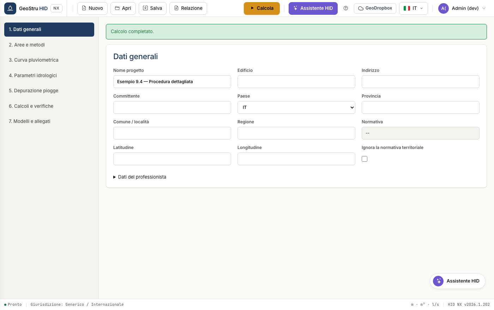
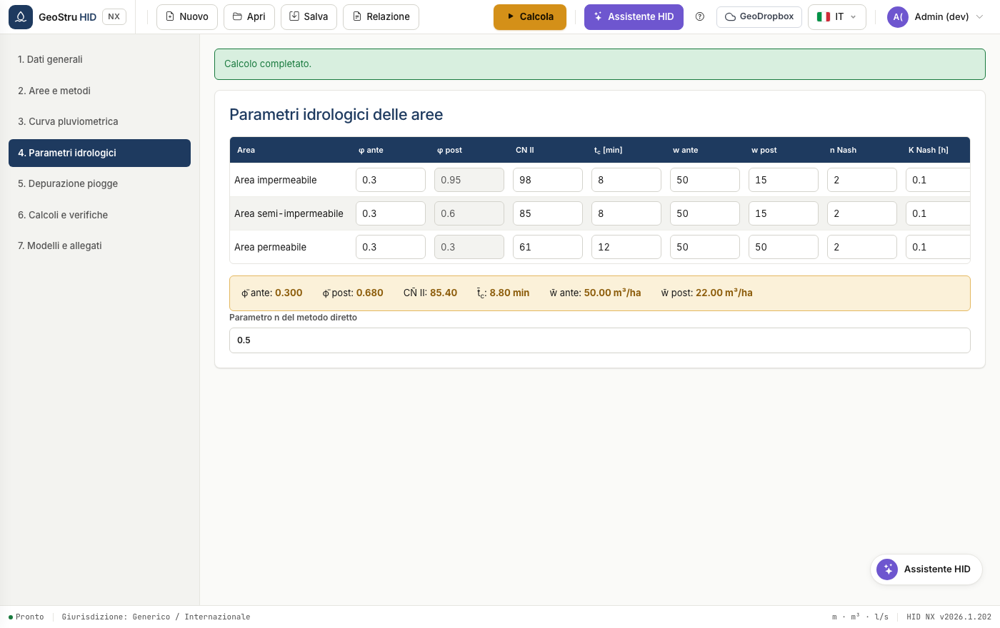
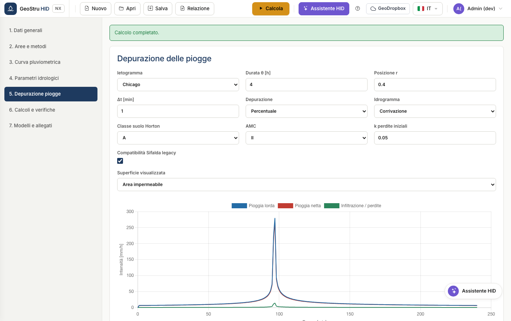
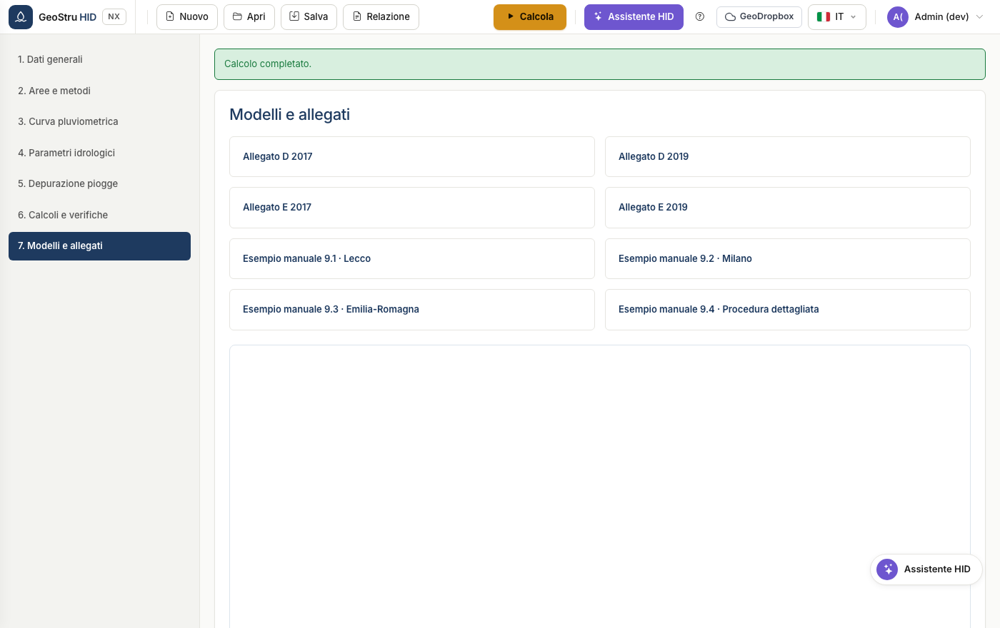

# Workflow completo

La sequenza di un progetto reale, dalla scelta del paese alla relazione firmata.
Le sette sezioni dell'app seguono quest'ordine: percorrile dall'alto in basso.

## 1. Dati generali e normativa

Inserisci l'anagrafica del progetto e del professionista, poi scegli il **paese**.

Per l'Italia digita provincia e comune: HID ricava regione, coordinate e
normativa applicabile, e mostra solo i campi che quella normativa richiede. In
Lombardia compaiono il menu della versione regolamentare e l'ambito di criticità;
in Emilia-Romagna e Marche compare il blocco delle superfici del metodo diretto
regionale.

La casella **Ignora la normativa territoriale** forza il profilo generico anche
in Italia, utile quando l'ente impone condizioni proprie.

!!! warning "Attenzione"
    In Lombardia la curva GEV è obbligatoria e il metodo SCS-CN non è ammesso. Se
    li imposti diversamente, HID blocca il calcolo e spiega perché.

## 2. Aree e metodi

Definisci le superfici post operam: descrizione, tipo, area e coefficiente di
deflusso φ.

HID calcola i valori aggregati e li mostra nella fascia: superficie totale,
φ ponderato, superficie ponderata, portata limite e giurisdizione applicata.

Vedi [Aree e metodi](aree-metodi.md) per il dettaglio dei metodi disponibili.

## 3. Curva di probabilità pluviometrica

Scegli fra curva a due parametri e GEV, inserisci i coefficienti e il tempo di
ritorno. La tabella e il grafico mostrano le altezze di pioggia alle 28 durate
standard, da 0 a 24 ore.

Vedi [Curva pluviometrica](curva-pluviometrica.md).

## 4. Parametri idrologici

Per ogni superficie definisci curve number, tempo di corrivazione, volumi di
invaso specifici ante e post, e i parametri Nash se usi quel modello.

La tabella dei valori medi in fondo riporta le grandezze ponderate che entrano
nei metodi sintetici.

## 5. Depurazione delle piogge

Scegli l'intervallo di calcolo e il modello di depurazione: percentuale, Horton o
SCS-CN. La tabella mostra pioggia lorda e netta minuto per minuto.

Vedi [Dimensionamento](dimensionamento.md) per come ietogramma e depurazione
entrano nella procedura dettagliata.

## 6. Calcoli e verifiche

Definisci le caratteristiche dell'invaso e l'organo di scarico, poi calcola.

HID esegue tutti i metodi selezionati e adotta il massimo come volume
ammissibile. Le verifiche confrontano altezza utile, volume utile e tempo di
svuotamento con i valori di progetto.

Vedi [Sistema di scarico](scarico.md) per gli otto organi disponibili.

## 7. Modelli e allegati

Raccoglie i modelli di relazione e gli allegati normativi scaricabili.

## 8. Salvataggio e relazione

Salva il progetto in formato `.hid`, oppure produci la relazione dal menu
**Relazione**. Vedi [Formati file](formati.md).

---

*Hai trovato un errore in questa pagina? [Segnalacelo](mailto:info@geostru.ai?subject=Help%20HID%20NX).*
