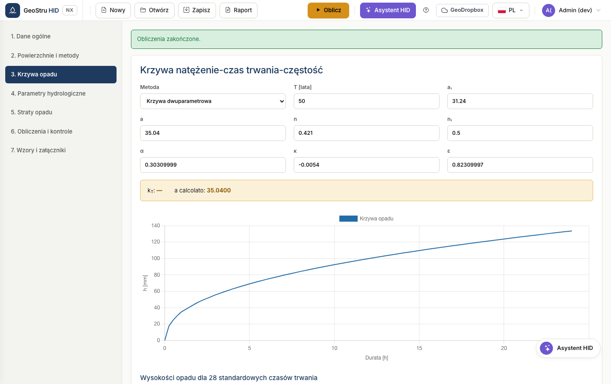

# Krzywa natężenie-czas trwania-częstość (IDF)

Krzywa wiąże wysokość opadu z czasem trwania zdarzenia dla danego okresu
powtarzalności. Stanowi dane wejściowe każdej metody wymiarowania.

## Krzywa dwuparametrowa

Postać klasyczna:

$$h(t) = a \cdot t^{n}$$

gdzie `h` w mm, a `t` w godzinach. Wprowadź `a` (godzinowy współczynnik opadu)
oraz `n` (współczynnik skali). Parametr **n₁** rządzi czasami trwania krótszymi
niż godzina, gdzie krzywa ma inne nachylenie; typowa wartość to 0,5.

!!! example "Przykład"
    Przy a = 46,49 i n = 0,364 opad 3-godzinny wynosi
    46,49 × 3^0,364 = 69,35 mm; opad 24-godzinny wynosi 147,83 mm.

## Krzywa GEV

Uogólniony rozkład wartości ekstremalnych wyznacza współczynnik `a` z godzinowego
współczynnika `a₁` oraz ze współczynnika wzrostu powiązanego z okresem
powtarzalności:

$$a = a_1 \cdot K_T$$

Wprowadź parametry α (alfa), k (kappa) i ε (epsilon) oraz okres powtarzalności.
HID oblicza K_T i pokazuje go obok krzywej.

!!! warning "Lombardia"
    Rozporządzenie regionalne narzuca krzywą GEV. Parametry uzyskuje się z
    właściwej służby regionalnej. Przy krzywej dwuparametrowej HID blokuje
    obliczenia.

## Tabela i wykres

Po obliczeniu tabela podaje wysokości dla 28 standardowych czasów trwania: 0,
0,25, 0,50, 0,75, 1 godzina, a następnie co godzinę aż do 24. Wykres poniżej
przedstawia tę samą serię.

!!! note "Zaokrąglenia"
    Wartości są obliczane z podwójną precyzją i zaokrąglane wyłącznie na potrzeby
    wyświetlania. Niewielkie różnice na ostatniej cyfrze względem innego
    oprogramowania wynikają ze sposobu zaokrąglania, a nie z obliczeń.

---

*Znalazłeś błąd na tej stronie? [Zgłoś go nam](mailto:info@geostru.ai?subject=Help%20HID%20NX).*
