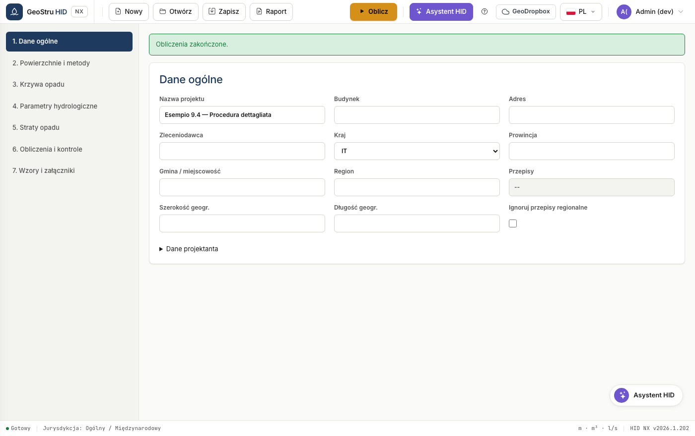
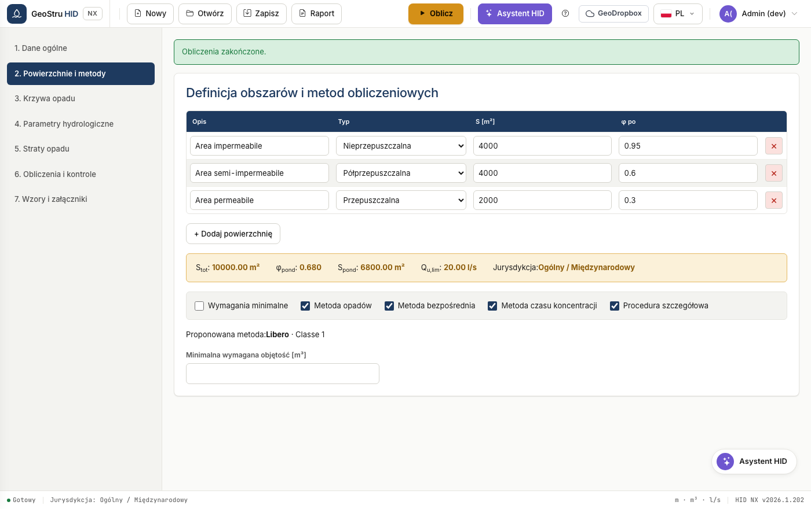
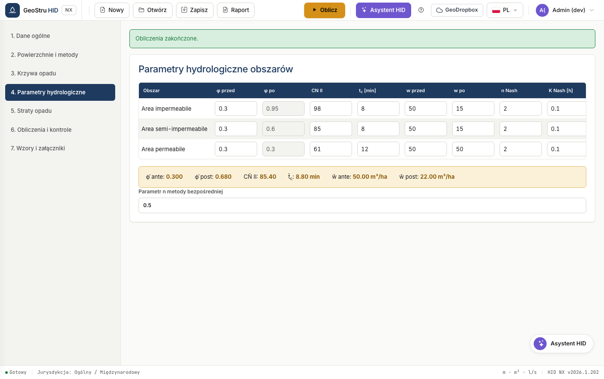
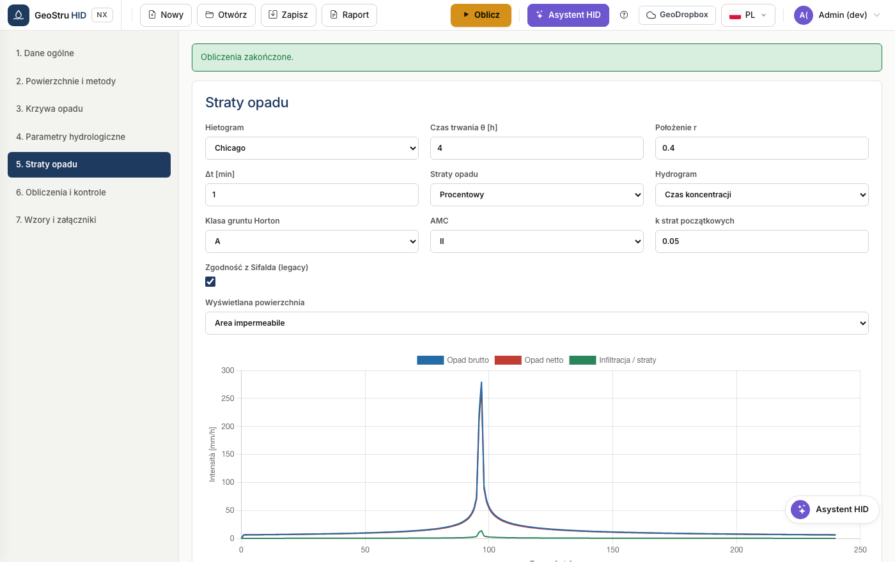
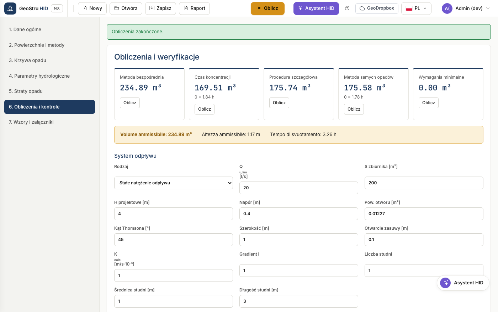
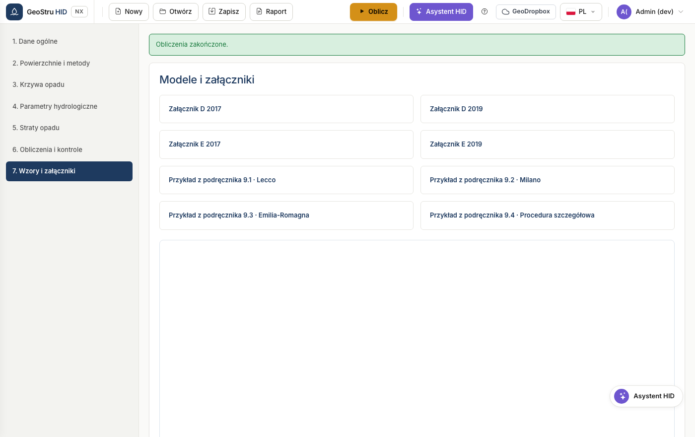

# Pełny przebieg pracy

Kolejność działań w rzeczywistym projekcie, od wyboru kraju do podpisanego
operatu. Siedem sekcji aplikacji odpowiada tej kolejności: przechodź je z góry na
dół.

## 1. Dane ogólne i przepisy

Wprowadź dane projektu i projektanta, następnie wybierz **kraj**.

Dla Włoch wpisz prowincję i gminę: HID wyznaczy region, współrzędne i mające
zastosowanie przepisy oraz wyświetli tylko te pola, których te przepisy wymagają.
W Lombardii pojawia się menu wersji rozporządzenia oraz strefa krytyczności; w
Emilia-Romagna i Marche pojawia się blok powierzchni regionalnej metody
bezpośredniej.

Pole **Pomiń przepisy terytorialne** wymusza profil ogólny także we Włoszech, co
jest przydatne, gdy organ narzuca własne warunki.

!!! warning "Uwaga"
    W Lombardii krzywa GEV jest obowiązkowa, a metoda SCS-CN nie jest dopuszczona.
    Jeśli ustawisz je inaczej, HID zablokuje obliczenia i wyjaśni przyczynę.

## 2. Powierzchnie i metody

Zdefiniuj powierzchnie po inwestycji: opis, typ, wielkość i współczynnik spływu φ.

HID oblicza wartości zagregowane i pokazuje je na pasku: powierzchnia całkowita,
φ ważony, zastępcza powierzchnia nieprzepuszczalna, dopuszczalne natężenie
odpływu i zastosowany profil regulacyjny.

Zobacz [Powierzchnie i metody](aree-metodi.md), aby poznać szczegóły dostępnych
metod.

## 3. Krzywa natężenie-czas trwania-częstość (IDF)

Wybierz między krzywą dwuparametrową a GEV, wprowadź współczynniki i okres
powtarzalności. Tabela i wykres pokazują wysokości opadu dla 28 standardowych
czasów trwania, od 0 do 24 godzin.

Zobacz [Krzywa IDF](curva-pluviometrica.md).

## 4. Parametry hydrologiczne

Dla każdej powierzchni zdefiniuj curve number, czas koncentracji, jednostkowe
objętości retencyjne przed i po inwestycji oraz parametry Nash, jeśli używasz tego
modelu.

Tabela wartości średnich na dole podaje wielkości ważone, które wchodzą do metod
syntetycznych.

## 5. Straty opadu

Wybierz krok obliczeniowy i model strat: procentowy, Horton lub SCS-CN. Tabela
pokazuje opad całkowity i opad efektywny minuta po minucie.

Zobacz [Wymiarowanie](dimensionamento.md), aby dowiedzieć się, jak hietogram i
straty opadu wchodzą do procedury szczegółowej.

## 6. Obliczenia i sprawdzenia

Zdefiniuj charakterystykę zbiornika retencyjnego i urządzenie odpływowe, a
następnie oblicz.

HID wykonuje wszystkie wybrane metody i przyjmuje maksimum jako objętość
dopuszczalną. Sprawdzenia porównują wysokość użyteczną, objętość użyteczną i czas
opróżniania z wartościami projektowymi.

Zobacz [System odpływu](scarico.md), aby poznać osiem dostępnych urządzeń.

## 7. Wzory i załączniki

Zbiera wzory operatów oraz załączniki normatywne do pobrania.

## 8. Zapis i operat

Zapisz projekt w formacie `.hid` albo wygeneruj operat z menu **Operat**. Zobacz
[Formaty plików](formati.md).

---

*Znalazłeś błąd na tej stronie? [Zgłoś go nam](mailto:info@geostru.ai?subject=Help%20HID%20NX).*
