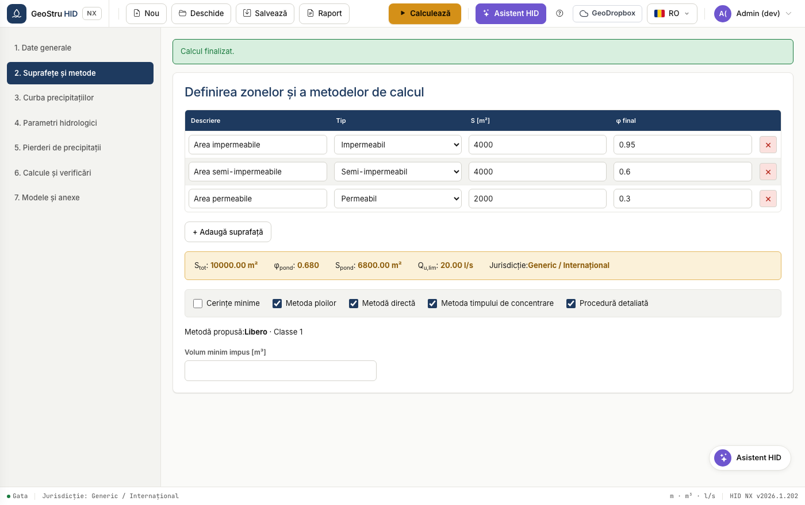

# Suprafețe și metode de calcul

## Suprafețe de colectare

Fiecare rând al tabelului este o suprafață omogenă ca utilizare și
permeabilitate. Sunt necesare descrierea, tipul, aria în m² și coeficientul de
scurgere φ după intervenție.

Tipul suprafeței (impermeabilă, semi-impermeabilă, permeabilă) este o etichetă
descriptivă care sugerează ordinul de mărime al lui φ; valoarea care intră în
calcul este întotdeauna cea pe care o scrii tu.

HID calculează **coeficientul de scurgere ponderat**:

$$\varphi_{pond} = \frac{\sum \varphi_i \cdot S_i}{\sum S_i}$$

și **suprafața impermeabilă echivalentă** $S_{pond} = S_{tot} \cdot \varphi_{pond}$.

## Metodele de dimensionare

HID distinge metodele **universale**, valabile pretutindeni, de cele **de
reglementare**, care există doar acolo unde normativul le prescrie.

### Cerințe minime

Volum specific pe hectar impus de reglementare în funcție de zona de criticitate.
În Lombardia este 800, 500 sau 400 m³/ha, în funcție de zona A, B sau C și de
versiunea regulamentului. Acolo unde reglementarea nu îl prescrie, volumul minim
îl impui tu.

### Metoda ploilor

Echilibrează volumul afluent cu cel evacuat la debit constant, căutând durata
care maximizează retenția. Este metoda cea mai răspândită pentru verificările
rapide.

!!! note "Durate sub o oră"
    Când durata critică scade sub o oră, HID folosește exponentul n₁ al curbei,
    așa cum este prevăzut. Nu rotunjește durata la o oră: procedând astfel se
    subestimează volumul, iar aceasta este o eroare pe care am corectat-o
    validând aplicația față de versiunea anterioară.

### Metoda timpului de concentrare

Introduce timpul de concentrare al bazinului, deci ține cont de forma
hidrografului. Returnează durata critică și volumul.

### Metoda directă

Compară volumele de retenție specifice înainte și după intervenție prin raportul
coeficienților de scurgere. În Emilia-Romagna și Marche reglementarea prescrie o
variantă cu coeficienți ficși, pe care HID o expune ca metodă separată, **Metoda
directă regională**, vizibilă doar în acele regiuni.

### Procedură detaliată

Este simularea completă: hietograma de proiect, pierderile hidrologice,
hidrograful de viitură și atenuarea în bazinul de retenție, pas cu pas. Este
metoda cea mai laborioasă și cea mai ușor de susținut.

## Cum este ales volumul

HID calculează toate metodele selectate și adoptă ca volum admisibil **maximul**
dintre rezultate. Metoda propusă de reglementare este indicată sub casete, dar nu
limitează metodele pe care le poți calcula.

---

*Ai găsit o eroare în această pagină? [Semnalează-ne-o](mailto:info@geostru.ai?subject=Help%20HID%20NX).*
