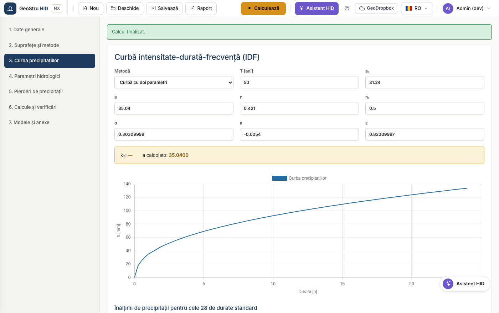

# Ghid rapid

Cinci minute de la deschiderea aplicației până la volumul de retenție verificat.
Vom folosi exemplul preîncărcat din manual, astfel încât cifrele pe care le vezi
să fie comparabile.

## 1. Deschide aplicația și încarcă exemplul

Accesează [nx.geostru.ai/hid](https://nx.geostru.ai/hid/). La pornire găsești deja
încărcat **exemplul 9.4 — Procedură detaliată**: trei suprafețe însumând
10.000 m².

Toate comenzile se află în bara de sus: **Nou**, **Deschide**, **Salvează**,
**Memoriu**, iar în dreapta butonul **Calculează**.

## 2. Verifică suprafețele

Deschide secțiunea **2. Suprafețe și metode**. Fiecare rând este o suprafață cu
aria sa și cu coeficientul său de scurgere φ.

Banda colorată prezintă valorile agregate: suprafață totală, φ ponderat,
suprafață impermeabilă echivalentă și debit maxim admis la evacuare. Dedesubt
alegi metodele de comparat.

!!! tip "Recomandare"
    Lasă active mai multe metode. HID le calculează pe toate și adoptă maximul:
    este condiția cea mai acoperitoare și îți evită refacerea lucrării dacă
    autoritatea care instrumentează dosarul cere o altă metodă.

## 3. Verifică curba de ploaie

Secțiunea **3. Curbă IDF**. Cu curba cu doi parametri introduci `a` și `n`; cu
GEV introduci parametrii distribuției și perioada de revenire.

## 4. Calculează

Apasă **Calculează** în dreapta sus. Mergi la secțiunea **6. Calcule și
verificări**.

Fiecare metodă are fișa sa cu volumul calculat. Banda de dedesubt prezintă
**volumul admisibil** adoptat, înălțimea corespunzătoare și timpul de golire.

Pentru exemplul 9.4 trebuie să citești: metoda directă 234,89 m³, metoda timpului
de concentrare 169,51 m³, procedură detaliată 175,74 m³, metoda ploilor
175,58 m³. Volumul adoptat este **234,89 m³**.

## 5. Generează memoriul

Deschide meniul **Memoriu** din bară și alege formatul: Word, PDF sau Word 97.
Documentul este generat în limba selectată în aplicație.

---

*Ai găsit o eroare în această pagină? [Semnalează-ne-o](mailto:info@geostru.ai?subject=Help%20HID%20NX).*
