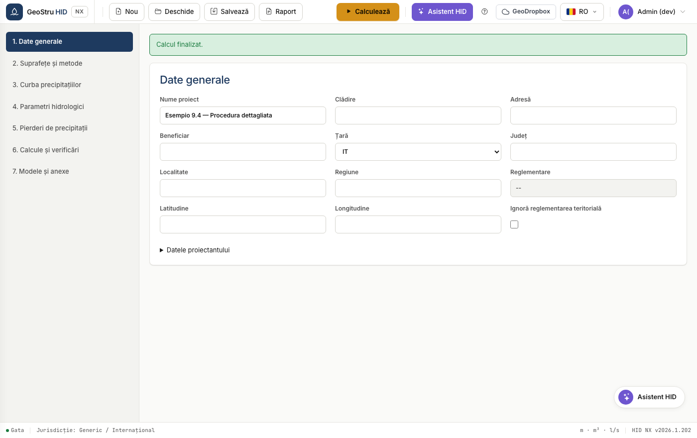
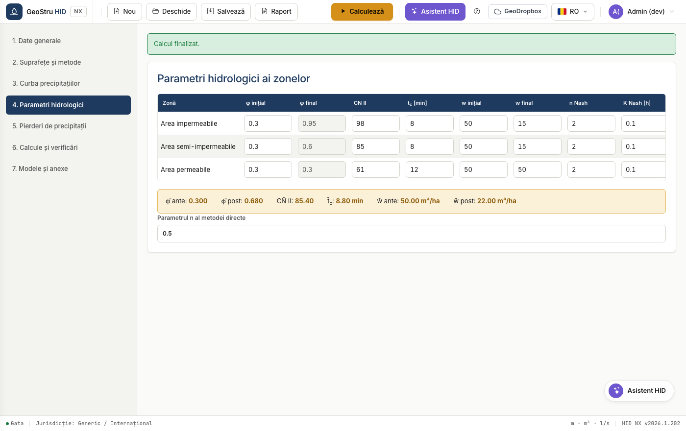
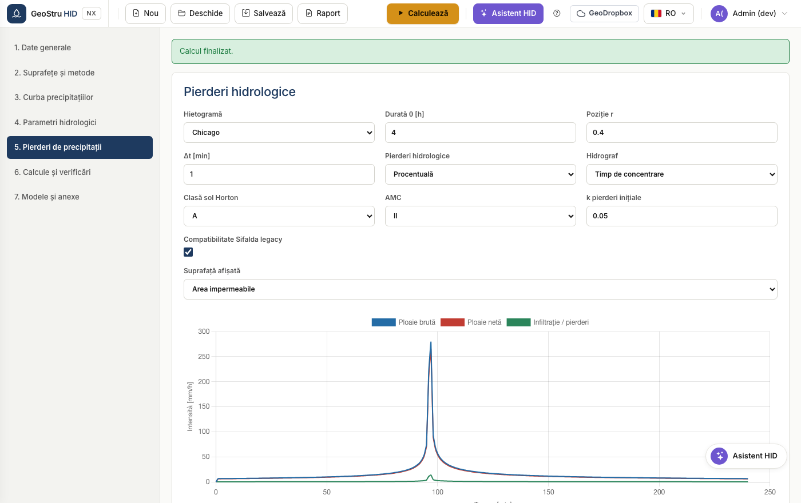
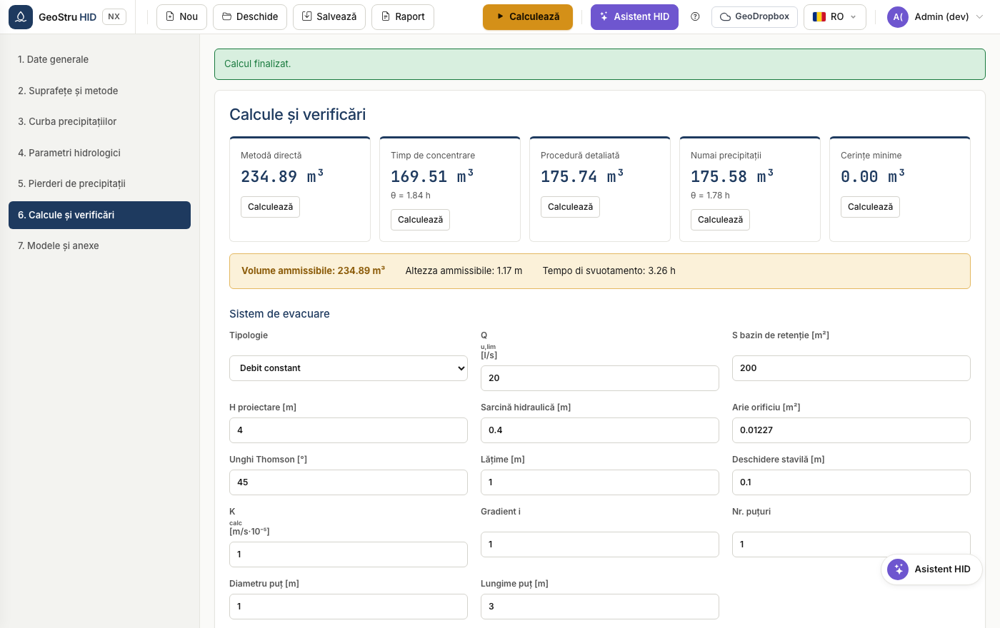
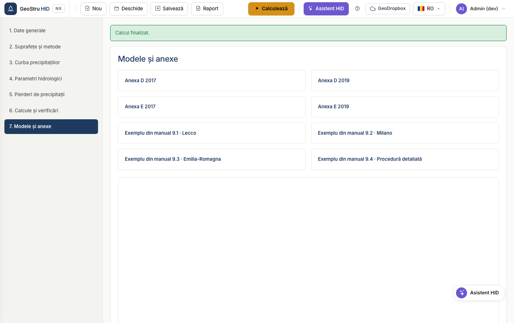

# Flux de lucru complet

Secvența unui proiect real, de la alegerea țării până la memoriul semnat. Cele
șapte secțiuni ale aplicației urmează această ordine: parcurge-le de sus în jos.

## 1. Date generale și reglementări

Introdu datele de identificare ale proiectului și ale proiectantului, apoi alege
**țara**.

Pentru Italia scrie provincia și localitatea: HID deduce regiunea, coordonatele și
reglementarea aplicabilă și afișează doar câmpurile cerute de acea reglementare.
În Lombardia apar meniul versiunii regulamentare și zona de criticitate; în
Emilia-Romagna și Marche apare blocul suprafețelor din metoda directă regională.

Caseta **Ignoră reglementarea teritorială** forțează profilul generic și în
Italia, utilă atunci când autoritatea impune condiții proprii.

!!! warning "Atenție"
    În Lombardia curba GEV este obligatorie, iar metoda SCS-CN nu este admisă.
    Dacă le setezi altfel, HID blochează calculul și explică motivul.

## 2. Suprafețe și metode

Definește suprafețele după intervenție: descriere, tip, arie și coeficient de
scurgere φ.

HID calculează valorile agregate și le afișează în bandă: suprafață totală,
φ ponderat, suprafață impermeabilă echivalentă, debit maxim admis la evacuare și
reglementarea aplicată.

Vezi [Suprafețe și metode](aree-metodi.md) pentru detalii despre metodele
disponibile.

## 3. Curbă intensitate-durată-frecvență

Alege între curba cu doi parametri și GEV, introdu coeficienții și perioada de
revenire. Tabelul și graficul prezintă înălțimile de ploaie la cele 28 de durate
standard, de la 0 la 24 h.

Vezi [Curbă IDF](curva-pluviometrica.md).

## 4. Parametri hidrologici

Pentru fiecare suprafață definește curve number, timpul de concentrare, volumele
de retenție specifice înainte și după intervenție, precum și parametrii Nash dacă
folosești acel model.

Tabelul valorilor medii de la final prezintă mărimile ponderate care intră în
metodele sintetice.

## 5. Pierderi hidrologice

Alege intervalul de calcul și modelul de pierderi: procentual, Horton sau SCS-CN.
Tabelul afișează ploaia brută și ploaia netă minut cu minut.

Vezi [Dimensionare](dimensionamento.md) pentru modul în care hietograma și
pierderile intră în procedura detaliată.

## 6. Calcule și verificări

Definește caracteristicile bazinului de retenție și organul de evacuare, apoi
calculează.

HID execută toate metodele selectate și adoptă maximul ca volum admisibil.
Verificările compară înălțimea utilă, volumul util și timpul de golire cu
valorile de proiect.

Vezi [Sistem de evacuare](scarico.md) pentru cele opt organe disponibile.

## 7. Modele și anexe

Reunește modelele de memoriu și anexele normative descărcabile.

## 8. Salvare și memoriu

Salvează proiectul în format `.hid` sau generează memoriul din meniul
**Memoriu**. Vezi [Formate de fișier](formati.md).

---

*Ai găsit o eroare în această pagină? [Semnalează-ne-o](mailto:info@geostru.ai?subject=Help%20HID%20NX).*
