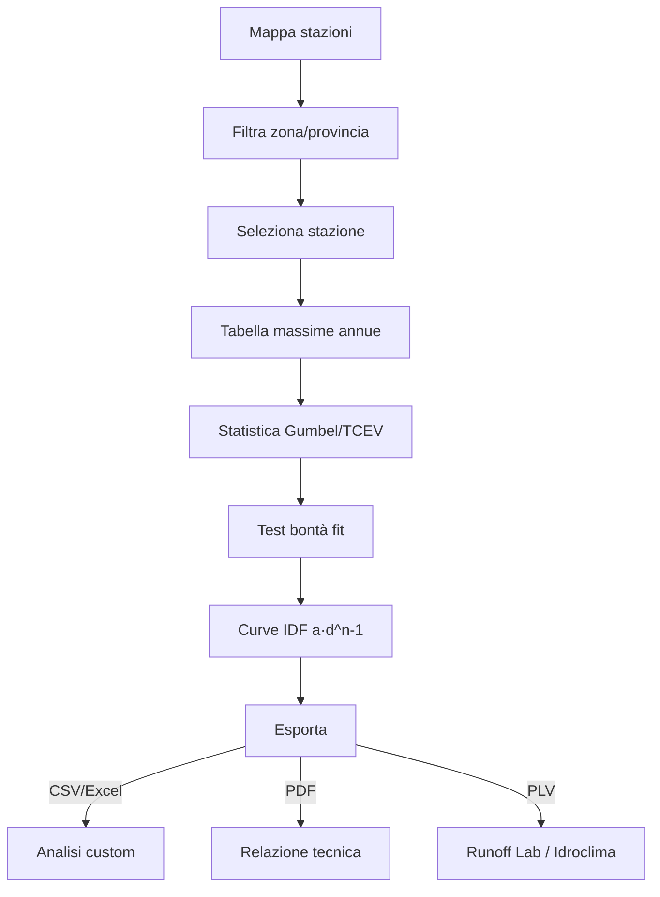

# Workflow completo

Sequenza di un'analisi pluviometrica reale, dalla ricerca della stazione
al PLV per il software di calcolo idraulico.

## Schema generale

```
RICERCA                  ANALISI                  OUTPUT
───────                  ───────                  ──────
1. Mappa stazioni        4. Massime annue         7. Tabella h(d,T)
2. Filtra per zona       5. Statistica EV1/TCEV   8. Grafici Gumbel paper
3. Seleziona stazione    6. Curve IDF             9. Curve IDF a·d^(n-1)
                                                  10. Export CSV/Excel/PDF/PLV
```

## 1. Ricerca della stazione

### Da mappa

- Zoom sulla zona del progetto (es. coordinate del cantiere)
- Click sui marker delle stazioni nelle vicinanze
- Cerchio di "raggio influenza" configurabile (default 30 km dal sito)

### Da filtri

- **Provincia**: dropdown con tutte le province italiane (~ 110)
- **Regione**: tutte e 19 le regioni con dati disponibili
- **Anni di osservazione**: filtra stazioni con almeno N anni di dati
  (es. ≥ 30 anni per analisi statistica robusta)

### Selezione multipla

Per **studi di area** (microzonazione idrologica): seleziona più stazioni e
confronta i parametri statistici. Hydrogeo calcola la media areale o la
distribuzione spaziale dei parametri.

## 2. Dati di intensità

Per ogni stazione selezionata vedi:

| Campo | Significato |
|---|---|
| **Codice ISPRA** | identificativo nazionale |
| **Fonte dati** | ISPRA / Regione / Provincia |
| **Periodo osservazione** | dal 1916, 1925, 1950, 1980, … |
| **Numero anni con dati** | gli anni utili per la statistica |
| **Durate disponibili** | 1h, 3h, 6h, 12h, 24h, e talvolta più (15min, 30min) |

### Tabella massime annue

Per ogni anno di osservazione e durata, la **massima precipitazione** in
mm. Essere consapevoli:

- Anni con **dati incompleti** vengono esclusi dalla statistica (non
  estrapolati)
- Anni **con valore = 0** sono possibili (anno secco) — non sono missing
- Negli ultimi anni i dati possono ancora non essere validati ISPRA

## 3. Analisi statistica

### Gumbel EV1 (Extreme Value Type I)

Distribuzione classica per le massime annuali, formula:

$$
F(h) = e^{-e^{-\alpha (h - u)}}
$$

con `α` parametro di scala, `u` parametro di posizione.

Altezza di pioggia per tempo di ritorno T:

$$
h_T = u - \frac{1}{\alpha} \ln\left(-\ln\left(1 - \frac{1}{T}\right)\right)
$$

### TCEV (Two-Component Extreme Value)

Distribuzione composita, utile per **dati bimodali** (es. sito con
piogge convettive estive E piogge frontali invernali). Più robusta
sui valori estremi (T grandi).

### Bontà del fit

Hydrogeo calcola il **test di Kolmogorov-Smirnov** per verificare
quanto la distribuzione teorica si adatta ai dati osservati. Se p-value
< 0.05 il fit è insufficiente — considera TCEV o una distribuzione
alternativa.

### Carta probabilistica (Gumbel paper)

Grafico con asse Y = h e asse X = `-ln(-ln(1 - 1/T))`. I punti osservati
si dispongono lungo una retta se la distribuzione è ben rappresentata da
Gumbel. La pendenza dà 1/α e l'intercetta dà u.

## 4. Curve IDF

La **curva intensità-durata-frequenza** descrive l'intensità di pioggia
massima i (mm/h) per:

- una durata d (h)
- un tempo di ritorno T (anni)

Forma classica:

$$
i(d, T) = a(T) \cdot d^{n-1}
$$

con `a(T)` e `n` parametri stimati ai minimi quadrati su tabella
h(d, T) ricavata dal punto 3.

Hydrogeo restituisce:

- Tabella **a** e **n** per ogni T (2, 5, 10, 20, 50, 100, 200, 500, 1000)
- Grafico log-log di i vs d
- Equazione della curva (per copia-incolla in software esterni)

## 5. Esporta

Toolbar → **Esporta**:

| Formato | Uso |
|---|---|
| **CSV** | Massime annue + statistica + IDF, semplice tabellare |
| **Excel** | Stessa tabella + grafici Gumbel paper |
| **PDF** | Relazione tecnica impaginata: tabelle + grafici + parametri |
| **PLV GeoStru** | Formato standard di interscambio idrologico — input per **Runoff Lab NX**, **Idroclima**, software desktop GeoStru |

### PLV GeoStru — formato

Il `.plv` contiene:

- Tutte le altezze di pioggia per durata × T
- Parametri delle curve IDF (a, n)
- Anagrafica della stazione
- Periodo di analisi

È il formato di **interscambio universale** GeoStru — caricabile in
qualsiasi prodotto della suite che fa calcolo idraulico.

## Schema riassuntivo



---

*Pagina utile? [Scrivici](mailto:info@geostru.ai?subject=Help%20Hydrogeo%20NX%20-%20Workflow).*
