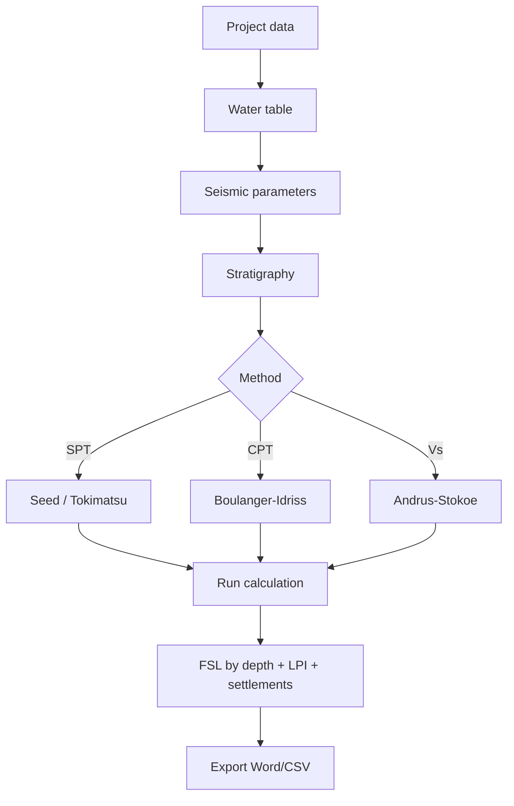

# Complete workflow

Detailed sequence of a real analysis, from input data to the report.

## Overall scheme

```
INPUT                       CALCULATION                OUTPUT
─────                       ───────────                ──────
1. Project data             5. CSR (seismic)            7. FSL(z) table
2. Site GPS · water table   6. CRR (resistance) →       8. FSL vs z plot
3. Seismic parameters           ↓                       9. LPI
4. Stratigraphy                                        10. Settlements
                                                       11. Word report
                                                       12. CSV
```

## 1. Project data

Fill in at least the **description** of the project (e.g. *"Residential
building — Versilia, lot B"*). Site, operator and date are optional but
useful for the report.

### Site GPS

**Latitude** and **longitude** of the site are strongly recommended:
LiquiTer uses them to:

- Geolocate the site on the **map** in the report
- Determine the value of **a_g** from the Italian seismic zonation (if the
  pre-fill from [`Parametri Sismici`](https://nx.geostru.ai/parametri-sismici/)
  is enabled)

## 2. Water table

**Water table depth** (m) from ground level. Above the water table there
is no liquefaction; below it the soils are saturated and susceptible.

!!! warning "Uncertain water table"
    If the water table depth is uncertain or varies seasonally, use the
    **worst case** (water table as high as possible). Liquefaction is a
    safety check: better conservative than optimistic.

## 3. Seismic parameters

### Code

Mandatory selection. LiquiTer supports:

- **NTC 2018** (Italian D.M. 17/01/2018) — reference for the Italian territory
- **Eurocode 8** (EN 1998-5) — European, equivalent on many points

### Ground category (A · B · C · D · E)

Determined by **Vs,30** (average shear-wave velocity in the top 30 m).
If you don't have a measured Vs, use the geotechnical stratigraphy:

| Cat. | Description | Vs,30 |
|---|---|---|
| **A** | Rock | > 800 m/s |
| **B** | Soft rocks or very dense coarse-grained soils | 360-800 |
| **C** | Dense coarse-grained soils or stiff clays | 180-360 |
| **D** | Loose coarse-grained soils or soft clays | < 180 |
| **E** | Shallow alluvial layers on a substrate | (special case) |

### Topographic category (T1 · T2 · T3 · T4)

Affects the topographic amplification factor `S_T`:

- **T1** — flat ground or slope < 15°
- **T2** — slope 15-30°
- **T3** — isolated ridge 15-30°
- **T4** — isolated ridge > 30°

### a_g (peak ground acceleration)

Peak ground acceleration, in g (e.g. 0.15 g). From the INGV grid for the
site coordinates + return period (nominal life × Cu × P_VR).

### Magnitude Mw

**Moment magnitude** of the design earthquake. Used by the magnitude
scaling factor (MSF) in most methods (Seed, Tokimatsu, Boulanger-Idriss).
Typical range for Italy: 5.5–7.0.

## 4. Stratigraphy

**Stratigraphy** tab — define the layers one by one:

| Field | Meaning |
|---|---|
| **Top/bottom depth** | top and bottom elevations of the layer (m) |
| **Lithology** | sand / silty sand / clay / gravel / etc. |
| **γ** (unit weight) | kN/m³ — total above the water table; saturated below |
| **N-SPT** | blows/30 cm from SPT (Standard Penetration Test) |
| **qc** | tip resistance from CPT (MPa) — if available |
| **Vs** | shear-wave velocity (m/s) — if available |
| **% clay** | clay fines fraction (relevant for liquefiability) |

!!! tip "Which test to use"
    - SPT is the most common in Italy → use Seed or Tokimatsu
    - CPT is more precise and continuous → use Boulanger-Idriss
    - Cross-hole / down-hole (Vs) → use Andrus-Stokoe

    If you have several tests, run the calculation with different methods
    and compare.

## 5. Calculation

**Results** tab → press **Run calculation**.

For each depth, LiquiTer:

1. Computes **σ_v** (total vertical stress) and **σ'_v** (effective)
2. Computes the **depth reduction coefficient r_d** as a function of depth
3. Computes **CSR = 0.65 · (a_max/g) · (σ_v/σ'_v) · r_d** (Seed-Idriss 1971)
4. Computes **CRR** with the selected method (see [methods](metodi.md))
5. Computes **FSL = (CRR / CSR) · MSF · K_σ** (with scaling factors)
6. Determines whether the point is **liquefiable** (FSL < FSL_limit, default 1.25)
7. Computes **LPI** integrating the contributions of the liquefiable layers
8. Estimates **post-seismic settlements** (Ishihara-Yoshimine 1992 method)

## 6. Inspect the results

### Table by depth

One row per calculation step:

| z | σ_v | σ'_v | r_d | CSR | CRR | FSL | Verdict |
|---|---|---|---|---|---|---|---|

The verdict is colour-coded: 🟢 stable · 🔴 liquefiable.

### FSL vs z plot

Vertical FSL profile. The red vertical line is FSL = 1 (liquefaction
threshold). Points to the left are critical.

### LPI index (Iwasaki)

| LPI | Risk |
|---|---|
| 0 | Negligible |
| 0–5 | Low |
| 5–15 | Medium |
| > 15 | High |

## 7. Export

**Export** in the toolbar:

- **Word report (.docx)** — technical report with figures, KPIs and tables
- **CSV** — raw data for further analysis

[Details →](esportazioni.md)

---

## Summary diagram



---

*Page useful? [Contact us](mailto:info@geostru.ai?subject=Help%20LiquiTer%20NX%20-%20Workflow).*
