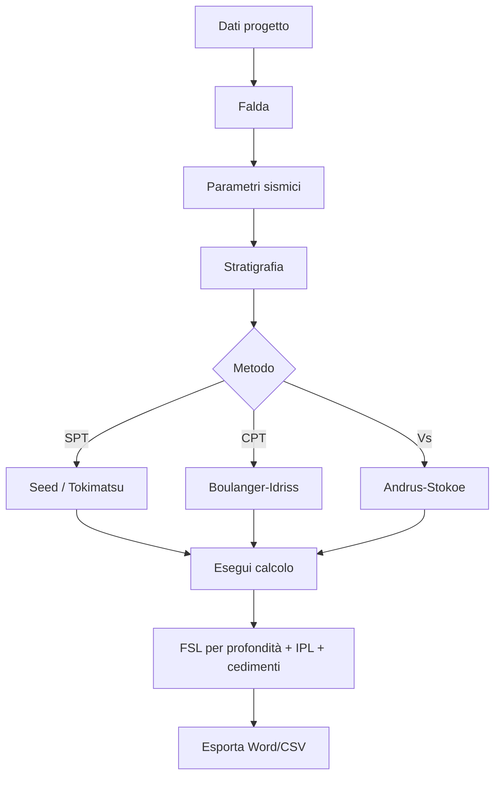

# Workflow completo

Sequenza dettagliata di un'analisi reale, dai dati di input al report.

## Schema generale

```
INPUT                       CALCOLO                   OUTPUT
─────                       ───────                   ──────
1. Dati progetto            5. CSR (sismica)           7. Tabella FSL(z)
2. Sito GPS · falda         6. CRR (resistenza) →      8. Grafico FSL vs z
3. Parametri sismici            ↓                      9. IPL
4. Stratigrafia                                       10. Cedimenti
                                                      11. Report Word
                                                      12. CSV
```

## 1. Dati progetto

Compila almeno la **descrizione** dell'opera (es. *"Edificio residenziale —
Versilia, lotto B"*). Sito, operatore e data sono opzionali ma utili per il
report.

### Sito GPS

**Latitudine** e **longitudine** del sito sono fortemente consigliate: LiquiTer
le usa per:

- Geolocalizzare il sito sulla **mappa** della relazione
- Determinare il valore di **a_g** dalla zonazione sismica italiana (se attivo
  il pre-fill da [`Parametri Sismici`](https://nx.geostru.ai/parametri-sismici/))

## 2. Falda

**Profondità della falda** (m) dal piano campagna. Sopra la falda non c'è
liquefazione, sotto la falda i terreni sono saturi e suscettibili.

!!! warning "Falda incerta"
    Se la profondità della falda è incerta o varia stagionalmente, usa il
    **caso più sfavorevole** (falda più alta possibile). La liquefazione è una
    verifica di sicurezza: meglio conservativi che ottimisti.

## 3. Parametri sismici

### Normativa

Selezione obbligatoria. LiquiTer supporta:

- **NTC 2018** (D.M. 17/01/2018) — italiana, riferimento per il territorio
  nazionale
- **Eurocodice 8** (EN 1998-5) — europea, equivalente in molti punti

### Categoria suolo (A · B · C · D · E)

Determinata dalla **Vs,30** (velocità media delle onde di taglio nei primi
30 m). Se non hai Vs misurata, usa la stratigrafia geotecnica:

| Cat. | Descrizione | Vs,30 |
|---|---|---|
| **A** | Roccia | > 800 m/s |
| **B** | Rocce tenere o terreni a grana grossa molto addensati | 360-800 |
| **C** | Terreni a grana grossa addensati o argille consistenti | 180-360 |
| **D** | Terreni a grana grossa scarsamente addensati o argille tenere | < 180 |
| **E** | Strati alluvionali superficiali su substrato | (caso speciale) |

### Categoria topografica (T1 · T2 · T3 · T4)

Influenza il coefficiente di amplificazione topografica `S_T`:

- **T1** — superficie pianeggiante o pendio < 15°
- **T2** — pendio 15-30°
- **T3** — rilievo isolato 15-30°
- **T4** — rilievo isolato > 30°

### a_g (accelerazione massima al suolo)

Accelerazione di picco al suolo, in g (per esempio 0.15 g). Da reticolo INGV
per le coordinate del sito + periodo di ritorno (vita nominale × Cu × P_VR).

### Magnitudo Mw

**Magnitudo momento** del terremoto di progetto. Usata dal fattore di scala
per la magnitudo (MSF) nella maggior parte dei metodi (Seed, Tokimatsu,
Boulanger-Idriss). Range tipico per l'Italia: 5.5–7.0.

## 4. Stratigrafia

Tab **Stratigrafia** — definisci gli strati uno per uno:

| Campo | Significato |
|---|---|
| **Profondità top/base** | quote del tetto e del letto dello strato (m) |
| **Litologia** | sabbia / sabbia limosa / argilla / ghiaia / etc. |
| **γ** (peso unità di volume) | kN/m³ — totale, sopra falda; saturo, sotto falda |
| **N-SPT** | colpi/30cm da prova SPT (Standard Penetration Test) |
| **qc** | resistenza alla punta da prova CPT (MPa) — se disponibile |
| **Vs** | velocità onde di taglio (m/s) — se disponibile |
| **% argilla** | frazione fine argillosa (rilevante per liquefacibilità) |

!!! tip "Quale prova usare"
    - SPT è la più diffusa in Italia → usa Seed o Tokimatsu
    - CPT è più precisa e continua → usa Boulanger-Idriss
    - Cross-hole / down-hole (Vs) → usa Andrus-Stokoe
    
    Se hai più prove, lancia il calcolo con metodi diversi e confronta.

## 5. Calcolo

Tab **Risultati** → premi **Esegui calcolo**.

LiquiTer per ogni profondità:

1. Calcola **σ_v** (tensione totale verticale) e **σ'_v** (efficace)
2. Calcola il **coefficiente riduttivo r_d** in funzione della profondità
3. Calcola **CSR = 0.65 · (a_max/g) · (σ_v/σ'_v) · r_d** (Seed-Idriss 1971)
4. Calcola **CRR** secondo il metodo selezionato (vedi [metodi](metodi.md))
5. Calcola **FSL = (CRR / CSR) · MSF · K_σ** (con fattori di scala)
6. Determina se il punto è **liquefacibile** (FSL < FSL_limite, default 1.25)
7. Calcola **IPL** integrando i contributi degli strati liquefacibili
8. Stima i **cedimenti post-sismici** (metodo Ishihara-Yoshimine 1992)

## 6. Esamina i risultati

### Tabella per profondità

Una riga per ogni passo di calcolo:

| z | σ_v | σ'_v | r_d | CSR | CRR | FSL | Esito |
|---|---|---|---|---|---|---|---|

L'esito è codificato a colori: 🟢 stabile · 🔴 liquefacibile.

### Grafico FSL vs z

Profilo verticale del FSL. La linea rossa verticale è FSL = 1 (soglia di
liquefazione). I punti a sinistra sono critici.

### Indice IPL (Iwasaki)

| IPL | Rischio |
|---|---|
| 0 | Trascurabile |
| 0–5 | Basso |
| 5–15 | Medio |
| > 15 | Alto |

## 7. Esporta

**Esporta** in toolbar:

- **Report Word (.docx)** — relazione tecnica con figure, KPI e tabelle
- **CSV** — dati grezzi per analisi successive

[Approfondimento →](esportazioni.md)

---

## Schema riassuntivo



---

*Pagina utile? [Scrivici](mailto:info@geostru.ai?subject=Help%20LiquiTer%20NX%20-%20Workflow).*
