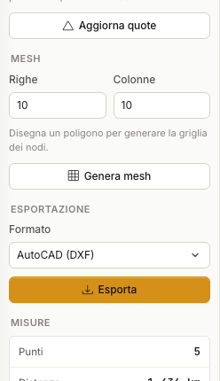

# Export and coordinates

## Reference systems

The map works in **geographic WGS84 coordinates** (latitude and longitude in
decimal degrees). The **NEZ** and **DXF** exports project to **UTM**.

!!! note "UTM zone"
    Zone and hemisphere follow from the position of the points. If the survey
    straddles two zones, check the result: projected coordinates only make sense
    within their own zone.

## The formats

| Format | What it contains | When to use it |
|---|---|---|
| **TXT** | plain text, one point per line | quick exchange, eyeball inspection |
| **CSV** | character separated (default `;`) | spreadsheet, database |
| **LLE** | latitude, longitude, elevation | GPS and tools working in geographic coordinates |
| **NEZ** | north, east, elevation (UTM) | survey work and CAD in cartesian coordinates |
| **DXF** | real CAD entities (points and polylines) | technical drawing |
| **GMT** | GMT format | scientific cartography |
| **Section profile** | chainage and elevation of the samples | sections for reports |

!!! tip "The DXF is not a picture"
    The DXF export writes points and polylines as **real entities**: they can be
    edited, snapped to and referenced like any other drawing.

## How to export

Choose the **Format** in the sidebar and press **Export**. The file is produced
and downloaded.

!!! info "Cost and guarantees"
    Each export consumes **10 credits**, whatever the format.
    If the export fails **nothing is charged**: credits are held first and
    committed only once the file exists. Repeating the same export, with the same
    data and the same format, within a few minutes does not pay twice.

## Saving and reopening the project

Exporting is not saving. To keep your work:

- **File › Save** downloads the map state as a `.gmap` file.
- **File › Open** loads it back.
- **GeoDropbox** keeps the project in the GeoStru cloud: reopen it from any
  workstation.

The `.gmap` file holds the view, the points, the tracks, the areas and the mesh
nodes — everything needed to find the survey exactly as you left it.

---

*Found an error on this page? [Let us know](mailto:info@geostru.ai?subject=Help%20Maps%20NX) or open a [Pull Request](https://github.com/EngSoft-Geostru/geostru-help-nx/edit/main/maps/docs/en/esportazione.md).*
