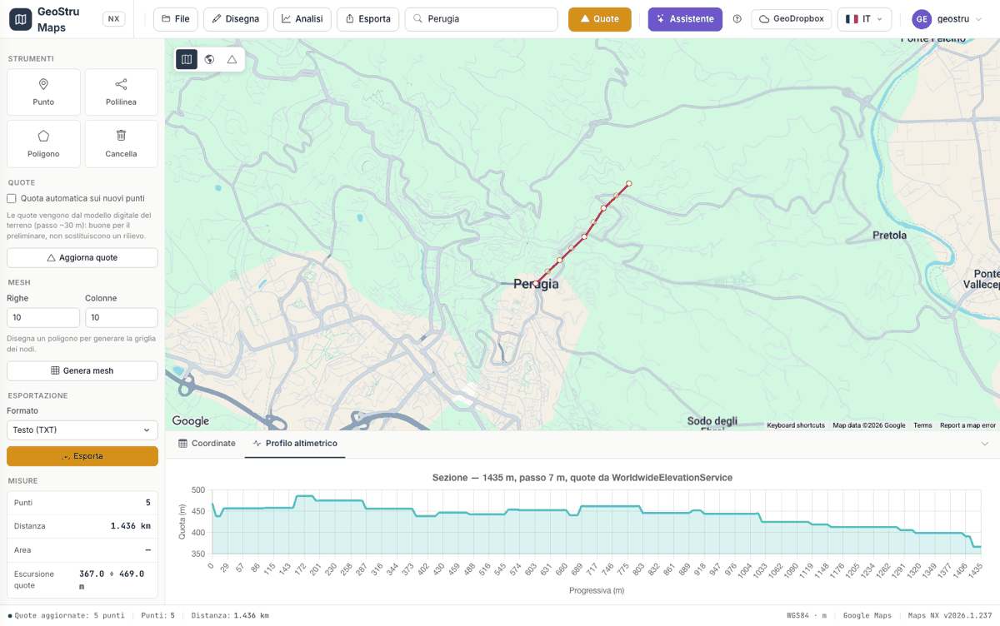

# Sezioni e profili

Maps NX ricava un profilo altimetrico in **due modi diversi**, che rispondono a
domande diverse.

## Profilo dai punti

Mette i vertici che hai cliccato in progressiva e ne traccia le quote.

- Ascissa: la progressiva cumulata sulla tabella coordinate.
- Ordinata: la quota di ciascun vertice.
- Il profilo **salta** da un vertice al successivo: fra due vertici non descrive
  il terreno.

Si ottiene aprendo la scheda **Profilo altimetrico** nel pannello in basso, o da
**Analisi › Sezione dai punti**.

## Sezione dalla traccia

Ricampiona la polilinea disegnata a **passo regolare** e chiede la quota in ogni
campione. È la sezione vera e propria.

- Il profilo segue il terreno anche fra i vertici.
- Il passo si adatta alla lunghezza della traccia, puntando a circa 200 campioni:
  un passo fisso su un tracciato di 5 km produrrebbe decine di migliaia di
  richieste di quota.
- Ogni campione porta progressiva, quota, coordinate geografiche **e** proiettate.

Si ottiene da **Analisi › Sezione dalla traccia**. Serve una polilinea disegnata.

!!! tip "Quale usare"
    Per il disegno di una sezione da mettere in relazione, usa **Sezione dalla
    traccia**. Il profilo dai punti serve piuttosto a controllare al volo le
    quote dei vertici che hai posato.

## La provenienza

Il titolo del grafico riporta lunghezza della traccia, passo di campionamento e
sorgente delle quote.

Non è un dettaglio estetico: **una sezione senza provenienza non è verificabile**.
In relazione bisogna poter dichiarare da dove vengono le quote e con che passo
sono state prese.

## Esportare il profilo

Il formato **Profilo Sezione**, nell'elenco dei formati di esportazione, produce
il file del profilo. Vedi [Esportazione e coordinate](esportazione.md).

---

*Hai trovato un errore in questa pagina? [Segnalacelo](mailto:info@geostru.ai?subject=Help%20Maps%20NX) o apri una [Pull Request](https://github.com/EngSoft-Geostru/geostru-help-nx/edit/main/maps/docs/it/sezioni.md).*
