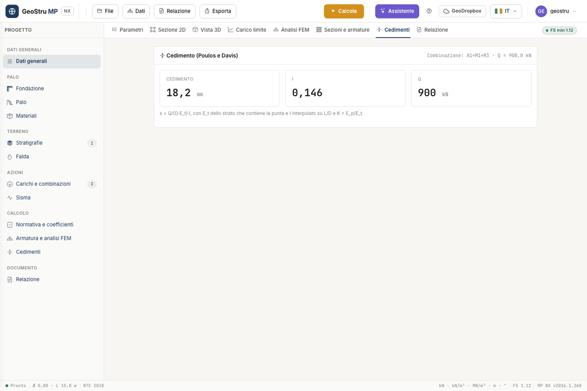

# Settlements

MP NX computes the settlement of the **single pile** with the **Poulos and Davis** method
(1980), for an axial load Q:

s = Q/(D·E~t~)·I

with D the pile diameter, E~t~ the elastic modulus of the soil and I the influence factor.
The method assumes an elastic medium with Poisson's ratio ν = 0.5.

## Required data

- **E** of the layer containing the pile **toe**, in MPa: it is column E of the
  [stratigraphy](stratigrafia.md). Without a value of E the settlement is meaningless.
- The elastic modulus of the pile E~p~, taken from the concrete class in the
  [materials archive](materiali.md).
- Pile diameter and length.
- A **vertical load**.

The factor I is interpolated from a table as a function of **L/D** (eight classes) and of
the relative stiffness **K = E~p~/E~t~** (linear interpolation between 10, 100, 1 000, 10⁴
and 10⁵).

## Settlement options

In the **Settlement options** card of the Parameters tab choose:

- the **Combination** the load is taken from. It is usually a serviceability combination:
  in the opening project the first one, "A1+M1+R3", is selected and "SLE" must be chosen by
  hand;
- the **Load**, in kN. With 0 the program uses the vertical resultant of the chosen
  combination; with a non-zero value it uses that.

The settlement is computed by **Calculate**, together with the rest, at no extra credits.

## Reading the Settlements tab

The tab shows the combination and the load used, then three tiles: the **Settlement** in mm,
the factor **I** and the load **Q**.

!!! example "Example"
    Q = 1 000 kN, D = 0.8 m, L = 10 m, E~p~ = 31 475 MPa, E~t~ = 30 MPa. L/D = 12.5 and
    K = 1 049 give I = 0.147. The settlement is s = 1 000/(0.8·30 000)·0.147 = 6.1 mm. It
    is case 6 of the [validation document](validazione.md).

## Why the settlement is sometimes missing

If the tab says **No settlement computed** after a successful calculation, the chosen
combination **has no vertical load**: E~d,v~ = 0 and the method needs an axial load. The
on-screen message names the combination concerned.

You have two remedies:

1. assign a vertical force **F~y~** in the loads of that combination, or choose another
   combination in the **Settlement options**;
2. enter the **Load** Q directly in the Settlement options.

It happens, for instance, with Bowles' example 16.3, which has the ultimate load only and no
design action.

## Limits

- The settlement is that of the **single** pile: there is no group effect.
- The method uses a single modulus E~t~, that of the toe layer: in strongly layered ground
  the result is an order of magnitude to be assessed with judgement.
- Settlement with Fleming's hyperbolic method, available in the desktop program, is not in
  MP NX.

---

*Found an error on this page? [Let us know](mailto:info@geostru.ai?subject=Help%20MP%20NX) or open a [Pull Request](https://github.com/EngSoft-Geostru/geostru-help-nx/edit/main/mp/docs/en/cedimenti.md).*
