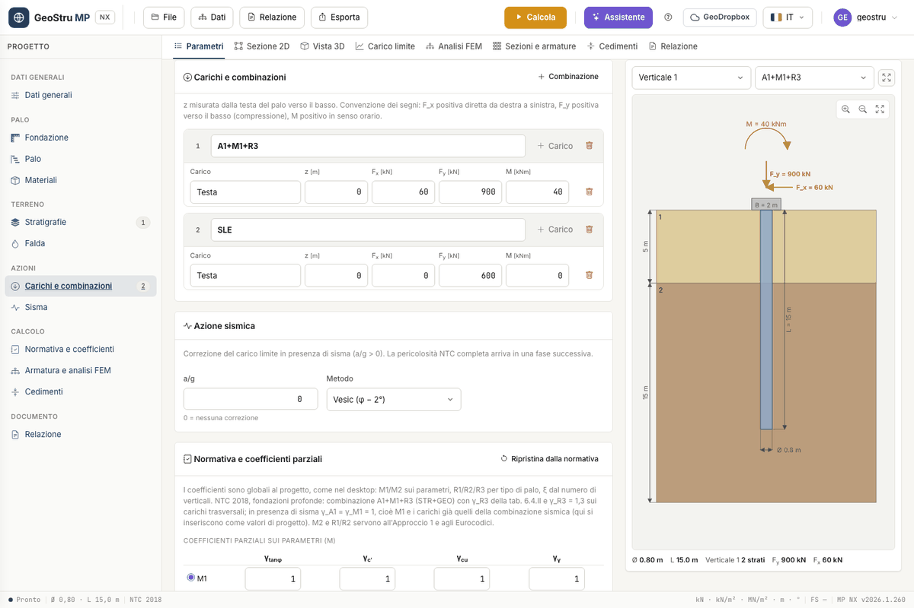

# Loads, combinations and design code

Actions are in the **Loads and combinations** card, factors in the **Code and partial
factors** card. The design code is chosen in **General data**.

## Loads at the head and at the nodes

A **combination** is a named list of loads. **Combination** adds one, **Load** adds a row to
the combination. Each load has:

| Column | Meaning |
|---|---|
| **z** | elevation of the point of application, measured **downwards from the pile head** [m] |
| **F~x~** | horizontal force [kN] |
| **F~y~** | vertical force [kN] |
| **M** | moment [kNm] |

With z = 0 the load is at the head. A load with z > 0 is applied along the shaft: in the
[FEM](fem.md) model it goes to the nearest node. It is used, for instance, for thrusts on a
free length above ground.

For the geotechnical check the program sums the loads of each combination: E~d,v~ is the
vertical resultant, E~d,h~ the horizontal one. If E~d,v~ is negative the combination is in
**tension**: the base does not work and R~d~ = R~k,s~/γ~s~ + W.

!!! warning "Loads are design values"
    MP NX does not multiply the actions by γ~F~. Enter loads **already combined** and
    factored, as they come out of the structural analysis. Names such as "A1+M1+R3" or "SLE"
    are labels: they do not change the factors.

### Sign convention

It is that of the MP desktop program, and the drawing follows it:

- **positive F~x~** acts **from right to left**;
- **positive F~y~** acts **downwards** (compression);
- **positive M** is **clockwise**.

The action scheme is drawn above the pile head, with the moment arc above the two arrows.
Check the direction of the loads there before calculating.

## Design code

In the **Design code (GEO)** field choose among:

- **NTC 2018 — D.M. 17/01/2018**;
- **Eurocodice 7 — EN 1997-1** (Eurocode 7);
- **EN 1997-1 — Romanian national annex**;
- **Classical theory (global factors)**.

When you change the code, the factors card reloads with the default values. Factors
**belong to the project**: they apply to all combinations.

### The NTC 2018 approach for deep foundations

For piles NTC 2018 prescribes combination **A1+M1+R3**: M1 factors (equal to one) on the
soil parameters and γ~R3~ from table 6.4.II on the resistances. With the default values:

| γ~R3~ | Base γ~b~ | Shaft in compression γ~s~ | Shaft in tension | Total |
|---|---|---|---|---|
| Bored piles | 1.35 | 1.15 | 1.25 | 1.30 |
| Driven piles | 1.15 | 1.15 | 1.25 | 1.15 |

On **transverse loads** γ~T~ = 1.3. With **seismic action** γ~A1~ = γ~M1~ = 1: enter the
loads of the seismic combination and keep M1. Sets M2 and R1/R2 serve Design Approach 1 and
the Eurocodes.

### Correlation factors ξ~3~ and ξ~4~

They depend on the number n of investigation verticals (NTC 2018, table 6.4.IV). The table
in the card has columns n = 1, 2, 3, 4, 5, 7, 10; with n = 6 and n = 9 the program uses
columns 7 and 10. With one vertical ξ~3~ = ξ~4~ = 1.70; with three, ξ~3~ = 1.60 and
ξ~4~ = 1.48.

The characteristic resistance is computed **separately for base and shaft**:
R~k~ = min(Q~mean~/ξ~3~, Q~min~/ξ~4~). With **User-assigned ξ** the program ignores the
table and uses the two values you enter.

### Design resistance

R~d~ = R~k,p~/γ~b~ + R~k,s~/γ~s~ − W in compression. With **Global factor on the ultimate
load** (General data) the "Total" factor is used on both. The check is FS = R~d~/|E~d~| ≥ 1.
For the lateral load R~d,h~ = R~k,h~/γ~T~.

With the **Classical theory** ξ = 1 and the global factors are 2.5 on base and shaft; you
find them in the **Classical theory and other** block, together with the **k rock**
exponent.

## Editable factors

All values in the card can be changed: the M1/M2 factors (γ~tanφ~, γ~c′~, γ~cu~, γ~γ~), the
R1/R2/R3 sets per pile type, γ~T~ and the ξ table. The M1/M2 and R1/R2/R3 buttons choose the
column applied. **Reset from code** reloads the defaults of the selected code.

The card also shows the **Screw piles** row, inherited from the code table: MP NX does not
compute screw piles and that row is not used.

## Seismic action

In the **Seismic action** card enter **a/g** and choose the method that corrects the
ultimate load: Vesic, Okamoto or Sano. With a/g = 0 there is no correction. The three
methods are described in [Ultimate load](carico-limite.md). The full NTC seismic hazard is
not part of MP NX: you obtain a/g separately.

---

*Found an error on this page? [Let us know](mailto:info@geostru.ai?subject=Help%20MP%20NX) or open a [Pull Request](https://github.com/EngSoft-Geostru/geostru-help-nx/edit/main/mp/docs/en/combinazioni.md).*
