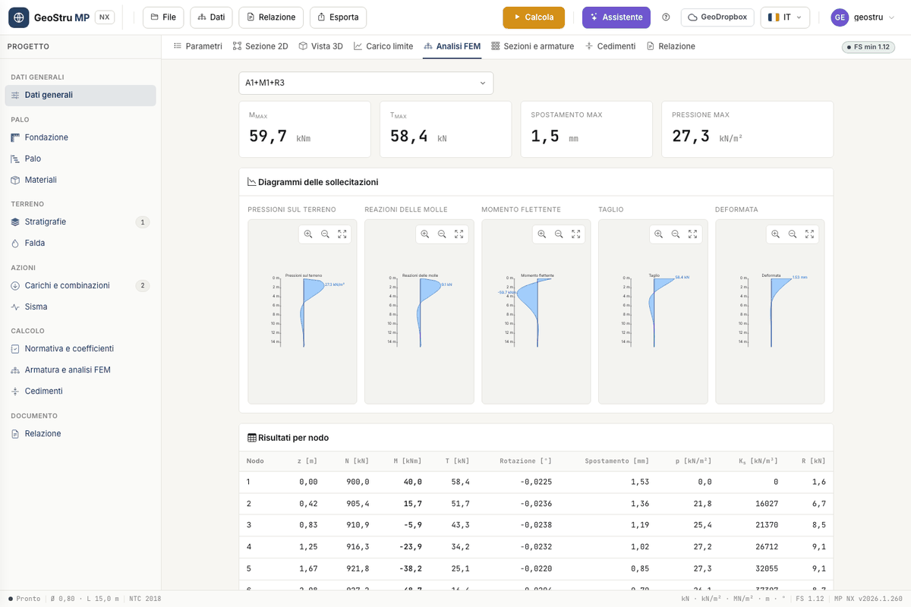

# FEM analysis

The FEM analysis computes the **internal forces along the pile** for horizontal forces,
moments and vertical forces applied at the head or at any elevation. The pile is a **beam on
Winkler elastic soil**: beam elements with constant stiffness E·J and, at each node in the
ground, a horizontal spring.

## Enabling the analysis

In the **Reinforcement and FEM analysis** card tick **Run the FEM analysis and the section
design with Calculate**. With the tick, **Calculate** also runs the FEM and the section
check, and charges 5 more credits. If the analysis produces no results the FEM credit is not
charged and the geotechnical calculation remains valid; the reason appears in the messages.

## The model

| Field | Meaning |
|---|---|
| **Number of elements** | segments the pile is divided into, protrusion included |
| **First soil node** | first node with a spring; 1 = the protrusion is not discretised separately |
| **Subgrade modulus K~s~** | **Bowles** or **Chiarugi-Maia** |
| **K~s~ varying with depth** | with Bowles, K~s~ = A~s~ + B~s~·z; unticked, constant K~s~ |
| **Non-linear soil** | iteratively removes the springs that are no longer effective |
| **X~max~** | maximum linear soil displacement [m] |
| **First-spring reduction** | factor on the spring at the first soil node |
| **Max iterations** | maximum number of cycles of the non-linear calculation |
| **A~s~**, **B~s~**, **n** | assigned K~s~: with A~s~ > 0, K~s~ = A~s~ + B~s~·zⁿ replaces the method |

The stiffness of each spring is K~s~(z)·D times the tributary length of the node, with half
a step at the ends. The elastic modulus of the pile is that of the concrete class in the
[materials archive](materiali.md); the second moment of area is J = π·D⁴/64, or the
**J assigned**. The axial force comes from the self-weight and the vertical forces.

### Modulus of subgrade reaction K~s~

- **Bowles**: K~s~ = A~s~ + B~s~·z, with A~s~ = 40·(c·N~c~ + ½·γ·D·N~γ~) and
  B~s~ = 40·γ·N~q~, in kN/m³, with Hansen's bearing capacity factors. It is computed
  automatically from the layer parameters.
- **Chiarugi-Maia**: k~h~ from the oedometric modulus E~ed~, Poisson's ratio ν of the layer
  and the pile-soil relative stiffness. Fill in E~ed~ and ν in the
  [layer properties](stratigrafia.md).
- **Assigned**: enter A~s~, B~s~ and n. Use it for a K~s~ from tests or from the literature.

### Linear and non-linear

In the **linear** calculation all springs work, in tension too. With **Non-linear soil**
the program repeats the solution and removes the springs with a negative displacement (in
tension) or one larger than **X~max~**, up to the maximum number of iterations.

## Reading the FEM analysis tab

Choose the combination from the drop-down. At the top the maxima: **M~max~**, **T~max~**,
**Max displacement** and **Max pressure**. Then the five **Internal-force diagrams**, each
with its maximum value and zoom controls:

- **Soil pressures** (p = K~s~·y)
- **Spring reactions**
- **Bending moment**
- **Shear**
- **Deflection**

The **Results per node** table reports, for each node: elevation z, N, M, T, rotation,
displacement, pressure p, K~s~ and reaction R. A load with z > 0 is applied to the node
nearest to the given elevation: check in the table where it ended up.

The internal forces of each combination feed the [section check](armature.md) node by node.
The diagrams also go into the DXF drawing and the report.

## Limits of the model

!!! warning "Large displacements"
    The Winkler model captures neither the interaction between springs nor soil yielding,
    beyond the removal of springs. For piles with large displacements you need analyses
    with p-y curves or continuum models, which MP NX does not offer.

The analysis concerns the **single pile**: it does not account for group effects. The
structural check that follows holds for the circular reinforced-concrete section: the FEM
accepts an **assigned J** for other sections, the ULS check remains that of the circular
section of diameter D.

---

*Found an error on this page? [Let us know](mailto:info@geostru.ai?subject=Help%20MP%20NX) or open a [Pull Request](https://github.com/EngSoft-Geostru/geostru-help-nx/edit/main/mp/docs/en/fem.md).*
