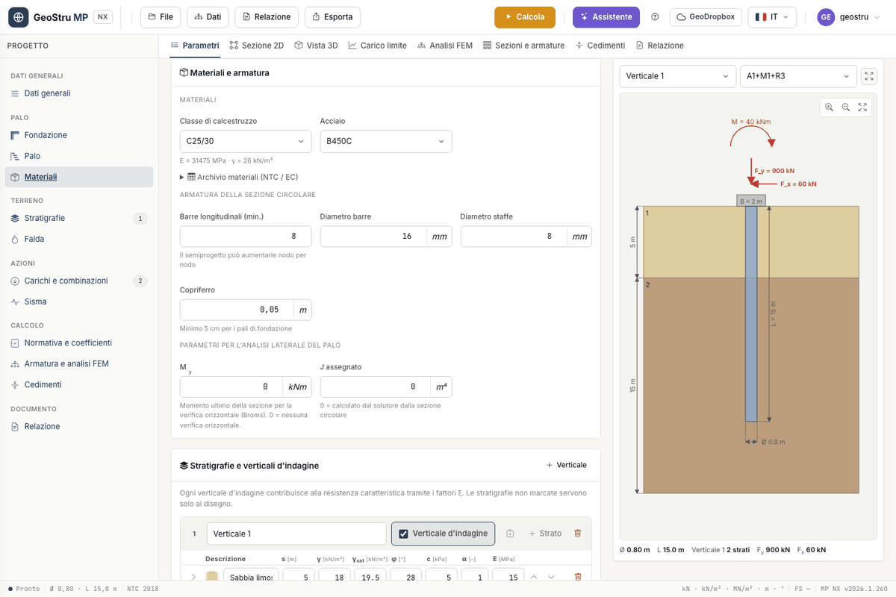

# Materials

The **Materials and reinforcement** card gathers three things: the pile materials, the
section reinforcement and the parameters for the lateral analysis (M~y~ and assigned J).

## Choosing the materials

- **Concrete class**: below the drop-down you see the values of the chosen class. The
  concrete gives the pile weight W, the elastic modulus E~c~ used by the FEM and by Poulos
  and Davis, and f~cd~ for the section check.
- **Steel**: the bar steel, for the pile and for the bar-reinforced micropile.
- **Tube steel**: replaces the bar steel when the micropile is tubular. See
  [Micropiles](micropali.md).

## The project archive

Open **Materials archive (NTC / EC)** to view and edit the tables. The archive **belongs to
the project**: it starts from that of the MP desktop program, travels in the `.mpnx` file
and does not affect other projects. A file saved without an archive takes the starting one.

In the tables you can:

- edit any value, row by row;
- add rows with **Add concrete**, **Add steel** and, for tubes, **Add tube steel**;
- delete a row with the bin at the end of the row.

Hover the headers to read the description of each column.

| Table | Columns |
|---|---|
| Concretes | R~ck~, E~c~, f~ck~, f~cd~, f~ctd~, f~ctm~, ν, α~T~, γ |
| Steels | E~s~, f~yk~, f~yd~, f~tk~, f~td~, ε~uk~, ε~ud~, β~1~β~2~ initial and final |
| Tube steels | product standard, E~s~, f~yk~, f~tk~ |

When you change **R~ck~** the program recomputes f~ck~, f~cd~, f~ctm~, f~ctd~ and E~c~ to
NTC 2018 § 11.2.10; the recomputed values stay editable. From **f~yk~** it recomputes f~yd~
and f~td~. For tube steels f~yd~ = f~yk~/1.05 is not a column: it is always derived.

!!! warning "The concrete unit weight changes the ultimate load"
    In the starting archive the unit weight γ is 25, 26, 27 and 28 kN/m³ for the four
    concrete classes. It enters the pile weight W, which is subtracted from the ultimate
    load. When you compare results with another calculation, check γ and E~c~ first: they
    are the most frequent cause of 1–2 % differences.

## Circular section reinforcement

For the pile and the bar-reinforced micropile enter:

- **Longitudinal bars (min.)**: the starting number. The semi-design may increase them node
  by node;
- **Bar diameter** and **Stirrup diameter**, in mm;
- **Cover**, in m. The on-screen hint recalls the 5 cm recommended for foundation piles; the
  program also accepts smaller values.

These data feed the ULS check and the cage drawing: see
[Sections and reinforcement](armature.md).

## Parameters for the lateral analysis of the pile

- **M~y~**: ultimate moment of the section for Broms' lateral check. With 0 and the FEM
  analysis enabled the program computes it from the reinforced section; with 0 and the FEM
  off there is no lateral check. Details in [Ultimate load](carico-limite.md).
- **J assigned**: second moment of area used by the FEM, in m⁴. With 0 it is computed from
  the circular section. Use it for non-circular sections or to reproduce a textbook case.

---

*Found an error on this page? [Let us know](mailto:info@geostru.ai?subject=Help%20MP%20NX) or open a [Pull Request](https://github.com/EngSoft-Geostru/geostru-help-nx/edit/main/mp/docs/en/materiali.md).*
