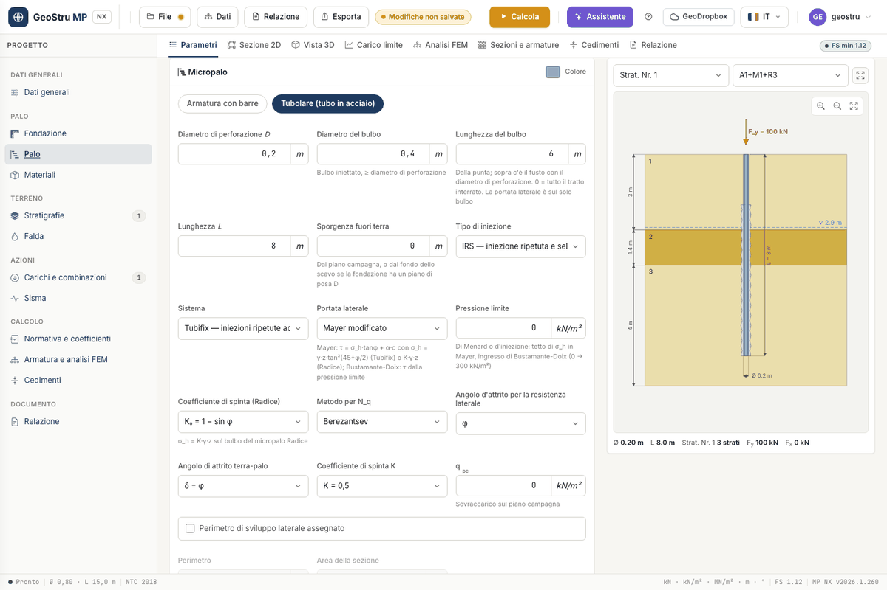

# Micropiles

In **General data** choose the **Type** **Micropile**: the **Pile** card takes the title
**Micropile** and shows the fields for the bulb, the system and the method. The calculation
uses the dedicated micropile routine of the MP desktop program, not the bored-pile one.

## Geometry and system

| Field | Meaning |
|---|---|
| **Drill diameter D** | diameter of the shaft above the bulb |
| **Bulb diameter** | grouted bulb, greater than or equal to the drill diameter |
| **Bulb length** | measured from the toe; 0 = whole embedded length |
| **Length L**, **Protrusion above ground** | as for the pile |
| **Grouting** | **IGU** (single global grouting) or **IRS** (repeated selective grouting) |
| **System** | **Tubifix** (repeated high-pressure grouting) or **Radice** (gravity or low-pressure grouting) |
| **Shaft resistance** | **modified Mayer** or **Bustamante & Doix** |
| **Limit pressure** | Menard or grouting pressure, in kN/m² |
| **Earth pressure coefficient (Radice)** | K~0~ = 1 − sin φ, K~a~ or K~p~ |

At the top of the card you choose the reinforcement: **Bar reinforcement** or **Tubular
(steel tube)**.

## How the capacity is computed

The **shaft resistance** is computed on the **bulb only**, integrating the shear stress in
10 cm steps along its length.

- **Modified Mayer**: τ = σ~h~·tan φ + α·c. For the **Tubifix** system
  σ~h~ = γ·z·tan²(45° + φ/2), capped by the limit pressure when you assign it. For the
  **Radice** system σ~h~ = K·γ·z, with K chosen among K~0~, K~a~ and K~p~.
- **Bustamante & Doix**: τ depends on the limit pressure p~lim~. In frictional soils
  τ = p~lim~/10; in cohesive soils a linear correlation in p~lim~ applies, different for
  **IRS** and **IGU** grouting. If the limit pressure is 0 the program assumes 300 kN/m².

The **base resistance** is computed on the **bulb diameter**, with N~q~ and N~c~ of the
chosen method and the overburden stress at the toe. The **weight** adds the grout of the
shaft, the grout of the bulb and the reinforcement per metre. Broms' **ultimate lateral
load** works on the bulb, with γ, φ and c averaged over the layer thicknesses.

Adhesion α and cohesion c (or c~u~ in undrained layers) come from the
[stratigraphy](stratigrafia.md).

## The tube

With **Tubular** the **Materials and reinforcement** card shows the **Tube** block:

- **Series diameter** and **Series thickness** offer the **UNI EN 10220** dimensional
  series. The choice writes **Tube outer diameter**, **Tube thickness** and **Reinforcement
  weight**, which stay editable for an off-series tube.
- The **Reinforcement weight**, in kN/m, comes from the tube geometry (0.02466·t·(D − t)
  kg/m) and adds to the grout weight.
- **Tube steel** picks the grade from the tube-steel archive: S235…S460 grades of
  EN 10210/10219, EN 10297-1 mechanical tubes, API 5CT and API 5L tubulars. The design
  strength is f~yd~ = f~yk~/1.05. The archive is edited like the other
  [materials](materiali.md).
- **Cover** is the grout thickness between the tube and the drill hole.

### M~y~ of the composite section

Broms needs the ultimate moment of the section, M~y~. If you leave it at 0, for the tubular
micropile the program computes the **full-plastic moment of the composite tube + grout
section** at zero axial force: tube steel at f~yd~, grout in compression at f~cd~ of the
chosen concrete class. If the solver does not converge it uses the plastic moment of the
tube alone, W~pl~·f~yd~, and reports it among the messages.

!!! note "The composite moment can be lower than that of the tube alone"
    In the DPHS1 example the composite section gives 39.68 kNm against 42.70 kNm for the
    tube alone. With the grout in compression the neutral axis rises and the steel in
    compression decreases more than the grout makes up for. It is the value of the desktop
    program, reproduced and declared.

If you assign M~y~ by hand, your value prevails. In the FEM model the inertia is the
equivalent tube + grout one, transformed with E~s~/E~c~, unless you assign J.

## What is not available

- The **node-by-node ULS check of the composite** tube + grout **section**: the **Sections
  and reinforcement** tab shows the notice "Tubular section check not available". The FEM is
  run anyway.
- **Micropile networks** and **raked micropiles**.
- The **critical buckling load** of the micropile.
- Settlement with Fleming's hyperbolic method: the settlement is that of
  [Poulos and Davis](cedimenti.md).

---

*Found an error on this page? [Let us know](mailto:info@geostru.ai?subject=Help%20MP%20NX) or open a [Pull Request](https://github.com/EngSoft-Geostru/geostru-help-nx/edit/main/mp/docs/en/micropali.md).*
