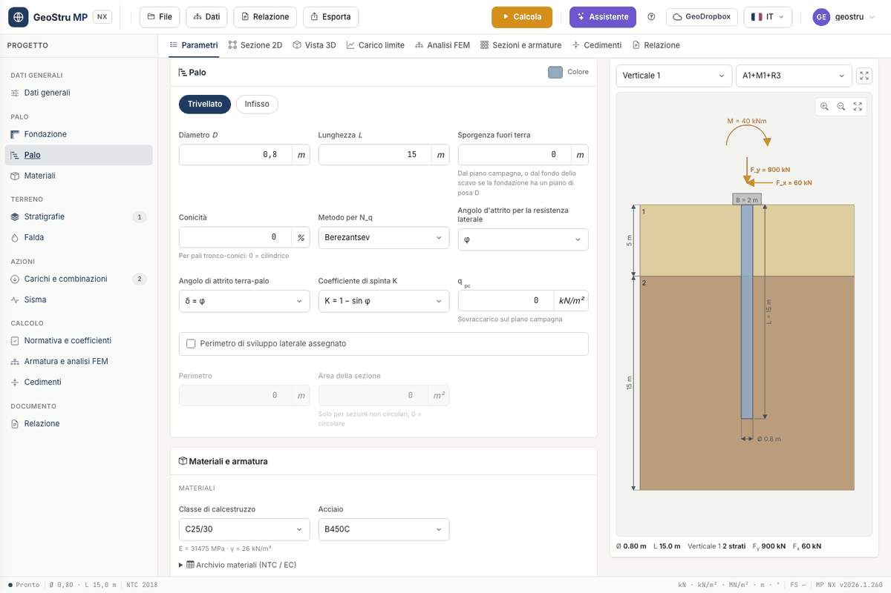

# Pile and footing

The geometry is described in three cards of the **Parameters** tab: **General data**,
**Connecting footing** and **Pile**. For micropiles the Pile card changes: see
[Micropiles](micropali.md).

## General data

Besides description, location, engineer and client, here you choose:

- the **Type**: **Pile** or **Micropile**;
- the **Design code (GEO)** and the **Design code (STRU)**, described in
  [Loads, combinations and design code](combinazioni.md) and in
  [Sections and reinforcement](armature.md);
- the **Head restraint**: **Fixed in the cap** or **Hinged under the cap**. It sets the
  scheme of Broms' ultimate lateral load (fixed or free head);
- **Exclude base resistance** (Q~p~ = 0, friction pile) or **Exclude shaft resistance**
  (Q~s~ = 0). The two cannot be excluded together;
- **Global factor on the ultimate load**: uses the "Total" factor instead of base + shaft.

## Connecting footing

With **Connecting footing present** you draw a beam, pad, raft or circular pile cap on top
of the pile, with dimensions B, L and height H.

The value that enters the calculation is the **Founding depth D**, that is the bottom of the
excavation. The pile starts there: the toe goes down to D + L, the shaft adhesion above the
founding plane is removed and the protrusion is measured from the excavation bottom. The
**Excavation width** is for the drawing only (0 = same as B).

!!! note "Founding plane inside the first layer"
    If the founding plane falls within the first layer, the adhesion above D is not removed.
    This is the behaviour of the desktop program, kept and declared in the validation
    document.

## Pile

Choose the installation method, **Bored** or **Driven**: it changes the set of γ~b~ and
γ~s~ factors applied by the design code and, for driven piles, enables the taper factor.

| Field | Meaning |
|---|---|
| **Diameter D** | shaft diameter; with a taper it is the diameter **at the toe** |
| **Length L** | pile length in the ground, from ground level or from the founding plane of the footing: the toe is at founding depth + L |
| **Protrusion above ground** | free length above ground level, or above the excavation bottom when the footing has a founding depth |
| **Taper** | in %, for tapered piles; 0 = cylindrical |
| **q~pc~** | surcharge at ground level, in kN/m² |

With a non-zero taper the diameter grows towards the head: the program uses the mean
diameter for the shaft resistance and the volume of the truncated cone for the weight. For
**driven** piles the frictional shaft resistance is also multiplied by the taper factor
F~w~.

The protrusion adds to L: it does not enter the weight W of the ultimate load, which is
computed on the length L, but it enters the FEM model, where the free length has no springs.
The "Pile immersed" example has 4 m above ground with water above ground level.

Method for N~q~, friction angle for the shaft resistance, δ and K sit in the same card but
concern the calculation: they are explained in [Ultimate load](carico-limite.md).

### Assigned perimeter

For a non-circular section tick **Assigned shaft perimeter** and enter **Perimeter** and
**Section area** (0 = circular). Until the box is ticked the two fields stay read-only. The
structural check remains that of the circular section: see the limits in
[Sections and reinforcement](armature.md).

## 2D section and 3D view

The **2D section** tab shows the dimensioned drawing of pile, footing, layers, water table
and actions, for the chosen vertical and combination. Export it as **PNG** (free) or in the
**DXF** drawing.

The **3D view** shows the pile inside a cut-away block of ground. Drag to orbit, use the
wheel to zoom and **Reset view** to go back to the initial view. The **Soil**, **Footing**
and **Reinforcement** boxes switch the solids on and off; with **Reinforcement** the pile
becomes translucent and the longitudinal bars appear. Stirrups are not drawn in 3D: their
spacing comes out of the calculation, not from the input.

---

*Found an error on this page? [Let us know](mailto:info@geostru.ai?subject=Help%20MP%20NX) or open a [Pull Request](https://github.com/EngSoft-Geostru/geostru-help-nx/edit/main/mp/docs/en/palo.md).*
