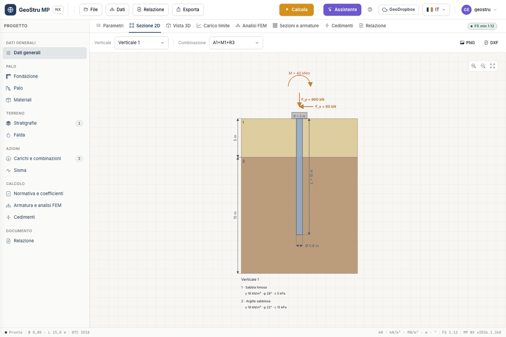

# Quick start (5 minutes)

When you first open it, MP NX shows a project that is ready to calculate: a **bored pile
Ø 0.80 m, L = 15 m**, with a pad footing, one investigation vertical of two layers (silty
sand and sandy clay) and two load combinations. Use it for a complete tour, then replace it
with your own data.

## 1. Open the app

Go to [nx.geostru.ai/mp](https://nx.geostru.ai/mp/) with your GeoStru account. The window
has three parts: the project tree on the left, the tabs in the middle (**Parameters**,
**2D section**, **3D view**, **Ultimate load**, **FEM analysis**, **Sections and
reinforcement**, **Settlements**, **Report**), and the top bar with the **File**, **Data**,
**Report** and **Export** menus and the **Calculate** button.

In the **Parameters** tab each item of the tree takes you to its card. The preview on the
right redraws pile, layers, water table and loads at every change; the two drop-downs above
the drawing choose the vertical and the combination shown.

## 2. Check the data

Scroll through the cards without changing anything: **General data** (type, design code,
head restraint), **Connecting footing**, **Pile**, **Materials and reinforcement**,
**Stratigraphies and investigation verticals**, **Water table**, **Loads and combinations**.
Combination "A1+M1+R3" applies F~y~ = 900 kN, F~x~ = 60 kN and M = 40 kNm at the head;
"SLE" applies 600 kN vertically.

!!! note "What the first calculation costs"
    In the opening project the FEM analysis is **enabled**: **Calculate** charges 8 + 5
    credits. For the ultimate load alone (8 credits) untick **Run the FEM analysis and the
    section design with Calculate**, in the **Reinforcement and FEM analysis** card.

## 3. Calculate

Press **Calculate**, top right. The page reloads with the results; next to the tabs the
**FS min** badge appears, green when all checks are satisfied.

## 4. Read the ultimate load

Open the **Ultimate load** tab. At the top you find the outcome and the **Governing
combination**, then four tiles: **Design resistance R~d~**, **Design action E~d~**,
**Characteristic resistance R~k~** and **Safety factor**. Below, one card per combination
with N~q~, N~c~, Q~p~, Q~s~, the weight W, the ultimate load Q and Broms' H~max~. The full
reading guide is in [Ultimate load](carico-limite.md).

With the FEM enabled, also look at **FEM analysis** (diagrams and table per node) and
**Sections and reinforcement** (ULS checks, cage, bar schedule). The **2D section** tab
shows the dimensioned drawing, with the **PNG** and **DXF** buttons.

## 5. Generate the report

Open the **Report** tab: the preview is free and follows the project. **DOCX** (or **PDF**)
downloads the document; the charge is applied only once the file has been produced.

## 6. Save the project

**File → Save** downloads the project as an **`.mpnx`** file; **File → Open** loads it
back. Alternatively use the **GeoDropbox** button to keep it in the cloud. Until you save,
the bar shows **Unsaved changes**.

## What next

To start from a different case, **File → New project** creates an empty project. Or
download one of the eight [example projects](esempi.md) from the **?** button (**Resources**
tab) and open it with **File → Open**.

---

*Found an error on this page? [Let us know](mailto:info@geostru.ai?subject=Help%20MP%20NX) or open a [Pull Request](https://github.com/EngSoft-Geostru/geostru-help-nx/edit/main/mp/docs/en/quickstart.md).*
