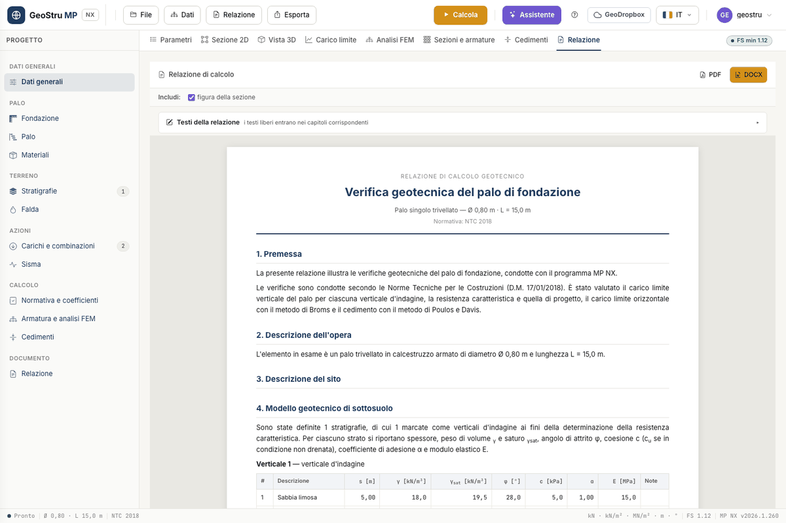

# Report, exports and assistant

## Report preview

The **Report** tab shows the preview of the document, updated from the project and from the
last calculation. The preview is free: use it to check texts and tables before generating
the file.

The report follows this outline: foreword; description of the work and of the site;
geological model and site investigation; subsoil geotechnical model, with the section
figure; the pile and the materials; design actions; calculation method and factors;
ultimate load of the pile; characteristic and design resistances; ultimate lateral load
(Broms); pile settlement (Poulos and Davis); structural analysis of the pile; section check
and design; reinforcement cage and bar schedule; construction requirements; conclusions;
warnings; references. The chapters on FEM, section and cage appear only when the analysis
has been run.

The **Include: section figure** box decides whether the 2D section goes into the document.

### Free texts per chapter

Open **Report texts** to write your own texts: **Type of work**, **Foreword**,
**Description of the work**, **Site description**, **Geological model**, **Site
investigation**, **Calculation model**, **Construction requirements** and **Conclusions**.
Each text goes into the corresponding chapter; with the **include** box next to the title
you leave out the optional chapters. The texts are saved with the project.

### Word and PDF

Generate the file with the **DOCX** and **PDF** buttons of the tab, or from the **Report**
menu: **Word (.docx)**, **PDF** and **Word 97-2003 (.doc)**. The report costs 10 credits,
charged only once the file has been produced. The document comes out in the interface
language, Italian or English.

## Exports

| What | Where | Credits |
|---|---|---|
| **Project (.mpnx)** | **Export** menu or **File → Save** | 0 |
| **Section (PNG)** | **Export** menu, or the **PNG** button of the 2D section tab | 0 |
| **DXF drawing (section, diagrams, reinforcement)** | **Export** menu, or the **DXF** button of the 2D section tab | 10 |
| **Cage DXF** | **Sections and reinforcement** tab | 10 |

The DXF drawing puts side by side the section, the five FEM diagrams and the reinforcement,
with the bar schedule. The **Cage DXF** contains the shop drawing alone, with the schedule.
Drawings are in metres.

### Provenance signature

Exported files carry a signature identifying their origin. The DXF has a comment at the top
of the file, which CAD programs ignore. The Word document has author and keywords in its
properties, with a fingerprint of the form `nx-…`. The report footer carries the provenance
notice with links to the terms of service and to the validation page.

## Project file and GeoDropbox

The project is an **`.mpnx`** file: it holds the data, the materials archive, the cage
rules and the report texts, not the results. **File → Save** downloads it with the current
name, **Save as** asks for the name, **Open** loads it back. The name of the current file is
shown in the status bar.

The **GeoDropbox** button opens and saves projects in the GeoStru cloud, so you find them
from any workstation. The GeoDropbox subscription is separate from app credits.

## AI assistant

The **Assistant** button opens the chat beside the project. The assistant:

- **reads the current project** and the results, and interprets them;
- explains the methods: N~q~, ξ and γ~R~ factors, Broms, Poulos and Davis, FEM, section
  check;
- carries out a **geotechnical review** of the data;
- **fills in the project from an attached document**: with the paperclip you attach, for
  example, a geological report in PDF, and the assistant proposes stratigraphy and
  parameters;
- opens a **support ticket**.

Each message costs 3 credits, charged only if the answer arrives.

!!! warning "Answers generated by an AI system"
    The assistant's answers are generated by an artificial intelligence system and may
    contain errors. Data filled in from a document and opinions on the results must be
    **verified by the designer**, who remains responsible for the calculation.

---

*Found an error on this page? [Let us know](mailto:info@geostru.ai?subject=Help%20MP%20NX) or open a [Pull Request](https://github.com/EngSoft-Geostru/geostru-help-nx/edit/main/mp/docs/en/relazione.md).*
