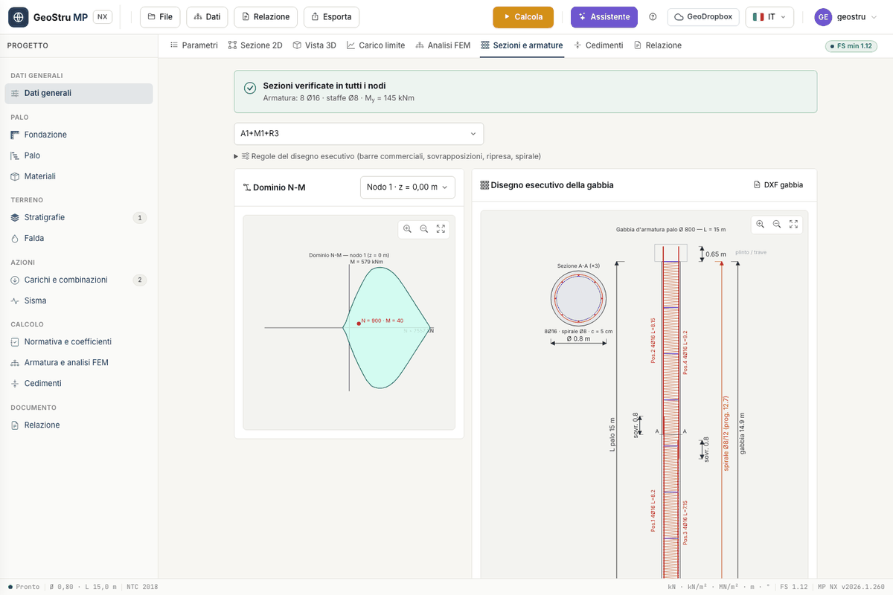
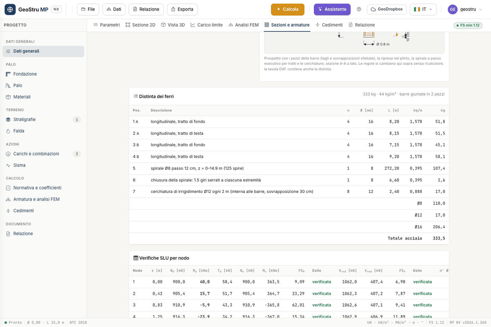

# Sezioni e armature

Con l'[analisi FEM](fem.md) attiva, **Calcola** verifica la **sezione circolare in
calcestruzzo armato** a ogni nodo del modello, per ogni combinazione, e progetta barre e
staffe dove serve. I risultati stanno nella scheda **Sezioni e armature**, insieme al
disegno esecutivo della gabbia e alla distinta dei ferri.

I dati d'ingresso sono nella card **Materiali e armatura**: classe di calcestruzzo, acciaio,
**Barre longitudinali (min.)**, **Diametro barre**, **Diametro staffe** e **Copriferro**.
Vedi [Materiali](materiali.md).

## Verifica SLU nodo per nodo

A ogni nodo il programma prende N~d~, M~d~ e T~d~ dal FEM e calcola:

- a **pressoflessione**, il momento resistente M~u~ del dominio N-M a N = N~d~, e la misura
  di sicurezza FS~M~ = M~u~/M~d~;
- a **taglio**, le resistenze V~rcd~ (puntone compresso) e V~rwd~ (armatura trasversale),
  con l'inclinazione θ del puntone, e FS~V~ = T~u~/T~d~.

Il dominio N-M è ottenuto per integrazione a strisce della sezione circolare, con legame
parabola-rettangolo per il calcestruzzo (ε~cu~ = 3,5 ‰) ed elasto-plastico per l'acciaio.
In entrambe le verifiche il nodo è verificato con FS ≥ 1.

### La normativa strutturale

Il campo **Normativa (STRU)**, nei Dati generali, ha tre voci:

| Voce | Momento resistente |
|---|---|
| **NTC 2018 (sismica non dissipativa)** | al **primo snervamento** dell'acciaio (NTC 2018 § 7.4.4.5) |
| **NTC (a rottura)** | a rottura, ε~su~ = 10 ‰ |
| **EC2** | a rottura secondo EN 1992-1-1, ε~ud~ = 0,9·ε~uk~ |

Il taglio segue NTC 2018 § 4.1.2.3.5 o EN 1992-1-1 § 6.2.

!!! note "Il momento di primo snervamento è più basso: è voluto"
    Con **NTC 2018 (sismica non dissipativa)** la sezione deve restare in campo
    sostanzialmente elastico, quindi M~u~ è il momento di primo snervamento. Per un palo
    Ø 80 cm con 12 Ø 20 e C25/30 vale 315 kNm, contro 455 kNm a rottura. Se confronti il
    risultato con gli abachi adimensionali, che sono a rottura, scegli **NTC (a rottura)**.

### Semiprogetto

Se un nodo non è verificato, il programma **aumenta il numero di barre**, fino al limite
geometrico della sezione, e **riduce il passo delle staffe**. Barre e passo possono quindi
cambiare da nodo a nodo. Il numero che scrivi in **Barre longitudinali (min.)** è il punto
di partenza, non un vincolo.

## Leggere la scheda

L'esito in alto dice **Sezioni verificate in tutti i nodi** oppure **Sezione NON verificata
in almeno un nodo**, con l'armatura e il M~y~ calcolato; se in Broms è entrato un valore
manuale, è riportato accanto. Scegli la combinazione dalla tendina.

- **Dominio N-M**: il dominio di resistenza con il punto (N~d~, M~d~) del nodo scelto.
  Cambia nodo dalla tendina della card.
- **Disegno esecutivo della gabbia** e **Distinta dei ferri**, descritti più sotto.
- **Verifiche SLU per nodo**: quota z, N~d~, M~d~, T~d~, N~u~, M~u~, FS~M~ con l'esito,
  V~rcd~, V~rwd~, FS~V~ con l'esito, numero di barre, **Passo staffe**, asse neutro y~n~,
  deformazioni ε~c~ ed ε~s~, inclinazione θ dei puntoni.

## Disegno esecutivo della gabbia

La verifica dice quante barre e quale passo servono a ogni nodo. Il **Disegno esecutivo
della gabbia** trasforma quel risultato nella gabbia da costruire:

- le barre longitudinali sono il **massimo** fra i nodi, tagliate in pezzi entro la
  **lunghezza commerciale**;
- le giunzioni sono **per sovrapposizione**, **sfalsate** fra due gruppi di barre, così non
  cadono tutte sulla stessa sezione;
- le barre proseguono sopra la testa del palo con la **ripresa nel plinto**;
- l'armatura trasversale è una **spirale continua** o **staffe circolari chiuse**, a tratti
  di passo costante, con il passo di calcolo **arrotondato per difetto**;
- le **cerchiature di irrigidimento** tengono in forma la gabbia durante il sollevamento.

Il disegno mostra il prospetto con i pezzi e la sezione A-A a lato; rotella e trascinamento
fanno zoom e spostamento.

### Le regole

Apri **Regole del disegno esecutivo** sopra i disegni:

| Regola | Default |
|---|---|
| **Lunghezza commerciale barre** | 12 m |
| **Sovrapposizione l~s~** | 50 Ø (minimo 20 Ø) |
| **Ripresa nel plinto** | 40 Ø (0 = nessuna) |
| **Fondo gabbia dalla punta** | 0,10 m |
| **Armatura trasversale** | Spirale continua |
| **Arrotondamento del passo (per difetto)** | 0,01 m |
| **Cerchiature di irrigidimento Ø** | 12 mm (0 = nessuna) |
| **Interasse cerchiature** | 2 m |

Le regole sono salvate nel progetto e **non toccano il calcolo**. Quando ne cambi una, la
gabbia e la distinta si ridisegnano dal risultato già calcolato: **non serve ricalcolare e
non costa crediti**.

## Distinta dei ferri

La card **Distinta dei ferri** elenca le posizioni: descrizione, numero, diametro, lunghezza,
peso al metro e peso, con i parziali per diametro e il **Totale acciaio**. Nell'intestazione
leggi il peso totale, l'incidenza in kg/m³ e in quanti pezzi sono giuntate le barre. Il peso
al metro è 0,006165·Ø² kg/m, con Ø in mm.

Il pulsante **DXF gabbia** esporta il disegno esecutivo con la distinta; la tavola DXF
completa (menu **Esporta**) e la relazione riportano anch'esse la distinta. I due DXF
costano il credito di esportazione.

## Cosa non è coperto

- Sezioni **non circolari**: la verifica SLU è solo per la sezione circolare.
- Sezione mista **tubo + malta** del micropalo tubolare: la verifica nodo per nodo non è
  disponibile. Vedi [Micropali](micropali.md).
- L'armatura a traliccio e le verifiche agli stati limite di esercizio (fessurazione,
  tensioni) non fanno parte di MP NX.

---

*Hai trovato un errore in questa pagina? [Segnalacelo](mailto:info@geostru.ai?subject=Help%20MP%20NX) o apri una [Pull Request](https://github.com/EngSoft-Geostru/geostru-help-nx/edit/main/mp/docs/it/armature.md).*
