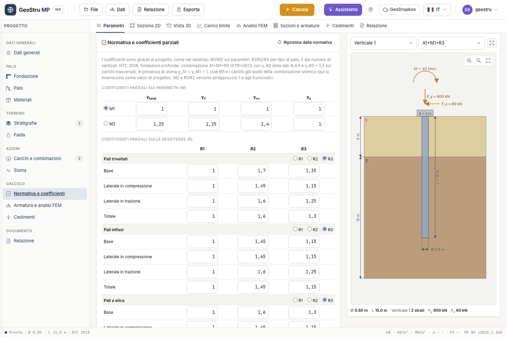

# Carichi, combinazioni e normativa

Le azioni stanno nella card **Carichi e combinazioni**, i coefficienti nella card
**Normativa e coefficienti parziali**. La normativa si sceglie nei **Dati generali**.

## Carichi in testa e ai nodi

Una **combinazione** è un elenco di carichi con un nome. Con **Combinazione** ne aggiungi
una, con **Carico** aggiungi una riga alla combinazione. Ogni carico ha:

| Colonna | Significato |
|---|---|
| **z** | quota del punto di applicazione, misurata **dalla testa del palo verso il basso** [m] |
| **F~x~** | forza orizzontale [kN] |
| **F~y~** | forza verticale [kN] |
| **M** | momento [kNm] |

Con z = 0 il carico è in testa. Un carico con z > 0 è applicato lungo il fusto: nel modello
[FEM](fem.md) finisce sul nodo più vicino. Serve, per esempio, per le spinte su un tratto
fuori terra.

Per la verifica geotecnica il programma somma i carichi di ogni combinazione: E~d,v~ è la
risultante verticale, E~d,h~ quella orizzontale. Se E~d,v~ è negativa la combinazione è in
**trazione**: la punta non lavora e R~d~ = R~k,s~/γ~s~ + W.

!!! warning "I carichi sono valori di progetto"
    MP NX non moltiplica le azioni per γ~F~. Scrivi i carichi **già combinati** e
    amplificati, come escono dall'analisi della struttura. I nomi «A1+M1+R3» o «SLE» sono
    etichette: non cambiano i coefficienti.

### Convenzione dei segni

È quella del programma desktop MP, e il disegno la segue:

- **F~x~ positiva** è diretta **da destra a sinistra**;
- **F~y~ positiva** è diretta **verso il basso** (compressione);
- **M positivo** è **orario**.

Lo schema delle azioni è disegnato sopra la testa del palo, con l'arco del momento sopra le
due frecce. Controlla lì il verso dei carichi prima di calcolare.

## Normativa

Nel campo **Normativa (GEO)** scegli fra:

- **NTC 2018 — D.M. 17/01/2018**;
- **Eurocodice 7 — EN 1997-1**;
- **EN 1997-1 — annesso nazionale rumeno**;
- **Teoria classica (coefficienti globali)**.

Cambiando normativa la card dei coefficienti si ricarica con i valori di default. I
coefficienti sono **del progetto**: valgono per tutte le combinazioni.

### L'approccio NTC 2018 per le fondazioni profonde

Per i pali le NTC 2018 prevedono la combinazione **A1+M1+R3**: coefficienti M1 (unitari) sui
parametri del terreno e γ~R3~ della tabella 6.4.II sulle resistenze. Con i valori di default:

| γ~R3~ | Base γ~b~ | Laterale in compressione γ~s~ | Laterale in trazione | Totale |
|---|---|---|---|---|
| Pali trivellati | 1,35 | 1,15 | 1,25 | 1,30 |
| Pali infissi | 1,15 | 1,15 | 1,25 | 1,15 |

Sui **carichi trasversali** γ~T~ = 1,3. In presenza di **sisma** γ~A1~ = γ~M1~ = 1: inserisci
i carichi della combinazione sismica e lascia M1. I gruppi M2 e R1/R2 servono
all'Approccio 1 e agli Eurocodici.

### Fattori di correlazione ξ~3~ e ξ~4~

Dipendono dal numero n di verticali d'indagine (NTC 2018, tabella 6.4.IV). La tabella della
card ha le colonne n = 1, 2, 3, 4, 5, 7, 10; con n = 6 e n = 9 il programma usa le colonne
7 e 10. Con una sola verticale ξ~3~ = ξ~4~ = 1,70; con tre, ξ~3~ = 1,60 e ξ~4~ = 1,48.

La resistenza caratteristica è calcolata **separatamente per punta e laterale**:
R~k~ = min(Q~med~/ξ~3~, Q~min~/ξ~4~). Con **ξ assegnati dall'utente** il programma ignora la
tabella e usa i due valori che scrivi.

### Resistenza di progetto

R~d~ = R~k,p~/γ~b~ + R~k,s~/γ~s~ − W in compressione. Con **Coefficiente globale sul carico
limite** (Dati generali) si usa il coefficiente «Totale» su entrambe. La verifica è
FS = R~d~/|E~d~| ≥ 1. Per il carico orizzontale R~d,h~ = R~k,h~/γ~T~.

Con la **Teoria classica** ξ = 1 e i coefficienti globali valgono 2,5 su base e laterale; li
trovi nel blocco **Teoria classica e altro**, insieme all'esponente **k roccia**.

## Coefficienti modificabili

Tutti i valori della card si possono cambiare: i coefficienti M1/M2 (γ~tanφ~, γ~c′~, γ~cu~,
γ~γ~), le terne R1/R2/R3 per tipo di palo, γ~T~ e la tabella ξ. I pulsanti M1/M2 e R1/R2/R3
scelgono la colonna applicata. **Ripristina dalla normativa** ricarica i default della
normativa selezionata.

La card mostra anche la riga **Pali a elica**, ereditata dalla tabella normativa: MP NX non
calcola pali a elica e quella riga non viene usata.

## Azione sismica

Nella card **Azione sismica** scrivi **a/g** e scegli il metodo di correzione del carico
limite: Vesic, Okamoto o Sano. Con a/g = 0 non c'è correzione. I tre metodi sono descritti
in [Carico limite](carico-limite.md). La pericolosità sismica NTC completa non fa parte di
MP NX: a/g lo ricavi a parte.

---

*Hai trovato un errore in questa pagina? [Segnalacelo](mailto:info@geostru.ai?subject=Help%20MP%20NX) o apri una [Pull Request](https://github.com/EngSoft-Geostru/geostru-help-nx/edit/main/mp/docs/it/combinazioni.md).*
