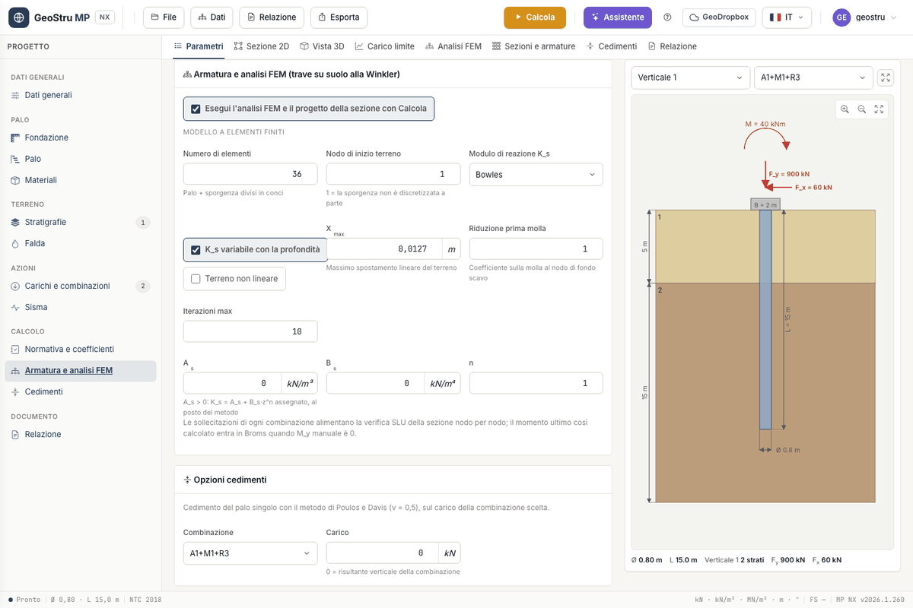

# Analisi FEM

L'analisi FEM calcola le **sollecitazioni lungo il palo** per forze orizzontali, momenti e
forze verticali applicati in testa o a qualunque quota. Il palo è una **trave su suolo
elastico alla Winkler**: elementi di trave con rigidezza E·J costante e, a ogni nodo nel
terreno, una molla orizzontale.

## Attivare l'analisi

Nella card **Armatura e analisi FEM** spunta **Esegui l'analisi FEM e il progetto della
sezione con Calcola**. Con la spunta, **Calcola** esegue anche il FEM e la verifica della
sezione, e addebita 5 crediti in più. Se l'analisi non produce risultati il credito del FEM
non viene addebitato e il calcolo geotecnico resta valido; il motivo compare fra i messaggi.

## Il modello

| Campo | Significato |
|---|---|
| **Numero di elementi** | conci in cui è diviso il palo, sporgenza compresa |
| **Nodo di inizio terreno** | primo nodo con la molla; 1 = la sporgenza non è discretizzata a parte |
| **Modulo di reazione K~s~** | **Bowles** o **Chiarugi-Maia** |
| **K~s~ variabile con la profondità** | con Bowles, K~s~ = A~s~ + B~s~·z; senza spunta, K~s~ costante |
| **Terreno non lineare** | esclude in modo iterativo le molle non più efficaci |
| **X~max~** | massimo spostamento lineare del terreno [m] |
| **Riduzione prima molla** | coefficiente sulla molla al nodo di fondo scavo |
| **Iterazioni max** | numero massimo di cicli del calcolo non lineare |
| **A~s~**, **B~s~**, **n** | K~s~ assegnato: con A~s~ > 0 vale K~s~ = A~s~ + B~s~·zⁿ al posto del metodo |

La rigidezza di ogni molla è K~s~(z)·D per la lunghezza di influenza del nodo, con metà
passo agli estremi. Il modulo elastico del palo è quello della classe di calcestruzzo
nell'[archivio dei materiali](materiali.md); il momento d'inerzia è J = π·D⁴/64, oppure il
**J assegnato**. Lo sforzo normale nasce dal peso proprio e dalle forze verticali.

### Modulo di reazione K~s~

- **Bowles**: K~s~ = A~s~ + B~s~·z, con A~s~ = 40·(c·N~c~ + ½·γ·D·N~γ~) e B~s~ = 40·γ·N~q~,
  in kN/m³, con i fattori di capacità portante di Hansen. È calcolato in automatico dai
  parametri degli strati.
- **Chiarugi-Maia**: k~h~ dal modulo edometrico E~ed~, dal coefficiente di Poisson ν dello
  strato e dalla rigidezza relativa palo-terreno. Compila E~ed~ e ν nelle
  [proprietà dello strato](stratigrafia.md).
- **Assegnato**: scrivi A~s~, B~s~ e n. Serve per usare un K~s~ da prove o da letteratura.

### Lineare e non lineare

Nel calcolo **lineare** tutte le molle lavorano, anche in trazione. Con **Terreno non
lineare** il programma ripete la soluzione ed esclude le molle con spostamento negativo (in
trazione) o maggiore di **X~max~**, fino al numero massimo di iterazioni.

## Leggere la scheda Analisi FEM

Scegli la combinazione dalla tendina. In alto i massimi: **M~max~**, **T~max~**,
**Spostamento max** e **Pressione max**. Poi i cinque **Diagrammi delle sollecitazioni**,
ognuno con il valore massimo e i comandi di zoom:

- **Pressioni sul terreno** (p = K~s~·y)
- **Reazioni delle molle**
- **Momento flettente**
- **Taglio**
- **Deformata**

La tabella **Risultati per nodo** riporta, per ogni nodo: quota z, N, M, T, rotazione,
spostamento, pressione p, K~s~ e reazione R. Un carico con z > 0 viene applicato al nodo più
vicino alla quota indicata: controlla in tabella dove è finito.

Le sollecitazioni di ogni combinazione alimentano la [verifica della sezione](armature.md)
nodo per nodo. I diagrammi entrano anche nella tavola DXF e nella relazione.

## Limiti del modello

!!! warning "Grandi spostamenti"
    Il modello alla Winkler non coglie l'interazione fra le molle né la plasticizzazione
    del terreno, oltre l'esclusione delle molle. Per pali con grandi spostamenti servono
    analisi con curve p-y o modelli continui, che MP NX non offre.

L'analisi riguarda il **palo singolo**: non tiene conto dell'effetto di gruppo. La verifica
strutturale che segue vale per la sezione circolare in calcestruzzo armato: il FEM accetta
un **J assegnato** per sezioni diverse, la verifica SLU resta quella della sezione circolare
di diametro D.

---

*Hai trovato un errore in questa pagina? [Segnalacelo](mailto:info@geostru.ai?subject=Help%20MP%20NX) o apri una [Pull Request](https://github.com/EngSoft-Geostru/geostru-help-nx/edit/main/mp/docs/it/fem.md).*
