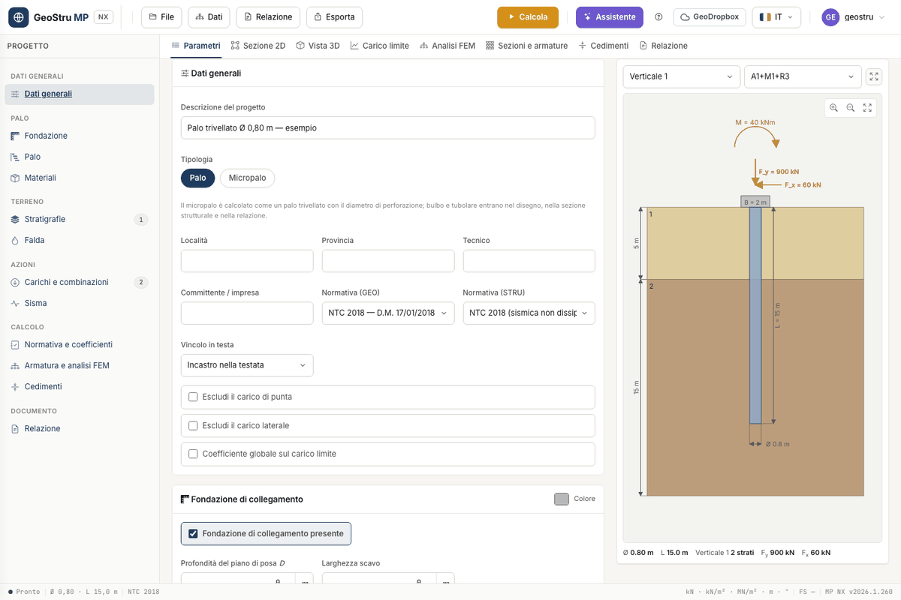

# MP NX — Pali e micropali

**MP NX** analizza e progetta un **palo di fondazione singolo** o un **micropalo singolo**:
carico limite verticale e orizzontale, resistenze di progetto secondo NTC 2018 ed
EN 1997-1, sollecitazioni lungo il fusto con un modello a elementi finiti, verifica della
sezione in calcestruzzo armato, gabbia d'armatura e cedimento. Il motore di calcolo è quello
di MP, il programma desktop di GeoStru per i pali, portato sul web.

[**Apri l'app**](https://nx.geostru.ai/mp/){ .md-button .md-button--primary }

## A chi serve

A ingegneri geotecnici e strutturisti, geologi, studi di progettazione e imprese che devono
dimensionare un palo o un micropalo e consegnare una relazione di calcolo. L'interfaccia e
la relazione sono in **italiano** e in **inglese**.

## Cosa fa

- **Carico limite verticale** (punta + laterale) per ogni verticale d'indagine, in
  compressione e in trazione, con stratigrafie multiple, falda, strati non drenati, strati
  rocciosi, attrito negativo e pali tronco-conici.
- **Resistenze caratteristiche e di progetto** con i fattori ξ~3~ e ξ~4~ e i coefficienti
  γ~b~, γ~s~: NTC 2018, EN 1997-1 (anche con l'annesso rumeno) o coefficienti globali.
- **Carico limite orizzontale** con il metodo di Broms.
- **Micropali** Tubifix e Radice, con bulbo, armatura a barre o tubolare.
- **Analisi FEM** del palo come trave su suolo elastico alla Winkler, lineare o non lineare.
- **Verifica SLU** a pressoflessione e taglio della sezione circolare, nodo per nodo, con
  dominio N-M, **disegno esecutivo della gabbia** e **distinta dei ferri**.
- **Cedimento** del palo singolo con il metodo di Poulos e Davis.
- **Relazione di calcolo** in Word e PDF, tavola DXF, vista 2D e 3D.

I dati si inseriscono nelle card della scheda **Parametri**; l'anteprima a destra segue ogni
modifica.

## Cosa non fa

MP NX copre il palo singolo e il micropalo singolo. **Non** copre:

- gruppi di pali ed efficienza della palificata;
- pali a elica, jet grouting, colonne di ghiaia, pali in acciaio o in legno;
- reticoli di micropali, micropali inclinati, carico critico d'instabilità del micropalo;
- verifica SLU nodo per nodo della sezione mista tubo + malta del micropalo tubolare;
- cedimento con il metodo iperbolico di Fleming, formule dinamiche, prove pressiometriche
  come dato d'ingresso del palo;
- pericolosità sismica NTC completa e momenti cinematici: il sisma entra come correzione
  del carico limite a partire da a/g.

I limiti del modello sono discussi nella pagina [Validazione del codice](validazione.md).

## Come si paga

MP NX funziona a **crediti**, addebitati solo quando un'operazione va a buon fine.

| Operazione | Crediti |
|---|---|
| **Calcola** | 8 |
| Analisi FEM e progetto della sezione, se attivi | + 5 |
| Tavola DXF o DXF della gabbia | 10 |
| Relazione (Word o PDF) | 10 |
| Messaggio all'assistente AI | 3 |

Anteprima, disegni, vista 3D, anteprima della relazione, salvataggio del progetto e
immagine PNG della sezione non costano crediti. Se un'operazione fallisce non viene
addebitato nulla. Cambiare le regole del disegno esecutivo della gabbia ridisegna senza
addebito.

## Da dove iniziare

1. [Guida rapida](quickstart.md) — dal progetto d'apertura alla relazione in 5 minuti.
2. [Palo e fondazione](palo.md), [Micropali](micropali.md), [Materiali](materiali.md) — la geometria e la sezione.
3. [Stratigrafie e falda](stratigrafia.md) — il terreno e le verticali d'indagine.
4. [Carichi, combinazioni e normativa](combinazioni.md) — azioni, segni e coefficienti.
5. [Carico limite](carico-limite.md), [Analisi FEM](fem.md), [Sezioni e armature](armature.md), [Cedimenti](cedimenti.md) — i risultati.
6. [Relazione, esportazioni e assistente](relazione.md), [Progetti di esempio](esempi.md), [Validazione del codice](validazione.md), [Domande frequenti](faq.md).

---

*Hai trovato un errore in questa pagina? [Segnalacelo](mailto:info@geostru.ai?subject=Help%20MP%20NX) o apri una [Pull Request](https://github.com/EngSoft-Geostru/geostru-help-nx/edit/main/mp/docs/it/index.md).*
