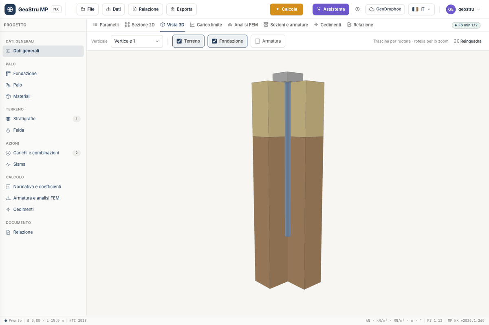

# Palo e fondazione

La geometria si descrive in tre card della scheda **Parametri**: **Dati generali**,
**Fondazione di collegamento** e **Palo**. Per i micropali la card Palo cambia aspetto: vedi
[Micropali](micropali.md).

## Dati generali

Oltre a descrizione, località, tecnico e committente, qui scegli:

- la **Tipologia**: **Palo** o **Micropalo**;
- la **Normativa (GEO)** e la **Normativa (STRU)**, descritte in
  [Carichi, combinazioni e normativa](combinazioni.md) e in [Sezioni e armature](armature.md);
- il **Vincolo in testa**: **Incastro nella testata** o **Cerniera sotto la testata**. Decide
  lo schema del carico limite orizzontale di Broms (testa incastrata o libera);
- **Escludi il carico di punta** (Q~p~ = 0, palo ad attrito) o **Escludi il carico laterale**
  (Q~s~ = 0). I due non si escludono insieme;
- **Coefficiente globale sul carico limite**: usa il coefficiente «Totale» al posto di
  base + laterale.

## Fondazione di collegamento

Con **Fondazione di collegamento presente** disegni trave, plinto, platea o fondazione
circolare sopra il palo, con le dimensioni B, L e l'altezza H.

Il dato che entra nel calcolo è la **Profondità del piano di posa D**, cioè il fondo dello
scavo. Il palo parte da lì: la punta scende a D + L, l'aderenza laterale sopra il piano di
posa viene sottratta e la sporgenza si misura dal fondo scavo. La **Larghezza scavo** serve
solo al disegno (0 = come B).

!!! note "Piano di posa nel primo strato"
    Se il piano di posa cade dentro il primo strato, l'aderenza sopra D non viene sottratta.
    È il comportamento del programma desktop, mantenuto e dichiarato nel documento di
    validazione.

## Palo

Scegli l'esecuzione, **Trivellato** o **Infisso**: cambia il gruppo di coefficienti γ~b~ e
γ~s~ applicato dalla normativa e, per gli infissi, attiva il fattore di conicità.

| Campo | Significato |
|---|---|
| **Diametro D** | diametro del fusto; con conicità è il diametro **alla punta** |
| **Lunghezza L** | lunghezza del palo nel terreno, dal piano campagna o dal piano di posa della fondazione: la punta sta a piano di posa + L |
| **Sporgenza fuori terra** | tratto libero sopra il piano campagna, o sopra il fondo scavo se la fondazione ha un piano di posa |
| **Conicità** | in %, per pali tronco-conici; 0 = cilindrico |
| **q~pc~** | sovraccarico sul piano campagna, in kN/m² |

Con una conicità diversa da zero il diametro cresce verso la testa: il programma usa il
diametro medio per la resistenza laterale e il volume del tronco di cono per il peso. Per i
pali **infissi** la resistenza laterale attritiva è inoltre moltiplicata per il fattore di
conicità F~w~.

La sporgenza si aggiunge a L: non entra nel peso W del carico limite, che è calcolato sulla
lunghezza L, ma entra nel modello FEM, dove il tratto libero non ha molle. L'esempio «Pile
immersed» ha 4 m fuori terra con l'acqua sopra il piano campagna.

Metodo per N~q~, angolo d'attrito per la resistenza laterale, δ e K stanno nella stessa card
ma riguardano il calcolo: sono spiegati in [Carico limite](carico-limite.md).

### Perimetro assegnato

Per una sezione non circolare spunta **Perimetro di sviluppo laterale assegnato** e scrivi
**Perimetro** e **Area della sezione** (0 = circolare). Finché la casella non è spuntata i
due campi restano in sola lettura. La verifica strutturale resta quella della sezione
circolare: vedi i limiti in [Sezioni e armature](armature.md).

## Sezione 2D e Vista 3D

La scheda **Sezione 2D** mostra il disegno quotato di palo, fondazione, strati, falda e
azioni, per la verticale e la combinazione scelte. Lo esporti in **PNG** (gratuito) o nella
tavola **DXF**.

La **Vista 3D** mostra il palo in un blocco di terreno aperto a spaccato. Trascina per
ruotare, usa la rotella per lo zoom e **Reinquadra** per tornare alla vista iniziale. Le
caselle **Terreno**, **Fondazione** e **Armatura** accendono e spengono i solidi; con
**Armatura** il palo diventa traslucido e compaiono i ferri longitudinali. Le staffe non sono
disegnate in 3D: il loro passo esce dal calcolo, non dai dati.

---

*Hai trovato un errore in questa pagina? [Segnalacelo](mailto:info@geostru.ai?subject=Help%20MP%20NX) o apri una [Pull Request](https://github.com/EngSoft-Geostru/geostru-help-nx/edit/main/mp/docs/it/palo.md).*
