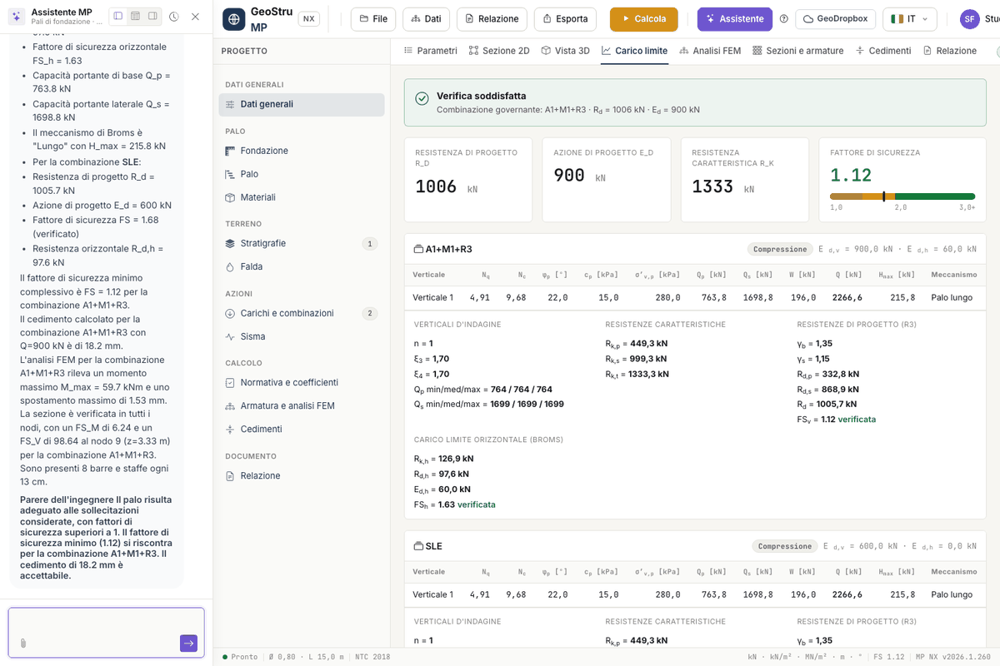

# Relazione, esportazioni e assistente

## Anteprima della relazione

La scheda **Relazione** mostra l'anteprima del documento, aggiornata dal progetto e
dall'ultimo calcolo. L'anteprima è gratuita: usala per controllare testi e tabelle prima di
generare il file.

La relazione segue questo indice: premessa; descrizione dell'opera e del sito; modello
geologico e campagna di indagini; modello geotecnico di sottosuolo, con la figura della
sezione; il palo e i materiali; azioni di progetto; metodo di calcolo e coefficienti; carico
limite del palo; resistenze caratteristiche e di progetto; carico limite orizzontale
(Broms); cedimento (Poulos e Davis); analisi strutturale del palo; verifica e progetto della
sezione; gabbia d'armatura e distinta dei ferri; prescrizioni esecutive; conclusioni;
avvertenze; bibliografia. I capitoli su FEM, sezione e gabbia compaiono solo se l'analisi è
stata eseguita.

La casella **Includi: figura della sezione** decide se la sezione 2D entra nel documento.

### Testi liberi per capitolo

Apri **Testi della relazione** per scrivere i testi tuoi: **Tipo di opera**, **Premessa**,
**Descrizione dell'opera**, **Descrizione del sito**, **Modello geologico**, **Campagna di
indagini**, **Modello di calcolo**, **Prescrizioni esecutive** e **Conclusioni**. Ogni
testo entra nel capitolo corrispondente; con la casella **includi** accanto al titolo
escludi i capitoli facoltativi. I testi sono salvati nel progetto.

### Word e PDF

Genera il file con i pulsanti **DOCX** e **PDF** della scheda, oppure dal menu **Relazione**:
**Word (.docx)**, **PDF** e **Word 97-2003 (.doc)**. La relazione costa 10 crediti,
addebitati solo quando il file è stato prodotto. Il documento esce nella lingua
dell'interfaccia, italiano o inglese.

## Esportazioni

| Cosa | Dove | Crediti |
|---|---|---|
| **Progetto (.mpnx)** | menu **Esporta** o **File → Salva** | 0 |
| **Sezione (PNG)** | menu **Esporta**, o pulsante **PNG** della scheda Sezione 2D | 0 |
| **Tavola DXF (sezione, diagrammi, armature)** | menu **Esporta**, o pulsante **DXF** della scheda Sezione 2D | 10 |
| **DXF gabbia** | scheda **Sezioni e armature** | 10 |

La tavola DXF affianca la sezione, i cinque diagrammi del FEM e le armature, con la
distinta. Il **DXF gabbia** contiene il solo disegno esecutivo con la distinta. I disegni
sono in metri.

### Firma di provenienza

I file esportati portano una firma che ne identifica l'origine. Il DXF ha un commento in
testa al file, che i programmi CAD ignorano. Il documento Word ha autore e parole chiave
nelle proprietà, con un'impronta del tipo `nx-…`. Il piè della relazione riporta la nota di
provenienza con i link ai termini di servizio e alla validazione.

## File di progetto e GeoDropbox

Il progetto è un file **`.mpnx`**: contiene dati, archivio dei materiali, regole della
gabbia e testi della relazione, non i risultati. **File → Salva** lo scarica con il nome in
uso, **Salva con nome** chiede il nome, **Apri** lo ricarica. Il nome del file in uso
compare nella barra di stato.

Il pulsante **GeoDropbox** apre e salva i progetti nel cloud GeoStru, così li ritrovi da
qualunque postazione. L'abbonamento GeoDropbox è separato dai crediti delle app.

## Assistente AI

Il pulsante **Assistente** apre la chat a lato del progetto. L'assistente:

- **legge il progetto corrente** e i risultati, e li interpreta;
- spiega i metodi: N~q~, fattori ξ e γ~R~, Broms, Poulos e Davis, FEM, verifica della sezione;
- fa una **revisione geotecnica** dei dati;
- **compila il progetto da un documento allegato**: con la graffetta alleghi, per esempio,
  una relazione geologica in PDF, e l'assistente propone stratigrafia e parametri;
- apre un **ticket di supporto**.

Ogni messaggio costa 3 crediti, addebitati solo se la risposta arriva.

!!! warning "Risposte generate da un sistema di AI"
    Le risposte dell'assistente sono generate da un sistema di intelligenza artificiale e
    possono contenere errori. I dati compilati da un documento e i pareri sui risultati
    vanno **verificati dal progettista**, che resta responsabile del calcolo.

---

*Hai trovato un errore in questa pagina? [Segnalacelo](mailto:info@geostru.ai?subject=Help%20MP%20NX) o apri una [Pull Request](https://github.com/EngSoft-Geostru/geostru-help-nx/edit/main/mp/docs/it/relazione.md).*
