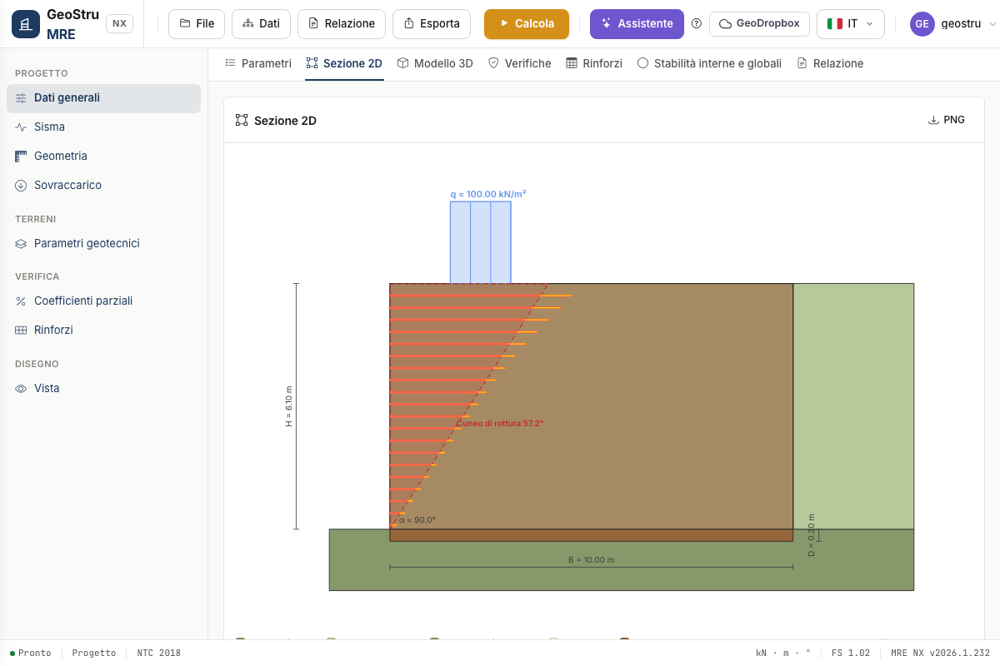
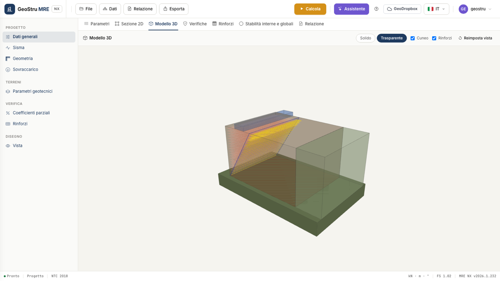

# Cross-section geometry

- **H** — height of the reinforced soil [m].
- **B** — base of the reinforced block [m].
- **α** — inclination of the outer facing [°], typically 45÷90. It defines the shape of
  the section (2D/3D); the kernel checks use the equivalent vertical wall, which is on
  the safe side for battered facings.
- **α~s~ (inner excavation)** — inclination of the uphill face of the block: **0 =
  parallel to the facing**; if set, it must lie between the shear resistance angle of the
  retained soil and 90° (an unsupported cut flatter than φ is not consistent).
- **β** — inclination of the backfill uphill [°]; it must be smaller than φ of the
  retained soil.
- **D** — depth of the foundation plane [m].

The **2D section** shows the dimensioned geometry together with the failure wedge and the
reinforcements, with total and effective length drawn apart.

The **3D model** extrudes the same geometry along the development of the structure; in
**Transparent** view you can see the reinforcement sheets and the surface of the active
wedge.

The colours of the backfill and of the foundation plane are picked directly in the
Geometry card; the colours of the soils in the corresponding Geotechnical parameters cards.

!!! warning "Reinforcement spacing and height"
    If H is an exact multiple of the spacing s, the last reinforcement would fall at the
    base where the wedge has zero length: the program reports it and asks you to change s
    or H slightly.

---

*Found an error on this page? [Let us know](mailto:info@geostru.ai?subject=Help%20MRE%20NX) or open a [Pull Request](https://github.com/EngSoft-Geostru/geostru-help-nx/edit/main/mre/docs/en/geometria.md).*
