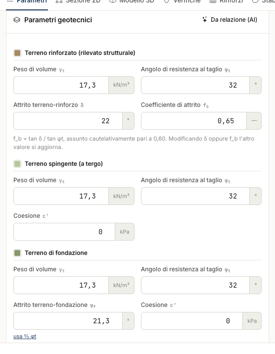

# Soils, surcharge and parameters

## The three soils

| Soil | Parameters | Role |
|---|---|---|
| **Reinforced** (structural fill) | γ~t~, φ~t~, δ (soil-reinforcement friction) | internal actions and weight of the structure |
| **Retained** (behind the block) | γ~t~, φ~t~, c′ | active thrust (Coulomb, δ = ⅔φ) |
| **Foundation** | γ~t~, φ~t~, φ~f~, c′ | sliding and bearing capacity |

The sliding friction coefficient f~b~ = tan δ / tan φ~t~ is kept in sync with δ (a typical
conservative value is 0.6).

## Surcharge

A load strip on the backfill, defined by q [kN/m²] and the abscissas x~in~/x~fin~ measured
from the top vertex. The stress increment on the reinforcements is evaluated with Boussinesq.

The **surcharge type** drives the combination factors:

| Type | γ~Q~ static | ψ₂ seismic |
|---|---|---|
| Permanent structural | 1.3 | 1.0 |
| Permanent non-structural | 1.5 | 1.0 |
| Dense crowd | 1.5 | 0.6 |
| Road traffic | 1.5 | 0.0 |
| Railway | 1.5 | 0.0 |
| Buildings | 1.5 | 0.3 |

## Site coordinates

Latitude, longitude and elevation appear in the report header and are filled in
automatically when you import a GeoStru PS report.

---

*Found an error on this page? [Let us know](mailto:info@geostru.ai?subject=Help%20MRE%20NX) or open a [Pull Request](https://github.com/EngSoft-Geostru/geostru-help-nx/edit/main/mre/docs/en/parametri.md).*
