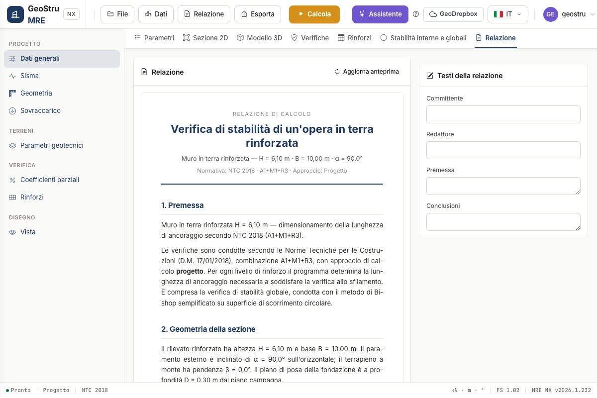

# Report and exports

The **Report** tab shows a preview of the document with, on the right, the **editable
texts** (client, author, foreword, conclusions).

The report covers: foreword; geometry (including the inner excavation); surcharge with its
type and the γ~Q~/ψ₂ factors; geotechnical parameters; **calculation combinations with the
table of A/M/R factors and k~h~/k~v~ per combination**; seismic action with the reference
to table 7.11.III and to the increased overturning coefficient; reinforcements (with the
commercial product and the wrap-around); external checks in order with the **FS ×
combination table**; reinforcement checks with the envelope table and the **charts per
level**; global stability with the **tieback/compound** paragraph; conclusions.

The **figures** (section, reinforcement layout, 3D, stability, charts) are captured from
the page: to have them in the document, run the calculation and visit the tabs before
generating. Export to **DOCX** (native) or **PDF**; the project is exported as an **.mre**
file or to GeoDropbox.

---

*Found an error on this page? [Let us know](mailto:info@geostru.ai?subject=Help%20MRE%20NX) or open a [Pull Request](https://github.com/EngSoft-Geostru/geostru-help-nx/edit/main/mre/docs/en/relazione.md).*
