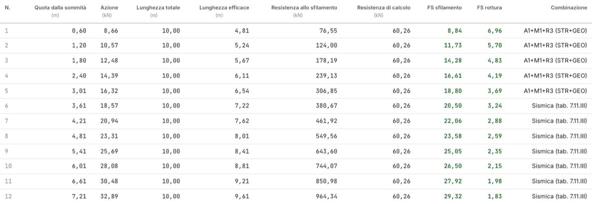
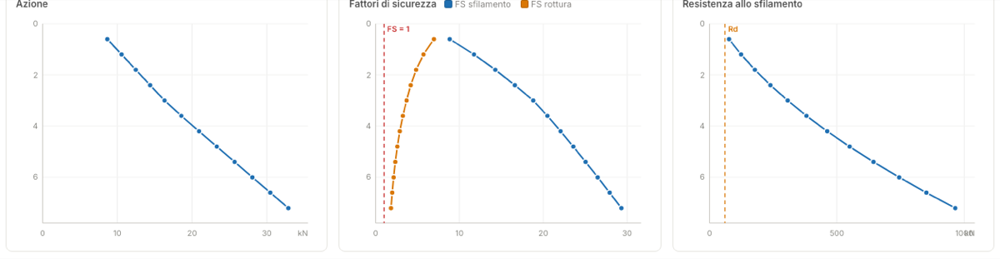

# Reinforcements and archive

## Reinforcement data

- **Spacing s** — vertical spacing; the levels are ⌊H/s⌋, at elevations z = s, 2s, …
  measured **from the top** (zero is at the crest).
- **t~ult~** and the reduction factors **RF~d~ · RF~id~ · RF~c~** → design resistance
  R~d~ = t~ult~/(RF~d~·RF~id~·RF~c~).
- **L** — anchorage length, used in the Check approach only.
- **L~rip~** — fold of the wrap-around facing: a construction detail drawn in 2D/3D and
  mentioned in the report (0 = no wrap-around).

## Reinforcement archive

The **Archive** button opens the catalogue (generic PET/HDPE classes) and your **personal
archive**: save the current values, import/export .json archives, or **extract the products
from a manufacturer data sheet in PDF** with the AI assistant (a credit action) — ideal
with certificates reporting t~ult~ and the reduction factors. Choosing **Use** fills in
t~ult~ and RF, and the commercial name stays in the project and in the report (it is
cleared if you edit the values by hand).

!!! warning "Indicative values"
    The strengths and reduction factors of the built-in archive are indicative: always
    check the manufacturer's data sheets and certificates.

## Results level by level

For each level the table shows: action A = (γ·z·K~a~ + Δq)·s, total and effective length,
pullout resistance R~sfil~ = 2·(γ·z+Δq)·tanδ·L~eff~, design resistance and the factors
**FS~sfil~ = R~sfil~/A** and **FS~rott~ = R~d~/A**.

With more than one combination the default view is the **design envelope** (per level: the
combination with the lowest FS and the largest length); the three **charts** below the
table — action, factors of safety with the FS = 1 threshold, pullout resistance with the
R~d~ line — also go into the report.

---

*Found an error on this page? [Let us know](mailto:info@geostru.ai?subject=Help%20MRE%20NX) or open a [Pull Request](https://github.com/EngSoft-Geostru/geostru-help-nx/edit/main/mre/docs/en/rinforzi.md).*
