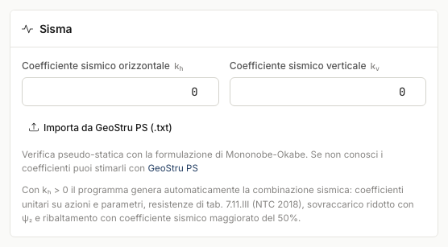

# Seismic action

The seismic check is pseudo-static, with the **Mononobe-Okabe** formulation (inertia angle
θ = arctan[k~h~/(1−k~v~)]).

## Seismic coefficients

You can enter k~h~ and k~v~ directly, or **import a GeoStru PS report** (.txt): the program
extracts a~g~, F₀, T~C~* for the four limit states, the subsoil and topographic category,
and computes, for **retaining walls** (NTC §7.11.6.2.1):

- a~max~ = S~S~ · S~T~ · a~g~
- k~h~ = **β~m~** · a~max~/g, with β~m~ = **0.38** (SLV/SLC) and **0.47** (SLO/SLD)
- k~v~ = ± 0.5 · k~h~

**SLV** is applied straight away; from the small table you can switch to another limit
state. The site coordinates are copied into General data.

## Effect on the checks

With k~h~ > 0 the program generates the seismic combination (see
[Design code and combinations](combinazioni.md)); global stability switches to the seismic
factors (γ~R2~ = 1.2, unit M2).

---

*Found an error on this page? [Let us know](mailto:info@geostru.ai?subject=Help%20MRE%20NX) or open a [Pull Request](https://github.com/EngSoft-Geostru/geostru-help-nx/edit/main/mre/docs/en/sisma.md).*
