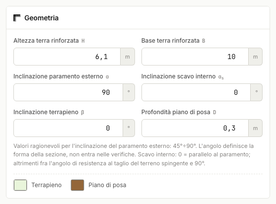

# Geometria della sezione

- **H** — altezza della terra rinforzata [m].
- **B** — base del blocco rinforzato [m].
- **α** — inclinazione del paramento esterno [°], valori tipici 45÷90. Definisce la
  forma della sezione (2D/3D); le verifiche del kernel usano la parete verticale
  equivalente, a favore di sicurezza per paramenti inclinati.
- **α~s~ (scavo interno)** — inclinazione della faccia a monte del blocco: **0 =
  parallela al paramento**; se impostata deve stare fra l'angolo di resistenza al
  taglio del terreno spingente e 90° (uno scavo non sostenuto più dolce di φ non è
  congruente).
- **β** — inclinazione del terrapieno a monte [°]; deve essere minore di φ del
  terreno spingente.
- **D** — profondità del piano di posa [m].

La **Sezione 2D** riporta la geometria quotata insieme al cuneo di rottura e ai
rinforzi, con lunghezza totale ed efficace distinte.

Il **Modello 3D** estrude la stessa geometria lungo lo sviluppo dell'opera; in vista
**Trasparente** si vedono i fogli di rinforzo e la superficie del cuneo attivo.

I colori di terrapieno e piano di posa si scelgono direttamente nella card Geometria;
quelli dei terreni nelle rispettive card dei Parametri geotecnici.

!!! warning "Passo dei rinforzi e altezza"
    Se H è un multiplo esatto del passo s, l'ultimo rinforzo cadrebbe alla base dove
    il cuneo ha lunghezza nulla: il programma lo segnala e chiede di variare
    leggermente s o H.

---

*Hai trovato un errore in questa pagina? [Segnalacelo](mailto:info@geostru.ai?subject=Help%20MRE%20NX) o apri una [Pull Request](https://github.com/EngSoft-Geostru/geostru-help-nx/edit/main/mre/docs/it/geometria.md).*
