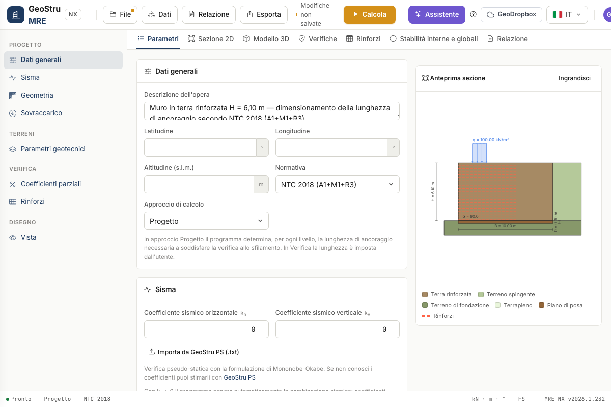
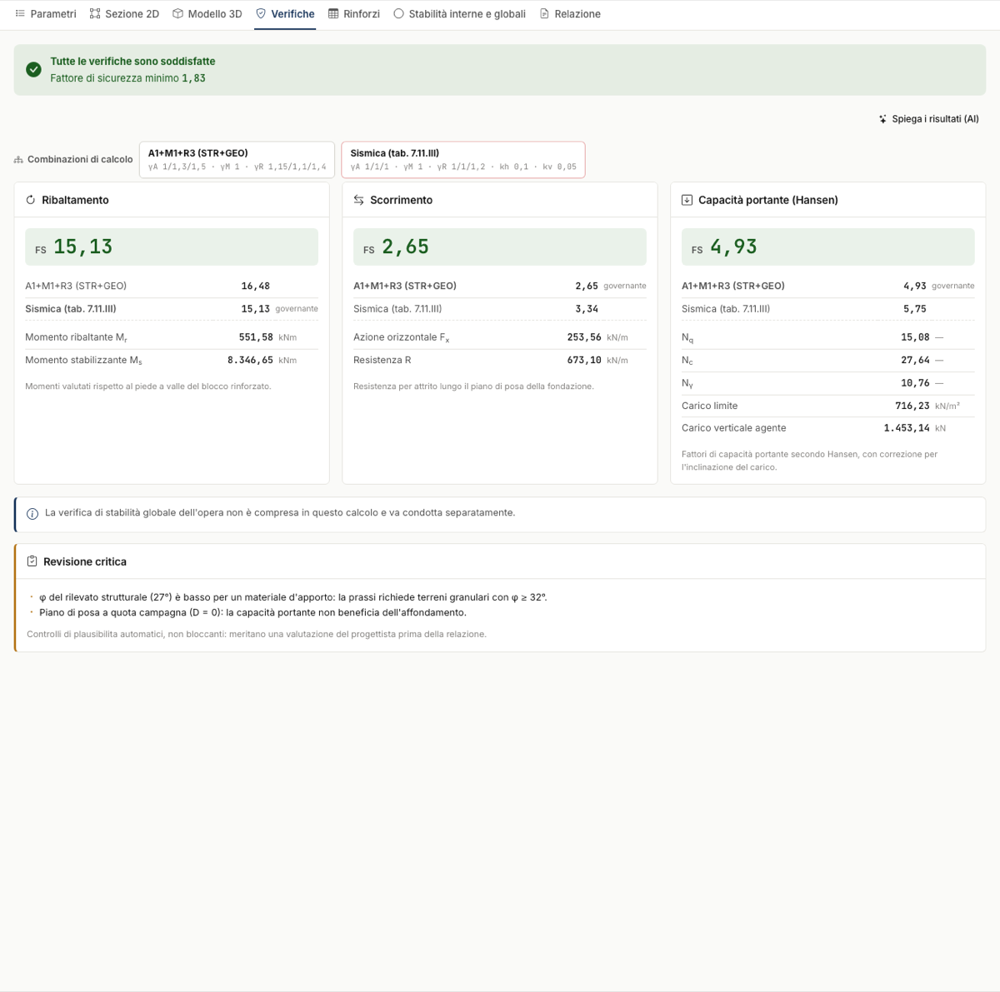

# Guida rapida (5 minuti)

1. **Dati generali** — descrizione, coordinate del sito (lat/lon/altitudine), normativa
   (NTC 2018, Eurocodici o Utente) e approccio: **Progetto** (le lunghezze di ancoraggio
   le determina il programma) o **Verifica** (le imponi tu).
2. **Sisma** — inserisci k~h~ e k~v~, oppure **Importa da GeoStru PS (.txt)**: il report
   di GeoStru PS compila pericolosità e coefficienti per i 4 stati limite (SLV applicato
   automaticamente) e riporta le coordinate nei Dati generali.
3. **Geometria** — altezza H, base B, inclinazione del paramento esterno α, eventuale
   scavo interno α~s~, terrapieno β e piano di posa D. L'anteprima a destra si aggiorna
   a ogni modifica.
4. **Sovraccarico** — striscia di carico q con ascisse iniziale/finale e **tipologia**
   (permanente, folla, traffico, …): determina γ~Q~ in statica e ψ₂ in sismica.
5. **Parametri geotecnici** — i tre terreni: rinforzato, spingente, di fondazione.
6. **Rinforzi** — passo s, resistenza nominale t~ult~ e fattori riduttivi RF, oppure
   scegli un prodotto dall'**Archivio**. Con L~rip~ > 0 disegni il risvolto in facciata.
7. Premi **Calcola** e leggi i risultati nei tab **Verifiche**, **Rinforzi** e
   **Stabilità globale**; genera la **Relazione** in DOCX.

I dati si inseriscono nelle card a sinistra; l'anteprima a destra segue ogni modifica.

Dopo il calcolo il tab **Verifiche** riassume ribaltamento, scorrimento e capacità
portante, con il fattore di sicurezza di ogni combinazione.

!!! note "Salvataggio"
    Il progetto si salva come file **.mre** (File → Salva) o su **GeoDropbox**;
    lo stato della pagina è comunque conservato in sessione a ogni modifica.

---

*Hai trovato un errore in questa pagina? [Segnalacelo](mailto:info@geostru.ai?subject=Help%20MRE%20NX) o apri una [Pull Request](https://github.com/EngSoft-Geostru/geostru-help-nx/edit/main/mre/docs/it/quickstart.md).*
