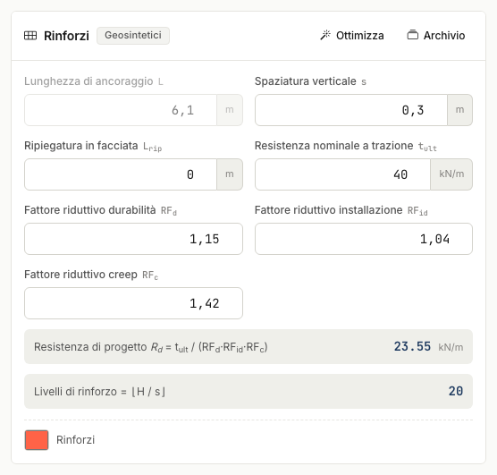
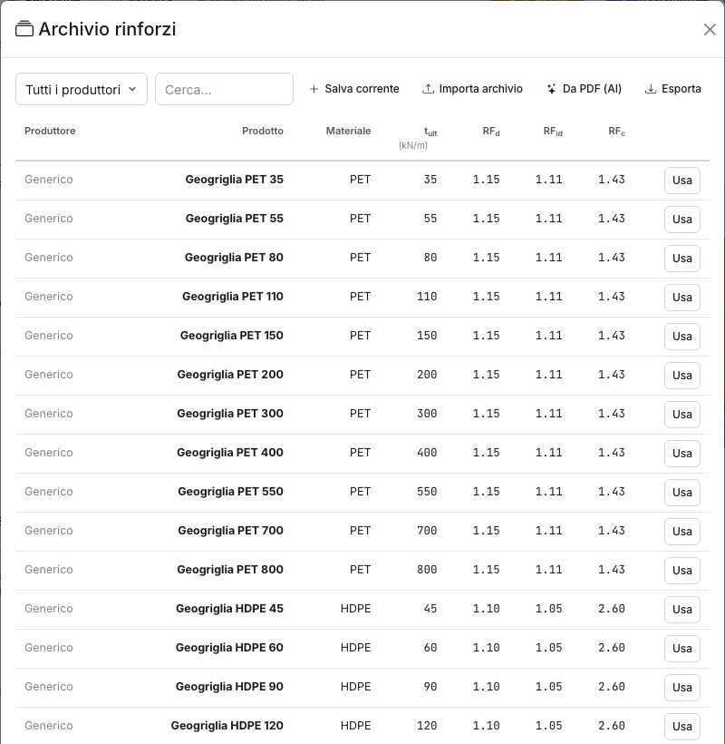

# Rinforzi e archivio

## Dati del rinforzo

- **Passo s** — spaziatura verticale; i livelli sono ⌊H/s⌋, a quote z = s, 2s, …
  misurate **dalla sommità** (lo zero è in alto).
- **t~ult~** e fattori riduttivi **RF~d~ · RF~id~ · RF~c~** → resistenza di progetto
  R~d~ = t~ult~/(RF~d~·RF~id~·RF~c~).
- **L** — lunghezza di ancoraggio, usata solo in approccio Verifica.
- **L~rip~** — ripiegatura del risvolto in facciata (wrap-around): dettaglio
  costruttivo disegnato in 2D/3D e citato in relazione (0 = nessun risvolto).

## Archivio rinforzi

Il pulsante **Archivio** apre il catalogo (classi generiche PET/HDPE) e l'**archivio
personale**: salva i valori correnti, importa/esporta archivi .json, oppure **estrai i
prodotti da una scheda tecnica PDF** del produttore con l'assistente AI (azione a
crediti) — ideale con i certificati che riportano t~ult~ e fattori riduttivi.
Scegliendo **Usa**, t~ult~ e RF si compilano e il nome commerciale resta nel progetto
e in relazione (si azzera se modifichi i valori a mano).

!!! warning "Valori indicativi"
    Le resistenze e i fattori riduttivi dell'archivio di serie sono indicativi:
    verifica sempre le schede tecniche e le certificazioni del produttore.

## Risultati per livello

La tabella mostra, per ogni livello: azione A = (γ·z·K~a~ + Δq)·s, lunghezze totale
ed efficace, resistenza allo sfilamento R~sfil~ = 2·(γ·z+Δq)·tanδ·L~eff~, resistenza
di calcolo e i fattori **FS~sfil~ = R~sfil~/A** e **FS~rott~ = R~d~/A**.

Con più combinazioni la vista predefinita è l'**inviluppo di progetto** (per livello:
la combinazione col FS più basso e la lunghezza massima); i tre **grafici** sotto la
tabella — azione, fattori di sicurezza con soglia FS = 1, resistenza allo sfilamento
con la retta R~d~ — finiscono anche in relazione.

---

*Hai trovato un errore in questa pagina? [Segnalacelo](mailto:info@geostru.ai?subject=Help%20MRE%20NX) o apri una [Pull Request](https://github.com/EngSoft-Geostru/geostru-help-nx/edit/main/mre/docs/it/rinforzi.md).*
